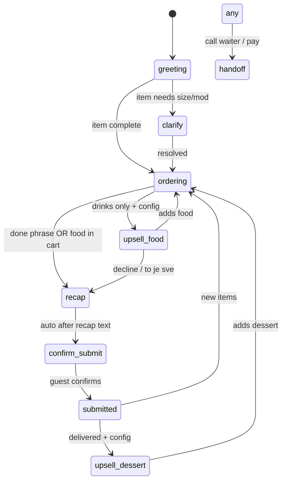
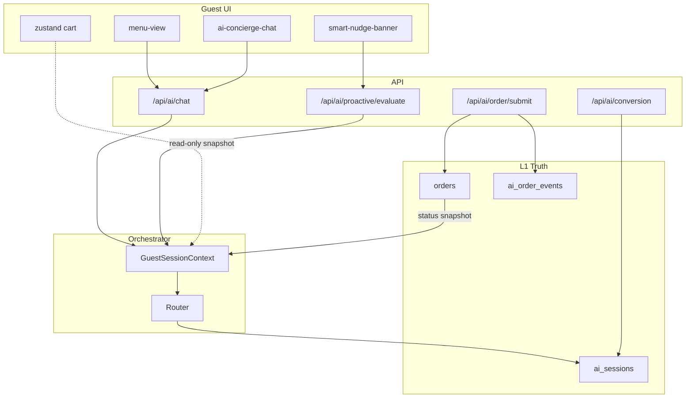

# ADR-002: AI Concierge Orchestrator (Denis Architecture)

| Field | Value |
|-------|-------|
| **Status** | **Proposed** |
| **Date** | 2026-05-27 |
| **Authors** | QR Order engineering |
| **Depends on** | [ADR-001](./ADR-001-universal-ordering-platform.md) (order core must stay atomic) |
| **Related** | `00046`–`00060` migrations · [Detail](./ADR-002-denis-architecture-detail.md) · [v2 PPAN](./ADR-003-denis-platform-v2.md) · **[Kernel](./ADR-004-denis-kernel.md)** |

> **Implementation blueprint (Phase 1 bootstrap):** [ADR-002-denis-architecture-detail.md](./ADR-002-denis-architecture-detail.md)  
> **Platform target (v2):** [ADR-003-denis-platform-v2.md](./ADR-003-denis-platform-v2.md)  
> **Strong Denis (kernel):** [ADR-004-denis-kernel.md](./ADR-004-denis-kernel.md) — beliefs, goals, VKG, conflict resolution  
> **Maximum Denis (ultimate north star):** [ADR-005-denis-maximum.md](./ADR-005-denis-maximum.md)

---

The AI Concierge today is a **single LLM call** wrapped with partial guardrails. It is **not** Denis-level: fragmented context, no phase machine, proactive nudges run on a separate client loop, admin has playbook text but no **advanced behavior matrix**.

**Denis** (target product) = a **connected digital head waiter** that:

- Knows everything relevant about **this table, this session, this guest** in one place
- Acts through **deterministic policies** for money/kitchen/fiscal paths
- Speaks with **configurable persona** per location (name, tone, upsell rules)
- Proactively helps at the **right moment** (pairing, dessert, slow kitchen) using the **same brain** as chat
- Is **operable**: owner toggles features; support reads full audit trail

### Design principle (Cursor analogy)

**Cursor:** model proposes → tools execute → repo is source of truth.  
**Denis:** model proposes → **Policy Engine + Executor** validate → **GuestSessionContext** is source of truth.

---

## 2. Decision — Seven-layer Denis stack

```
┌──────────────────────────────────────────────────────────────────────────┐
│ L7 — Admin & Ops                                                         │
│ ConciergeConfig UI · golden scenarios · ai_insights · session replay      │
└────────────────────────────────────┬─────────────────────────────────────┘
                                     │
┌────────────────────────────────────▼─────────────────────────────────────┐
│ L6 — Persona & Prompt Compiler                                           │
│ ai_playbook · ai_examples · ai_description · phase-specific prompt slices │
└────────────────────────────────────┬─────────────────────────────────────┘
                                     │
┌────────────────────────────────────▼─────────────────────────────────────┐
│ L5 — Proactive Brain (server-side)                                       │
│ triggers · nudges · outbox order-status hooks · same GuestSessionContext  │
└────────────────────────────────────┬─────────────────────────────────────┘
                                     │
┌────────────────────────────────────▼─────────────────────────────────────┐
│ L4 — Orchestrator Router (chat-service + proactive API)                  │
│ build context → policy check → route (deterministic | LLM | proactive)   │
└────────────────────────────────────┬─────────────────────────────────────┘
                                     │
         ┌───────────────────────────┼───────────────────────────┐
         ▼                           ▼                           ▼
┌─────────────────┐       ┌─────────────────────┐       ┌──────────────────┐
│ L3a State       │       │ L3b Policy Engine   │       │ L3c LLM Adapter  │
│ Phase machine   │       │ allergies · limits  │       │ extract · speak  │
│ GuestSession    │       │ alcohol · hours     │       │ structured JSON  │
│ Context Fusion  │       │ upsell caps         │       │ phase-narrow     │
└────────┬────────┘       └──────────┬──────────┘       └────────┬─────────┘
         │                             │                            │
         └─────────────────────────────┼────────────────────────────┘
                                       ▼
┌──────────────────────────────────────────────────────────────────────────┐
│ L2 — Skill Executor (bounded tools — not open agent)                     │
│ cart · submit · browse · status · pairing · waiter-call · split-hint       │
└────────────────────────────────────┬─────────────────────────────────────┘
                                     ▼
┌──────────────────────────────────────────────────────────────────────────┐
│ L1 — Truth Store (PostgreSQL + Redis + ADR-001 outbox)                   │
│ ai_sessions · orders · table_sessions · ai_order_events · menu cache      │
└──────────────────────────────────────────────────────────────────────────┘
```

**Hard rule:** L2 executors touch orders/fiscal. L3c LLM **never** commits side effects without L3b policy pass + L2 execution.

---

## 3. Denis Capability Model

What “advanced” means — explicit product capabilities:

| ID | Capability | Deterministic | LLM | Config key |
|----|------------|---------------|-----|------------|
| V1 | Unified session memory | ✓ | hint | `context.*` |
| V2 | Phase-aware ordering | ✓ | extract | `ordering.flow` |
| V3 | Multi-language guest follow | partial | ✓ | `language.*` |
| V4 | Allergy-safe recommendations | ✓ | ✓ | `policy.allergiesStrict` |
| V5 | Food upsell after drinks | ✓ | speak | `upsell.foodAfterDrinks` |
| V6 | Smart pairing (drink↔food) | ✓ | pick 1 | `proactive.pairing` |
| V7 | Dessert timing nudge | ✓ | speak | `proactive.dessert` |
| V8 | Slow-kitchen empathy nudge | ✓ | speak | `proactive.slowKitchen` |
| V9 | Order status Q&A | ✓ | speak | `context.orderStatus` |
| V10 | Browse intelligence (scroll) | ✓ | rank | `context.scroll` |
| V11 | Return guest recognition | ✓ | speak | `memory.tableSession` |
| V12 | Manual cart awareness | ✓ | hint | `context.manualCart` |
| V13 | Waiter call handoff | ✓ | speak | `handoff.waiterCall` |
| V14 | Payment / split hint | ✓ | speak | `handoff.paymentHint` |
| V15 | Post-meal review prompt | ✓ | speak | `proactive.reviewPrompt` |
| V16 | Owner persona (name/ton) | — | ✓ | `persona.*` |
| V17 | A/B playbook variants | ✓ | ✓ | `experiments.*` |
| V18 | Full session audit replay | ✓ | — | always on |

---

## 4. GuestSessionContext — Context Fusion Engine

Built **once per turn** (chat, nudge, proactive push). Immutable for that turn.

### 4.1 Input planes (all fused)

| Plane | Source | Refresh |
|-------|--------|---------|
| **Identity** | `table_sessions`, `tables`, `locations` | per turn |
| **Conversation** | `ai_sessions.messages`, `order_draft`, `flow.phase` | per turn |
| **Commerce** | `orders` + `order_items` for active table session | per turn |
| **AI commerce** | `linked_order_ids`, `products_added`, `conversion_count` | per turn |
| **Telemetry** | `scroll_context`, client `browsingContext`, dwell time | per turn |
| **Manual cart** | client snapshot (read-only JSON) | per turn |
| **Preferences** | `guest_preferences`, sheet allergies/mood | per turn |
| **Operational** | `accepting_orders`, menu schedule, 86'd items | cache 60s |
| **Status** | `last_order_status_snapshot` + poll active orders | event + turn |
| **Config** | `ConciergeConfig` merged org → location | cache 300s |
| **Persona** | playbook + examples + prompt compiler | cache 300s |

### 4.2 Output (fed to router + LLM)

```typescript
type GuestSessionContext = {
  sessionId: string;
  tableSessionId: string | null;
  phase: ConversationPhase;

  config: ConciergeConfig;           // resolved location config
  persona: CompiledPersona;          // name, tone rules, forbidden phrases

  fusion: {
    cart: AiOrderDraft;
    manualCart: ManualCartSnapshot | null;
    tableOrders: AiGuestOrder[];
    aiSubmittedOrderIds: string[];
    orderStatus: OrderStatusSnapshot;
    scroll: ScrollContext | null;
    preferences: GuestPreferences;
    operational: OperationalFlags;
  };

  memory: SessionMemory;             // derived facts (see §5)

  routing: {
    skipLlm: boolean;
    skipReason?: string;
    allowedSkills: SkillId[];        // phase + config gated
    proactiveEligible: ProactiveKind[];
  };

  observability: {
    contextHash: string;             // log correlation
    sourcesUsed: string[];           // audit which planes included
  };

  promptBlock: string;               // single authoritative LLM block
};
```

### 4.3 Context hash & replay

Every turn logs `contextHash = sha256(promptBlock + phase + cartRevision)`.  
Support/admin **Session Replay** reconstructs decisions from:

`ai_order_events` + stored `GuestSessionContext` snapshot (JSONB on event, track B4).

---

## 5. Session Memory (derived — not LLM memory)

**No** “remember forever in prompt”. Derived facts computed deterministically:

```typescript
type SessionMemory = {
  hasOrderedThisVisit: boolean;
  hasDrinksOnly: boolean;
  hasFood: boolean;
  hasDessert: boolean;
  totalSpendEstimate: number;
  minutesAtTable: number;
  topViewedProducts: Array<{ productId: string; views: number }>;
  alreadyRecommended: string[];
  alreadyUpsold: { food: boolean; dessert: boolean; pairing: string[] };
  guestDeclinedCategories: string[];   // from phrases + dismissals
  lastProactiveAt: string | null;
  returnVisit: boolean;                // prior table_session same device fingerprint
};
```

Memory drives **Policy Engine** and **Proactive Brain** — not raw chat history bloat.

---

## 6. Conversation Phase Machine (extended)

Stored in `order_draft.flow.phase`:

| Phase | Entry | LLM | Skills allowed |
|-------|-------|-----|----------------|
| `greeting` | session start | speak | browse, recommend |
| `clarify` | `pending` | speak/clarify | cart.resolvePending |
| `ordering` | items in draft | extract | cart.add, browse |
| `upsell_food` | drinks-only + config | template | upsell.askFoodOnce |
| `upsell_dessert` | food delivered + config | template | upsell.dessert |
| `recap` | done phrase / policy | **none** | cart.recap |
| `confirm_submit` | recap shown | **none** | order.submit |
| `submitted` | post-submit | speak | status, ordering (new round) |
| `handoff` | waiter/payment intent | template | handoff.* |

### Transition diagram



Every transition → `ai_order_events.phase_changed` + `syncFlowPhase()`.

---

## 7. ConciergeConfig — Advanced Options (Denis control plane)

**Storage:** `locations.ai_concierge_config JSONB` (migration `00086`).  
**Merge order:** platform defaults → org override → location override.  
**Cache:** Redis `ai:config:{locationId}` TTL 300s.

### 7.1 Full schema (v1)

```typescript
type ConciergeConfig = {
  version: 1;
  enabled: boolean;

  persona: {
    name: string;                    // "Denis"
    role: string;                    // "Head waiter · Rooftop bar"
    tone: "warm_short" | "formal" | "playful_luxury" | "efficient";
    greetingStyle: "offer_drink_or_food" | "welcome_only" | "venue_story";
    forbiddenPhrases: string[];      // e.g. "As an AI language model"
    emoji: boolean;                  // default false
    maxWordsPerReply: number;        // default 45
  };

  language: {
    venueDefault: string;            // de | en | sr | hr ...
    followGuest: boolean;            // default true
    fallbackWhenUnknown: "venue" | "english";
  };

  context: {
    scroll: boolean;                 // browsing telemetry
    tableOrders: boolean;            // live orders for table session
    orderStatus: boolean;            // status snapshot
    manualCart: boolean;             // read-only Zustand snapshot
    orderHistory: boolean;           // don't recommend duplicates
    includePairingHistory: boolean;
    maxContextTokens: number;        // trim fusion block
  };

  ordering: {
    flow: "denis_short" | "classic_chatty";  // denis_short = max 4 turns to submit
    requireExplicitConfirm: boolean;          // always true for fiscal
    allowMultiItemParse: boolean;             // "cola and burger"
    defaultServeSize: string | null;          // null = always ask
    maxItemsPerOrder: number;
    maxQuantityPerLine: number;
  };

  upsell: {
    foodAfterDrinks: boolean;
    foodAfterDrinksProductIds: string[] | null;  // null = LLM picks from menu
    dessertAfterDelivered: boolean;
    dessertDelayMinutes: number;
    maxUpsellsPerSession: number;               // default 2
    respectDecline: boolean;                    // never re-ask declined category
  };

  proactive: {
    enabled: boolean;
    browseNudgeMinutes: number;
    pairing: boolean;
    dessert: boolean;
    slowKitchen: boolean;
    slowKitchenThresholdMinutes: number;
    reviewPrompt: boolean;
    reviewPromptAfterDelivered: boolean;
    minMinutesBetweenProactive: number;
    shareSessionWithChat: boolean;              // MUST true for Denis
  };

  policy: {
    allergiesStrict: boolean;                   // block propose if uncertain
    blockAlcoholWithoutFood: boolean;           // optional venue rule
    blockOrderingWhenClosed: boolean;
    maxOrderTotal: number | null;
    requireServeSizeForDrinks: boolean;
  };

  llm: {
    model: string | null;                       // null = env default
    fallbackModel: string | null;
    temperatureOrdering: number;                  // 0.1–0.3
    temperatureRecommend: number;                 // 0.4–0.6
    parseRetryAttempts: number;
    skipLlmWhenPossible: boolean;                 // default true
  };

  handoff: {
    waiterCall: boolean;
    paymentHint: boolean;
    phrases: string[];                          // trigger handoff phase
  };

  experiments: {
    playbookVariant: "A" | "B" | null;
    exampleSetId: string | null;
  };

  credits: {
    chargeProactive: boolean;                   // default false
    chargeDeterministic: boolean;               // default false
  };
};
```

### 7.2 Platform defaults (`src/lib/ai/config/concierge-defaults.ts`)

```json
{
  "version": 1,
  "enabled": true,
  "persona": {
    "name": "Denis",
    "tone": "warm_short",
    "greetingStyle": "offer_drink_or_food",
    "forbiddenPhrases": [],
    "emoji": false,
    "maxWordsPerReply": 45
  },
  "ordering": { "flow": "denis_short", "requireExplicitConfirm": true },
  "upsell": { "foodAfterDrinks": true, "maxUpsellsPerSession": 2, "respectDecline": true },
  "proactive": { "enabled": true, "shareSessionWithChat": true, "minMinutesBetweenProactive": 4 },
  "policy": { "allergiesStrict": true, "requireServeSizeForDrinks": true },
  "llm": { "skipLlmWhenPossible": true, "temperatureOrdering": 0.2 }
}
```

### 7.3 Admin UI (L7) — “Denis Settings”

Sections matching schema:

1. **Persona** — name, tone preset, greeting style, forbidden phrases  
2. **Conversation** — flow preset (`denis_short`), confirm rules, upsell caps  
3. **Context** — toggles for what AI “sees” (scroll, orders, manual cart)  
4. **Proactive** — pairing/dessert/slow kitchen/review + timing  
5. **Safety** — allergies strict, max total, closed-menu behavior  
6. **Advanced** — model override, A/B variant, credit rules  
7. **Examples & Playbook** — existing panel, linked as persona source  

Preview: **“Test as guest”** opens demo-table with applied config (no deploy).

---

## 8. Policy Engine (L3b)

Runs **before** LLM output is applied and **before** executors.

```typescript
type PolicyResult =
  | { allow: true }
  | { allow: false; reason: string; guestMessage: string }
  | { allow: true; modify: ProposedItemPatch[] };
```

| Check | Source |
|-------|--------|
| Allergen conflict | `fusion.preferences` × product allergens |
| Product unavailable / 86'd | menu cache |
| Ordering disabled | `operational.acceptingOrders` |
| Max total / max items | `config.ordering` + draft |
| Serve size required | `config.policy` + product |
| Upsell cap exceeded | `memory.alreadyUpsold` |
| Alcohol rule | `config.policy.blockAlcoholWithoutFood` |
| Phase skill gate | `routing.allowedSkills` |

Policy failures return **deterministic guest messages** — never generic LLM apology.

---

## 9. Skill Executor (L2) — Bounded tool set

Not an open agent. Fixed registry:

| SkillId | Trigger | Side effects |
|---------|---------|--------------|
| `cart.add` | LLM proposedItems + policy pass | `order_draft`, `cart_applied` event |
| `cart.resolvePending` | clarify reply | draft update |
| `cart.recap` | phase recap | message only |
| `order.submit` | confirm_submit + policy | ADR-001 create-order |
| `browse.search` | browse intent | recommendations |
| `status.table` | status question | read snapshot |
| `upsell.askFoodOnce` | phase upsell_food | phase transition |
| `proactive.pairing` | trigger match | nudge + optional LLM pick 1 |
| `handoff.waiterCall` | phrase / button | existing waiter call API |
| `handoff.paymentHint` | phrase | message + link to checkout |

Skills are **config-gated** and **phase-gated**. Router picks skill; LLM only fills slots.

---

## 10. LLM Adapter — Phase-narrow prompts (L3c)

**Prompt Compiler** (L6) builds minimal system prompt:

```
basePolicy(language)
+ personaBlock(config.persona, playbook)
+ phaseBlock(phase)              // 3–5 lines only for this phase
+ guestSessionContext.promptBlock  // fused truth
+ menuSlice(catalog, relevant)    // optional: trim to viewed/cart categories
+ outputSchema(phase)              // stricter schema in recap (message-only)
```

| Phase | Schema |
|-------|--------|
| ordering | full JSON + proposedItems |
| recap / confirm_submit | `{ message }` only — **or skip LLM entirely** |
| recommend | recommendations + message |

**Parse failure strategy:**

1. Retry once (configurable)  
2. If `skipLlmWhenPossible` + phrase match → deterministic skill  
3. Log `parse_failed` with contextHash  
4. Guest message: persona-specific fallback — **not** English generic error  

---

## 11. Proactive Brain (L5) — Same brain as chat

**Problem today:** `useSmartNudges` runs client-side with separate fetch; `includeOrderContext: false` in places.

**Denis target:** Server endpoint `POST /api/ai/proactive/evaluate`:

```
Input:  locationId, tableId, sessionToken, aiSessionId, clientTelemetry
Output: { nudge?: ProactiveNudge; contextRevision }
```

Server builds **same GuestSessionContext**, runs `detect*Trigger` (existing `proactive-triggers.ts`), applies:

- `config.proactive.*`  
- `memory.alreadyUpsold`  
- `minMinutesBetweenProactive`  
- `nudges_shown` persistence on `ai_sessions`  

Nudge message text: template first; optional LLM **speak-only** call (no cart mutation).

**Order status hook (ADR-001 alignment):**  
Outbox consumer or order status webhook updates `last_order_status_snapshot` → proactive can offer status without guest asking.

---

## 12. Realtime connection map

Everything connects through **one session graph**:



**Invariant:** `aiSessionId` created on first AI touch; all surfaces reuse it.

---

## 13. Data model extensions

### 13.1 Existing (use fully)

| Table / column | Denis role |
|----------------|-------------|
| `ai_sessions.order_draft` | cart + phase |
| `ai_sessions.scroll_context` | fusion |
| `ai_sessions.nudges_shown` | proactive dedupe |
| `ai_sessions.linked_order_ids` | AI orders |
| `ai_sessions.last_order_status_snapshot` | status skill |
| `ai_order_events` | full audit |

### 13.2 New (minimal)

**Migration `00086_ai_concierge_config.sql`:**

```sql
ALTER TABLE locations
  ADD COLUMN IF NOT EXISTS ai_concierge_config JSONB;

ALTER TABLE organizations
  ADD COLUMN IF NOT EXISTS ai_concierge_config JSONB;
```

**Migration `00087_ai_order_events_extend.sql`:**

```sql
ALTER TABLE ai_order_events DROP CONSTRAINT IF EXISTS ai_order_events_event_type_check;
-- extend check to include: phase_changed, cart_applied, draft_updated,
-- llm_skipped, parse_failed, submit_requested, proactive_shown, policy_blocked,
-- context_snapshot (payload stores GuestSessionContext hash + optional snapshot)
```

Optional **B4:** `context_snapshot JSONB` on each event for replay (watch row size — truncate menu).

---

## 14. Observability & Denis quality bar

### 14.1 Metrics dashboard (per location)

| Metric | Target |
|--------|--------|
| Session → submitted order | ↑ |
| Turns to submit (p50) | ≤ 4 (denis_short) |
| `parse_failed` rate | ≤ 2% |
| `llm_skipped` rate | ≥ 40% (healthy) |
| Proactive → conversion | track |
| Policy blocks | monitor allergens |
| Phase drop-off | upsell_food stuck |

### 14.2 Golden scenarios (≥ 20)

Ordering (8) · Proactive (4) · Policy (4) · Handoff (2) · Multilingual (2)

**Release gate:** all golden + ADR-001 tests green.

---

## 15. Implementation tracks

### Phase A — Core orchestrator (required)

| Track | Scope |
|-------|-------|
| **A1** | Approve this ADR |
| **A2** | `ConciergeConfig` schema + defaults + merge resolver |
| **A3** | `GuestSessionContext` fusion builder |
| **A4** | Phase machine + extended phases |
| **A5** | Turn router + Policy Engine v1 (allergies, caps, phase gates) |
| **A6** | Prompt Compiler (phase-narrow) |
| **A7** | `ai_order_events` full instrumentation |
| **A8** | Unify `aiSessionId` + context on chat/nudge/menu |
| **A9** | Golden scenario tests |
| **A10** | Admin “Denis Settings” UI (config toggles) |

### Phase B — Advanced Denis (after A complete)

| Track | Scope |
|-------|-------|
| **B1** | Server proactive API (`/api/ai/proactive/evaluate`) |
| **B2** | Order status snapshot writer (outbox hook) |
| **B3** | Manual cart snapshot in fusion |
| **B4** | Session replay + context snapshots on events |
| **B5** | Return-visit memory (device fingerprint table session) |
| **B6** | Playbook A/B variants |
| **B7** | Handoff skills (waiter, payment hint) |
| **B8** | Menu slice optimizer (token budget) |

**Rule:** One PR per track. No A2 until A1 approved.

---

## 16. Non-goals

- Open-ended tool loop / arbitrary code execution  
- Cross-venue guest PII memory (GDPR)  
- Voice STT/TTS in Phase A/B  
- Fine-tuned per-restaurant models  
- Replacing ADR-001 order write path  

---

## 17. Risks

| Risk | Mitigation |
|------|------------|
| Config explosion | Presets: `denis_short`, `classic_chatty`; advanced collapsed in UI |
| Token cost | Prompt compiler + menu slice; deterministic turns free |
| Stale snapshot | Refresh status on turn + outbox hook |
| GDPR | Session memory only; no cross-visit PII without consent flag (B5) |

---

## 18. Success criteria — “Denis level”

1. **One brain:** chat, nudge, proactive share `GuestSessionContext`  
2. **≥95%** confirm phrases handled without LLM parse  
3. **Owner configures** persona + upsell + context without deploy  
4. **Full audit:** support replays any session from events  
5. **Guest feel:** ≤4 messages to submit on happy path; AI never contradicts visible order state  

---

## 19. Approval checklist

- [ ] Seven-layer stack accepted  
- [ ] `ConciergeConfig` schema approved (§7)  
- [ ] Phase machine includes upsell + handoff phases  
- [ ] Proactive moves server-side (B1) agreed  
- [ ] Tracks A1–A10 + B1–B8 sequenced in session prompts  
- [ ] No conflict with ADR-001 order atomicity  

---

## Appendix A — Current vs Denis target

| Dimension | Today | Denis (ADR-002) |
|-----------|-------|------------------|
| Architecture layers | 2 (LLM + guards) | 7 |
| Configurable options | playbook text only | 40+ config keys |
| Context planes | 3 fragmented | 11 fused |
| Proactive | client loop, disconnected | server, same context |
| Policy | allergies in prompt | Policy Engine |
| Phase model | 2 booleans | 9 phases |
| Audit | 1 event type | 10+ event types |
| Admin | basic examples | full Denis Settings |

**Honest score today:** Infrastructure 60% · Architecture 20% · Product “Denis feel” 15%.  
**This ADR defines the remaining 85% without replacing order core.**
