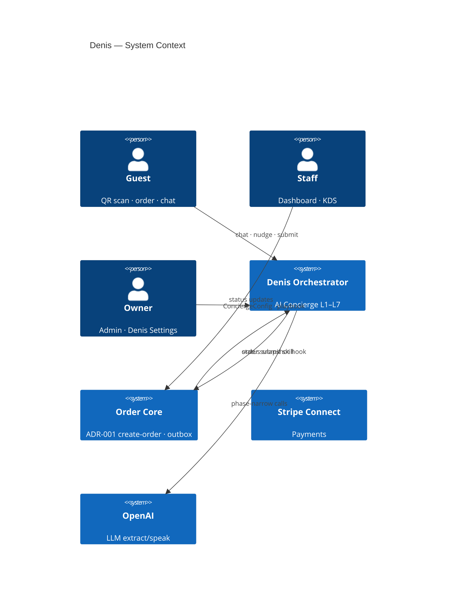
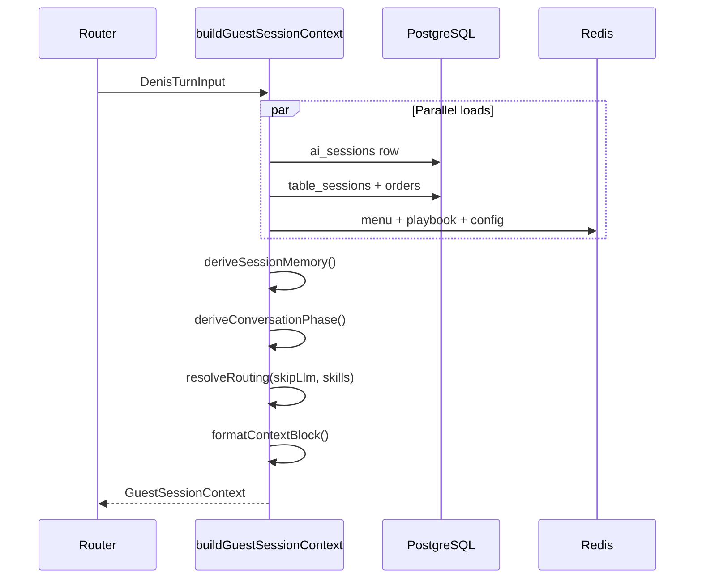
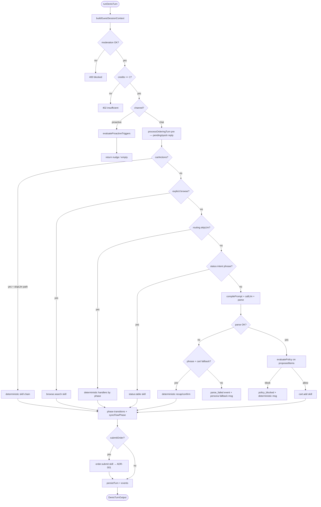
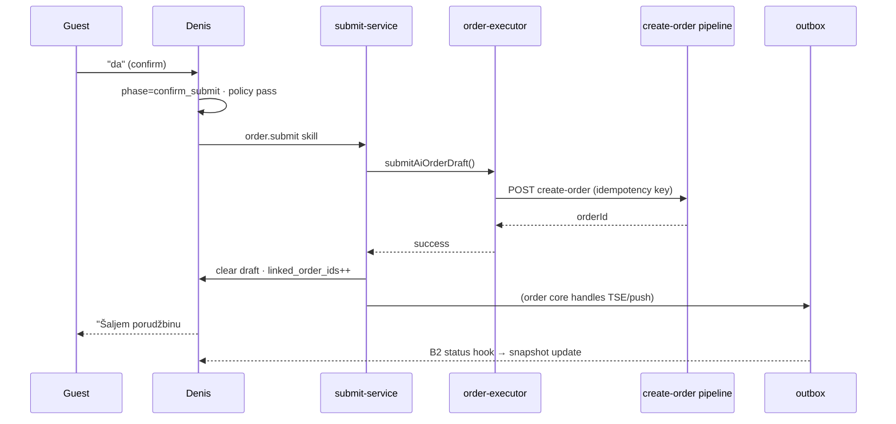

# ADR-002 — Denis Architecture (Detailed Specification)

| Field | Value |
|-------|-------|
| **Status** | **Proposed** — bootstrap spec; ultimate north star is [ADR-005 Maximum](./ADR-005-denis-maximum.md) · kernel is [ADR-004](./ADR-004-denis-kernel.md) |
| **Date** | 2026-05-27 |
| **Audience** | Engineering, product, Cursor agents |
| **Codename** | **Denis** — connected AI head waiter |

> **ADR-002** = decision + capability model.  
> **This document** = Phase 1 bootstrap (modules, APIs, flows).  
> **For platform target architecture**, see **[ADR-003](./ADR-003-denis-platform-v2.md)** (PPAN pipeline, event timeline, Flow DSL).

---

## 0. Executive summary

Denis is **not** a smarter chatbot. It is an **orchestrated system**:

1. **One truth** per turn — `GuestSessionContext` fuses 11 input planes.
2. **One state machine** — `ConversationPhase` drives routing; money paths skip LLM.
3. **One config** — `ConciergeConfig` per location (merged org → location).
4. **One session graph** — chat, nudge, conversion, submit share `aiSessionId`.
5. **One audit trail** — `ai_order_events` records every decision.

LLM role: **language + menu mapping only**. Everything else is code.

---

## 1. System context diagram



---

## 2. Layer responsibilities (detailed)

### L1 — Truth Store

| Store | Key | TTL | Owner |
|-------|-----|-----|-------|
| PostgreSQL `ai_sessions` | session UUID | session lifetime | orchestrator |
| PostgreSQL `orders` | order UUID | permanent | order core |
| PostgreSQL `ai_order_events` | event UUID | permanent | orchestrator |
| Redis `ai:menu:{locationId}` | location | 300s | menu-cache |
| Redis `ai:playbook:{locationId}` | location | 300s | playbook loader |
| Redis `ai:config:{locationId}` | location | 300s | config resolver |

**Invariant:** No module-level `Map`/`Set` for guest/session state (serverless rule).

### L2 — Skill Executor

Skills are **pure functions** with typed I/O. No skill calls another skill directly — router sequences them.

```typescript
type SkillContext = {
  guest: GuestSessionContext;
  catalog: AiCatalog;
  admin: SupabaseClient;
};

type SkillResult = {
  guest: GuestSessionContext;       // updated draft/phase/memory
  message?: string;
  recommendations?: AiChatRecommendation[];
  submitOrder?: boolean;
  events: AiOrderEventInsert[];
};
```

### L3a — State (phase + fusion)

- `buildGuestSessionContext()` — read-only assembly
- `deriveSessionMemory()` — computed facts
- `syncFlowPhase()` — write phase after transition

### L3b — Policy Engine

- `evaluatePolicy(action, ctx)` — runs before any skill with side effects
- Returns block / allow / modify

### L3c — LLM Adapter

- `compilePrompt(ctx, phase)` — L6
- `callLlm(compiled)` — existing openai-client
- `parseStructured(raw, phase)` — phase-specific schema

### L4 — Orchestrator Router

Single entry: `runDenisTurn(input: DenisTurnInput): DenisTurnOutput`

Wrappers:
- `handleAiChat()` → `runDenisTurn({ channel: "chat", ... })`
- `handleProactiveEvaluate()` → `runDenisTurn({ channel: "proactive", ... })`

### L5 — Proactive Brain

Uses same `buildGuestSessionContext` + `proactive-triggers.ts` + config gates.

### L6 — Prompt Compiler

Deterministic string build — no LLM.

### L7 — Admin & Ops

Denis Settings UI, golden tests, `ai_insights`, session replay (B4).

---

## 3. Module layout (target tree)

New files marked with `★`. Existing files marked with `→` (refactor in place).

```
src/lib/ai/
├── orchestrator/                    ★ L4
│   ├── run-denis-turn.ts            ★ main router
│   ├── turn-input.ts                ★ types
│   ├── route-decision.ts            ★ decision tree
│   └── persist-turn.ts              ★ session + events atomic patch
├── context/                         ★ L3a fusion
│   ├── build-guest-session-context.ts
│   ├── derive-session-memory.ts
│   ├── format-context-block.ts
│   └── loaders/
│       ├── load-table-orders.ts     → wraps order-context.ts
│       ├── load-operational-flags.ts
│       └── load-order-status-snapshot.ts
├── phase/                           ★ L3a state machine
│   ├── conversation-phase.ts
│   ├── phase-transitions.ts
│   └── phase-guards.ts
├── config/                          ★ L7 config
│   ├── concierge-config.schema.ts   ★ zod
│   ├── concierge-defaults.ts
│   ├── resolve-concierge-config.ts  ★ org → location merge
│   └── config-cache.ts
├── policy/                          ★ L3b
│   ├── evaluate-policy.ts
│   ├── rules/
│   │   ├── allergens.ts
│   │   ├── ordering-limits.ts
│   │   ├── operational.ts
│   │   └── upsell-caps.ts
│   └── policy-messages.ts           ★ i18n deterministic errors
├── skills/                          ★ L2 registry
│   ├── registry.ts
│   ├── cart-add.ts
│   ├── cart-recap.ts
│   ├── cart-resolve-pending.ts
│   ├── order-submit.ts              → wraps submit-service
│   ├── browse-search.ts             → wraps catalog-search
│   ├── status-table.ts
│   ├── upsell-food-once.ts
│   ├── handoff-waiter.ts
│   └── handoff-payment.ts
├── prompt/                          ★ L6 compiler
│   ├── compile-system-prompt.ts     → replaces build-system-prompt usage
│   ├── phase-blocks.ts
│   ├── persona-block.ts
│   └── menu-slice.ts                ★ B8 token trim
├── proactive/                       ★ L5 (server)
│   ├── evaluate-proactive.ts
│   └── nudge-templates.ts
├── events/                          ★ audit
│   ├── emit-ai-order-event.ts
│   └── event-types.ts
├── chat-service.ts                  → thin wrapper → runDenisTurn
├── build-system-prompt.ts           → deprecated; shim to compile-system-prompt
├── ordering/                        → keep; called by skills
│   ├── order-flow.ts                → merge into phase/ + skills
│   ├── ordering-turn.ts
│   ├── draft-engine.ts
│   └── ...
└── ...

src/app/api/ai/
├── chat/route.ts                    →
├── order/submit/route.ts            →
├── conversion/route.ts              →
├── proactive/evaluate/route.ts      ★ B1
└── session/replay/route.ts          ★ B4 admin only
```

---

## 4. Core types (canonical)

### 4.1 ConversationPhase

```typescript
export type ConversationPhase =
  | "greeting"
  | "clarify"
  | "ordering"
  | "upsell_food"
  | "upsell_dessert"
  | "recap"
  | "confirm_submit"
  | "submitted"
  | "handoff";
```

Stored at: `order_draft.flow.phase` (JSONB on `ai_sessions`).

### 4.2 AiOrderFlowState (extended)

```typescript
export type AiOrderFlowState = {
  phase: ConversationPhase;
  foodUpsellAsked: boolean;
  dessertUpsellAsked: boolean;
  awaitingFinalConfirm: boolean;
  lastRecapAt: string | null;          // ISO — re-show recap if guest confused
  declinedCategories: string[];        // "food" | "dessert" | "pairing"
  handoffReason: "waiter" | "payment" | null;
};
```

### 4.3 DenisTurnInput / Output

```typescript
export type DenisChannel = "chat" | "proactive" | "status_poll";

export type DenisTurnInput = {
  channel: DenisChannel;
  locationId: string;
  tableId: string;
  sessionToken: string;              // table_sessions token
  aiSessionId?: string;
  userMessage?: string;              // chat only
  language: string;
  preferences?: AiGuestPreferences;
  browsingContext?: string | null;
  manualCartSnapshot?: ManualCartSnapshot | null;
  clientTelemetry?: ClientTelemetry | null;
  allowOrdering?: boolean;
};

export type DenisTurnOutput = {
  sessionId: string;
  message: string;
  phase: ConversationPhase;
  intent: AiConciergeIntent;
  recommendations: AiChatRecommendation[];
  cartActions: ValidatedCartAction[];
  quickReplies: string[];
  submitOrder: boolean;
  proactiveNudge?: ProactiveNudge | null;
  creditsDebited: number;
  contextHash: string;
};
```

### 4.4 ManualCartSnapshot (client → server, read-only)

```typescript
export type ManualCartSnapshot = {
  revision: number;
  items: Array<{
    productId: string;
    productName: string;
    quantity: number;
    serveSize: string | null;
    lineTotal: number;
  }>;
  updatedAt: string;
};
```

Denis **never** mutates manual cart. May mention it in recap if `config.context.manualCart`.

### 4.5 OrderStatusSnapshot

```typescript
export type OrderStatusSnapshot = {
  updatedAt: string;
  orders: Array<{
    orderId: string;
    orderNumber: number | null;
    status: string;
    items: string[];                 // "2× Cola 0.5L"
    etaMinutes: number | null;
  }>;
};
```

Written by: B2 hook on order status change + refreshed each turn if stale > 30s.

---

## 5. GuestSessionContext — build pipeline



### 5.1 Build steps (ordered)

| Step | Function | Output field |
|------|----------|--------------|
| 1 | Load `ai_sessions` or init empty draft | `sessionId`, messages count |
| 2 | `resolveConciergeConfig(org, location)` | `config` |
| 3 | `compilePersona(config, playbook, examples)` | `persona` |
| 4 | `loadTableOrders(tableId, sessionToken)` | `fusion.tableOrders` |
| 5 | Merge `order_draft` from session | `fusion.cart` |
| 6 | Parse scroll / browsingContext | `fusion.scroll` |
| 7 | Attach manualCartSnapshot if enabled | `fusion.manualCart` |
| 8 | Load status snapshot | `fusion.orderStatus` |
| 9 | `deriveSessionMemory(all planes)` | `memory` |
| 10 | `deriveConversationPhase(draft, memory, config)` | `phase` |
| 11 | `resolveRouting(phase, message, config)` | `routing` |
| 12 | `formatContextBlock(...)` | `promptBlock` |
| 13 | `sha256(promptBlock + phase + cartRevision)` | `contextHash` |

### 5.2 Context block format (LLM-facing)

```
GUEST SESSION CONTEXT
session_id: {uuid}
phase: ordering
persona: Denis · warm_short · max 45 words
language: sr (guest) / venue: de

MEMORY
- minutes_at_table: 12
- has_ordered: true
- drinks_only_cart: true
- food_upsell_not_yet_asked: true
- top_viewed: Espresso Martini (3×), Cola (1×)
- declined: none

CART (AI draft — authoritative for AI submit)
- 1× Cola 0.5L [product-uuid]

TABLE ORDERS (already sent to kitchen)
- #47 · preparing · 1× Burger, 1× Cola 0.5L

MANUAL CART (guest UI — read only)
- 1× Espresso Martini

PREFERENCES
- allergies: gluten
- mood: celebrating

OPERATIONAL
- accepting_orders: true
- ai_concierge_enabled: true

PHASE DIRECTIVE
Phase=ordering — map utterance to proposedItems; do not re-ask serve size if present.
```

---

## 6. Router decision tree



### 6.1 Deterministic routing table (skip LLM)

| Condition | Handler | Phase transition |
|-----------|---------|------------------|
| `draft.pending` + size/mod reply | `cart.resolvePending` | clarify → ordering |
| `isGuestDoneOrdering(msg)` | `cart.recap` | → recap → confirm_submit |
| `isGuestDecliningMore(msg)` + upsell done | `cart.recap` | upsell_food → recap |
| `isGuestFinalConfirm(msg)` + recap shown | `order.submit` | confirm_submit → submitted |
| Status regex match | `status.table` | no change |
| Handoff regex + config | `handoff.*` | → handoff |

---

## 7. Phase transition matrix

| From | Event | Guard | To | Side effect |
|------|-------|-------|-----|-------------|
| greeting | first item parsed | — | ordering / clarify | cart.add |
| clarify | pending resolved | — | ordering | cart.add |
| ordering | drinks-only item added | `upsell.foodAfterDrinks` | upsell_food | upsell.askFoodOnce |
| ordering | food item OR mixed | — | ordering | — |
| ordering | done phrase | has items | recap | cart.recap |
| upsell_food | decline / done | — | recap | — |
| upsell_food | food added | — | ordering | cart.add |
| recap | recap shown | — | confirm_submit | set awaitingFinalConfirm |
| confirm_submit | guest confirms | policy pass | submitted | order.submit |
| submitted | new order intent | — | ordering | new draft round |
| submitted | food delivered + config | dessert enabled | upsell_dessert | template nudge |
| * | waiter/payment phrase | handoff enabled | handoff | handoff skill |
| handoff | resolved / new order | — | greeting / ordering | clear handoffReason |

Every row emits `ai_order_events.phase_changed` with `{ from, to, trigger }`.

---

## 8. API specifications

### 8.1 POST `/api/ai/chat` (existing — contract frozen + extended)

**Request**

```typescript
{
  locationId: uuid;
  tableId: uuid;
  sessionToken: string;
  message: string;                    // max 500
  language: string;                   // de | en | sr | hr ...
  sessionId?: uuid;
  preferences?: { allergies?: string[]; mood?: string };
  includeOrderContext?: boolean;      // deprecated → always true internally
  browsingContext?: string;           // max 2000
  manualCartSnapshot?: ManualCartSnapshot;  ★ new optional
  allowOrdering?: boolean;
}
```

**Response**

```typescript
{
  message: string;
  sessionId: string;
  intent: AiConciergeIntent;
  recommendations: AiChatRecommendation[];
  cartActions: ValidatedCartAction[];
  quickReplies: string[];
  submitOrder: boolean;
  creditsRemaining: number;
  phase?: ConversationPhase;          ★ new — client can adapt UI
  contextRevision?: number;           ★ cartRevision echo
}
```

**Credits:** Debit 1 only when LLM called OR `config.credits.chargeDeterministic`. Proactive never debits by default.

### 8.2 POST `/api/ai/proactive/evaluate` ★ B1

**Request**

```typescript
{
  locationId: uuid;
  tableId: uuid;
  sessionToken: string;
  aiSessionId: uuid;
  browsingContext?: string;
  manualCartSnapshot?: ManualCartSnapshot;
  clientTelemetry?: { browseMinutes: number; cartItemCount: number };
}
```

**Response**

```typescript
{
  nudge: {
    kind: "browse_nudge" | "drink_pairing" | "dessert_nudge" | "slow_kitchen" | "review";
    message: string;
    recommendation?: { productId; name; price; imageUrl; reason };
    orderId?: string;
  } | null;
  sessionId: string;
  contextHash: string;
}
```

Rate limit: 12/min per table (separate from chat).

### 8.3 POST `/api/ai/order/submit` (unchanged path)

Must verify:
- `aiSessionId` active
- `phase === confirm_submit` OR explicit re-submit guard
- `order_draft` non-empty, no `pending`
- ADR-001 idempotency via device fingerprint

### 8.4 GET `/api/ai/session/replay` ★ B4 (staff auth)

Returns ordered `ai_order_events` + message history for support.

---

## 9. Skill registry (full)

| SkillId | Input | Output | Policy checks | ADR-001 |
|---------|-------|--------|---------------|---------|
| `cart.add` | proposedItems[] | draft++, cartActions | allergens, limits, 86 | — |
| `cart.resolvePending` | userMessage | draft++, cartActions | serve size valid | — |
| `cart.recap` | draft | message, phase→recap | — | — |
| `order.submit` | draft | orderId, clear draft | max total, closed | **yes** |
| `browse.search` | query | recommendations | — | — |
| `status.table` | snapshot | message | — | — |
| `upsell.askFoodOnce` | draft | message, phase→upsell_food | upsell caps | — |
| `upsell.dessert` | memory | message | dessert not declined | — |
| `proactive.pairing` | trigger | nudge | min interval, nudges_shown | — |
| `handoff.waiterCall` | — | message + API call | config enabled | — |
| `handoff.paymentHint` | — | message + checkout deep link | config enabled | — |

Registration:

```typescript
const SKILL_REGISTRY: Record<SkillId, SkillDefinition> = { ... };

function runSkill(id: SkillId, ctx: SkillContext, payload: unknown): Promise<SkillResult>;
```

---

## 10. Policy engine — rule catalog

Rules run in order; first block wins.

| Priority | Rule ID | Condition | Action |
|----------|---------|-----------|--------|
| 10 | `OPERATIONAL_CLOSED` | !acceptingOrders && blockWhenClosed | block + msg |
| 20 | `PHASE_SKILL_GATE` | skill ∉ allowedSkills | block |
| 30 | `ALLERGEN_STRICT` | product allergens ∩ guest allergies | block + suggest safe |
| 40 | `SERVE_SIZE_REQUIRED` | drink without size + policy | block → clarify |
| 50 | `MAX_ITEMS` | draft items > maxItemsPerOrder | block |
| 51 | `MAX_QTY` | line qty > maxQuantityPerLine | block |
| 52 | `MAX_TOTAL` | draft total > maxOrderTotal | block |
| 60 | `UPSELL_CAP` | upsell count ≥ maxUpsellsPerSession | block upsell skills |
| 61 | `DECLINE_RESPECT` | category in declinedCategories | block category upsell |
| 70 | `ALCOHOL_WITHOUT_FOOD` | config + drinks-only alcohol | block/warn |
| 80 | `PRODUCT_UNAVAILABLE` | !is_available | block |

Messages: `policy-messages.ts` keyed by `{ ruleId, language }`.

---

## 11. Prompt compiler stages

```typescript
function compileSystemPrompt(ctx: GuestSessionContext): string {
  return [
    multilingualPolicyBlock(ctx.config.language.venueDefault),
    baseSafetyBlock(),
    personaBlock(ctx.persona, ctx.config.persona),
    phaseBlock(ctx.phase, ctx.config.ordering.flow),
    ctx.promptBlock,
    menuSlice(ctx.catalog, ctx.memory, ctx.config.context.maxContextTokens),
    outputSchemaBlock(ctx.phase),
  ].join("\n\n");
}
```

### 11.1 Phase-specific output schemas

| Phase | JSON fields allowed |
|-------|---------------------|
| greeting, ordering, clarify | intent, message, proposedItems, quickReplies, recommendations |
| upsell_* | message only (template preferred — LLM optional speak) |
| recap, confirm_submit | **LLM skipped** — no call |
| submitted, handoff | intent, message, recommendations (no submitOrder) |

### 11.2 Menu slice (B8)

Include full menu if tokens < budget. Else:
1. Products in cart + pending
2. Top viewed (scroll)
3. Same category as viewed
4. Truncate rest

---

## 12. Event catalog (`ai_order_events`)

| event_type | payload schema | When |
|------------|----------------|------|
| `phase_changed` | `{ from, to, trigger }` | every transition |
| `context_built` | `{ contextHash, phase, sourcesUsed[] }` | start of turn |
| `llm_skipped` | `{ reason, skillId? }` | deterministic path |
| `llm_called` | `{ model, promptTokens, completionTokens }` | after OpenAI |
| `parse_failed` | `{ error, rawPreview }` | parse error |
| `policy_blocked` | `{ ruleId, productId? }` | policy block |
| `cart_applied` | `{ actions[], cartRevision }` | after cart.add |
| `draft_updated` | `{ cartRevision }` | any draft write |
| `submit_requested` | `{ cartRevision, itemCount }` | confirm |
| `order_created` | `{ orderId, orderNumber }` | existing |
| `status_notified` | `{ orderId, status }` | status skill |
| `proactive_shown` | `{ kind, orderId? }` | nudge displayed |
| `proactive_dismissed` | `{ kind }` | client dismiss |
| `handoff_triggered` | `{ kind }` | waiter/payment |

Migration `00087` extends CHECK constraint. Never edit `00087` after push — new migration for additions.

---

## 13. ConciergeConfig merge algorithm

```typescript
function resolveConciergeConfig(
  platform: ConciergeConfig,      // concierge-defaults.ts
  org: Partial<ConciergeConfig> | null,
  location: Partial<ConciergeConfig> | null
): ConciergeConfig {
  return deepMerge(platform, org ?? {}, location ?? {}, {
    arrays: "replace",              // forbiddenPhrases replaced wholesale
    maxDepth: 4,
  });
}
```

Validation: Zod schema parse after merge. Invalid location config → log warning + fall back to org → platform.

Cache invalidation: admin save → `invalidateConfigCache(locationId)`.

---

## 14. Integration with ADR-001 Order Core



**Denis must NOT:**
- Call TSE, push, or webhooks directly (outbox only)
- Duplicate submit paths
- Skip idempotency keys

---

## 15. Guest UI integration

### 15.1 Session ID lifecycle

```typescript
// guest-ai-token / guest-session-storage
1. First AI touch (chat open OR nudge OR proactive) → POST chat or GET session
2. Store aiSessionId in sessionStorage keyed by locationId+token
3. All subsequent calls include sessionId
4. menu-view, ai-concierge-chat, useSmartNudges → same id
```

### 15.2 Client changes (A8)

| Component | Change |
|-----------|--------|
| `ai-concierge-chat.tsx` | send `manualCartSnapshot`; display `phase` |
| `menu-view.tsx` | `includeOrderContext` always; pass manual cart |
| `use-smart-nudges.ts` | poll `/api/ai/proactive/evaluate` instead of local-only logic (B1) |
| `product-recommendation-card.tsx` | conversion API unchanged |

### 15.3 Phase-aware UI (optional polish)

| Phase | UI behavior |
|-------|-------------|
| recap / confirm_submit | Show order summary chip above input |
| clarify | Show quick-reply size buttons |
| submitted | Show status pill with last order # |

---

## 16. Security & RLS

| Resource | Guest | Staff |
|----------|-------|-------|
| `ai_sessions` | write via service role API only | read org |
| `ai_order_events` | no direct access | read org |
| `ai_concierge_config` | no access | admin write location |
| Replay endpoint | 401 | manager+ |

Existing: `verifyAiGuestContext()` — keep on every route.  
Rate limits (existing `AI_CONFIG.rateLimits`) + proactive separate cap.

Moderation: `moderateGuestInput()` before router.

---

## 17. Caching & invalidation

| Key | Invalidate on |
|-----|---------------|
| `ai:menu:{locationId}` | menu CRUD, product availability |
| `ai:playbook:{locationId}` | playbook/examples save |
| `ai:config:{locationId}` | Denis Settings save |

Context itself is **never cached** — built fresh each turn.

---

## 18. Golden scenarios (acceptance tests)

### Ordering (8)

1. `denis_happy_path_sr` — cola 0.5 → ne hvala → da → submit  
2. `denis_clarify_size` — cola → 0.5L → upsell → recap  
3. `denis_multi_item` — burger + cola (allowMultiItemParse)  
4. `denis_allergy_block` — gluten allergy → no pasta recommend  
5. `denis_parse_fail_recovery` — simulate bad JSON + "to je sve"  
6. `denis_de_confirm` — Nein danke → Ja bitte  
7. `denis_no_upsell_when_disabled` — config upsell off  
8. `denis_max_items_block` — policy max items  

### Proactive (4)

9. `proactive_pairing_after_food`  
10. `proactive_dessert_after_delivered`  
11. `proactive_slow_kitchen`  
12. `proactive_respect_min_interval`  

### Policy + handoff (4)

13. `policy_closed_venue`  
14. `handoff_waiter_phrase`  
15. `status_query_snapshot`  
16. `manual_cart_awareness_in_prompt`  

### Multilingual (2)

17. `lang_follow_guest_hr`  
18. `lang_unknown_fallback_de`  

Each test: mock catalog + deterministic session seed → `runDenisTurn` assertions on phase, message substring, events.

---

## 19. Implementation tracks — acceptance criteria

### Phase A (required for Denis v1)

| Track | Done when |
|-------|-----------|
| **A1** | ADR-002 + this doc approved |
| **A2** | Zod schema; merge resolver; Redis cache; unit tests |
| **A3** | `buildGuestSessionContext` fuses ≥8 planes; contextHash stable |
| **A4** | All phase transitions tested; legacy bool migration |
| **A5** | Router skips LLM ≥95% on golden 1–6; policy blocks logged |
| **A6** | Prompt size ↓ vs current; phase blocks verified |
| **A7** | All event types emitted; staff can query last 50 events |
| **A8** | Single aiSessionId across chat + menu nudge |
| **A9** | 18 golden tests green in CI |
| **A10** | Admin saves config; guest demo reflects within 5 min |

### Phase B (Denis v2)

| Track | Done when |
|-------|-----------|
| **B1** | Nudge server API; client hook migrated |
| **B2** | Snapshot updates within 60s of order status change |
| **B3** | Manual cart appears in context block |
| **B4** | Replay UI shows timeline |
| **B5** | Return visit flag without PII storage |
| **B6** | A/B variant selects different example set |
| **B7** | Waiter call triggered from chat phrase |
| **B8** | Menu slice keeps prompts under token budget |

---

## 20. Migration plan

| # | File | Content |
|---|------|---------|
| 00086 | `ai_concierge_config.sql` | JSONB on org + location |
| 00087 | `ai_order_events_extend.sql` | Extended event_type CHECK |
| 00088 | `ai_sessions_flow_version.sql` | Optional: `flow_version: 2` in draft schema comment only (no column) |

**Never** rewrite old migrations. Seed default config for Skyline demo location in `00086` optional UPDATE.

---

## 21. Operator one-liner (for Cursor)

```
ADR Denis mode. Read docs/architecture/ADR-002-ai-concierge-orchestrator.md +
ADR-002-denis-architecture-detail.md. Execute next open track (A2–A10).
One PR per track. Session report at end. Do not commit unless asked.
```

---

## 22. Mapping — today → Denis

| Today | Denis module |
|-------|--------------|
| `chat-service.ts` (900 lines) | `orchestrator/run-denis-turn.ts` + thin wrapper |
| `build-system-prompt.ts` | `prompt/compile-system-prompt.ts` |
| `order-flow.ts` | `phase/*` + `skills/cart-recap.ts` |
| `ordering-turn.ts` | `skills/cart-add.ts` + pre-turn in router |
| `proactive-triggers.ts` | `proactive/evaluate-proactive.ts` |
| `use-smart-nudges.ts` (client) | calls B1 API |
| scattered prompt blocks | `context/format-context-block.ts` |

---

## 23. Document index

| Doc | Purpose |
|-----|---------|
| [ADR-002](./ADR-002-ai-concierge-orchestrator.md) | Decision, capabilities, config overview |
| **This doc** | Modules, APIs, flows, types, tests |
| ADR-001 | Order core — Denis submits through it only |

---

**Next step:** Approve A1 → begin A2 (`ConciergeConfig` schema + merge resolver).
