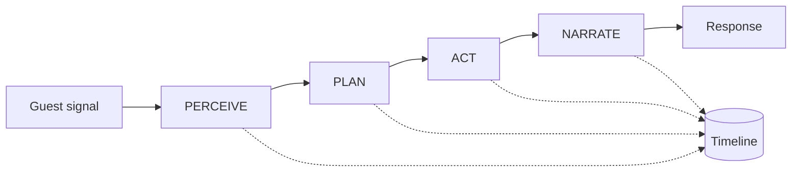
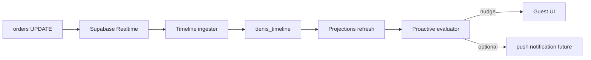

# ADR-003: Denis Platform Architecture (v2)

| Field | Value |
|-------|-------|
| **Status** | **Proposed** — platform v2 (Layer 1 spine); see [ADR-004 Kernel](./ADR-004-denis-kernel.md) + [ADR-005 Maximum](./ADR-005-denis-maximum.md) |
| **Date** | 2026-05-27 |
| **Depends on** | [ADR-001](./ADR-001-universal-ordering-platform.md) · [ADR-002](./ADR-002-ai-concierge-orchestrator.md) |
| **Codename** | **Denis** |

---

## 0. Why ADR-002 is not enough

ADR-002 is a **good MVP orchestrator spec**. It is **not** yet a platform architecture:

| Gap in ADR-002 | Why it limits you |
|----------------|-------------------|
| Flat `GuestSessionContext` string block | Hard to extend, hard to replay, hard to test planes in isolation |
| Phase enum written to JSONB | State can drift from reality; debugging “why recap?” is guesswork |
| Router as big `if/else` | Becomes unmaintainable at 20+ skills |
| LLM still in critical path for ordering | Parse failures remain a product risk |
| Proactive bolted on later (B1) | Second-class citizen — not “one brain” |
| No realtime sensory plane | Denis is blind between guest messages |
| No eval / regression system | Quality rots silently on prompt changes |
| No formal boundary to Order Core | AI types leak toward `create-order` over time |

**ADR-003** defines Denis as a **platform**: event-sourced, multi-plane, with LLM relegated to **narration + ambiguous extraction only**.

ADR-002 tracks (A2–A10) remain valid as **Phase 1 bootstrap** — they build toward v2, not throwaway work.

---

## 1. North-star model: four cognitive tiers

Every guest signal is handled by the **lowest sufficient tier**. Higher tiers are fallback only.

```
┌─────────────────────────────────────────────────────────────────┐
│ T0 REFLEX        │ 0ms · pure code · NEVER fails                │
│ Regex/handlers   │ CONFIRM, DECLINE, DONE, SIZE tap, HANDOFF    │
├─────────────────────────────────────────────────────────────────┤
│ T1 ROUTINE       │ 1–5ms · deterministic skills                 │
│ Policy+catalog   │ cart.add, recap, submit, browse, status      │
├─────────────────────────────────────────────────────────────────┤
│ T2 COGNITIVE     │ 200–800ms · LLM STRUCTURED extract ONLY      │
│ Slot filling     │ map utterance → OrderSlots (not free chat)   │
├─────────────────────────────────────────────────────────────────┤
│ T3 NARRATION     │ 200–500ms · LLM speak ONLY                   │
│ Persona          │ natural reply FROM committed facts           │
└─────────────────────────────────────────────────────────────────┘
```

**Rule:** T3 never decides. T3 only phrases what T0–T2 already committed.

**Guest experience:** Feels like a genius waiter (T3 voice) with accountant reliability (T0–T1).

---

## 2. PPAN pipeline (replaces monolithic router)

Each turn is a **pipeline with artifacts**, not one function:



### 2.1 PERCEIVE — ingest & normalize

**Input channels (unified):**

| Channel | Signal |
|---------|--------|
| `chat.message` | text |
| `ui.quick_reply` | structured tap |
| `ui.conversion` | product card add |
| `telemetry.scroll` | dwell / views |
| `telemetry.manual_cart` | Zustand snapshot |
| `realtime.order_status` | Supabase orders UPDATE |
| `realtime.waiter_call` | optional |
| `system.proactive_tick` | timer / cron |

**Output artifact:** `PerceptionFrame`

```typescript
type PerceptionFrame = {
  channel: PerceptionChannel;
  raw: unknown;
  normalizedText: string | null;
  structuredIntent: IntentHypothesis | null;  // from T0
  ingestedAt: string;
  revision: number;                           // monotonic per session
};
```

**T0 intent hypotheses** (no LLM):

```typescript
type GuestIntent =
  | "ORDER" | "CLARIFY_REPLY" | "CONFIRM" | "DECLINE" | "DONE"
  | "BROWSE" | "STATUS" | "HANDOFF_WAITER" | "HANDOFF_PAY"
  | "SMALLTALK" | "UNKNOWN";

type IntentHypothesis = {
  intent: GuestIntent;
  confidence: "certain" | "likely" | "unknown";
  evidence: string;                           // rule id
};
```

If `confidence === "certain"` → skip T2 entirely.

### 2.2 PLAN — decide actions on Context Graph

**Input:** `PerceptionFrame` + materialized `SessionProjection`  
**Output:** `ActionPlan` (ordered list of actions, may be empty)

```typescript
type PlannedAction =
  | { type: "skill"; skillId: SkillId; input: unknown }
  | { type: "slot_extract"; slots: OrderSlotRequest }   // triggers T2
  | { type: "narrate"; factsKey: string }               // triggers T3
  | { type: "noop"; reason: string };

type ActionPlan = {
  actions: PlannedAction[];
  flowNodeId: string;                         // from Flow DSL
  policyDecisions: PolicyDecision[];
};
```

Planning uses **Flow DSL** (§5) + **Policy Engine** — never LLM.

### 2.3 ACT — execute skills (side effects)

Runs `ActionPlan` sequentially. Commits:

- `order_draft` mutations
- `DenisCommand` to Order Core (ACL §8)
- timeline events

**Output:** `ActionResult` with **committed facts** (immutable for this turn).

```typescript
type CommittedFacts = {
  cartRevision: number;
  itemsAdded: ValidatedCartAction[];
  submitTriggered: boolean;
  orderId: string | null;
  phase: FlowNodeId;
  blockedByPolicy: PolicyDecision | null;
};
```

### 2.4 NARRATE — phrase committed facts (T3 optional)

**Input:** `CommittedFacts` + persona config  
**Output:** guest-visible `message` (+ recommendations if browse)

If `plan` already includes template message (recap, upsell) → **skip T3**.

LLM prompt for T3 is tiny:

```
Persona: Denis, warm_short, sr.
Facts (DO NOT CHANGE): {json committed facts}
Write one reply ≤45 words.
```

No `proposedItems` in T3 schema — ever.

---

## 3. Event-sourced Timeline (single source of truth)

**Problem:** `order_draft` + `messages` + scattered flags = drift.  
**Solution:** Append-only **`denis_timeline`** (or extended `ai_order_events`) is authoritative. Everything else is a **projection**.

### 3.1 Timeline events

```typescript
type DenisTimelineEvent =
  | { type: "perception.ingested"; frame: PerceptionFrame }
  | { type: "intent.resolved"; intent: GuestIntent; tier: "T0"|"T2" }
  | { type: "plan.created"; plan: ActionPlan }
  | { type: "skill.executed"; skillId: SkillId; result: unknown }
  | { type: "policy.blocked"; decision: PolicyDecision }
  | { type: "draft.changed"; cartRevision: number; diff: DraftDiff }
  | { type: "flow.transitioned"; from: FlowNodeId; to: FlowNodeId }
  | { type: "order.command.sent"; command: DenisOrderCommand }
  | { type: "order.command.ack"; orderId: string }
  | { type: "narration.sent"; message: string; tier: "template"|"T3" }
  | { type: "realtime.ingested"; source: "orders"; payload: unknown }
  | { type: "proactive.emitted"; nudge: ProactiveNudge };
```

### 3.2 Projections (materialized views)

| Projection | Built from | Used by |
|------------|------------|---------|
| `SessionProjection` | timeline + DB seed | PLAN |
| `CartProjection` | draft.* events | ACT, guest UI |
| `FlowProjection` | flow.* events | PLAN |
| `MemoryProjection` | derived rules on timeline | PLAN, proactive |
| `ContextGraph` | all projections merged | NARRATE, debug |

**Phase is not stored.** Phase = `FlowProjection.currentNodeId`.

Replay = fold timeline → projections (same code as live).

### 3.3 Schema (migration 00089)

```sql
CREATE TABLE IF NOT EXISTS denis_timeline (
  id UUID PRIMARY KEY DEFAULT gen_random_uuid(),
  ai_session_id UUID NOT NULL REFERENCES ai_sessions(id) ON DELETE CASCADE,
  seq BIGSERIAL NOT NULL,
  event_type TEXT NOT NULL,
  payload JSONB NOT NULL DEFAULT '{}',
  context_hash TEXT,
  created_at TIMESTAMPTZ NOT NULL DEFAULT now(),
  UNIQUE (ai_session_id, seq)
);

CREATE INDEX idx_denis_timeline_session
  ON denis_timeline (ai_session_id, seq);
```

Keep `ai_order_events` during migration; dual-write → cutover → deprecate.

---

## 4. Context Graph (replaces flat prompt block)

Instead of one string, Denis maintains a **structured graph** projected for LLM when needed.

```typescript
type ContextGraph = {
  identity: {
    sessionId: string;
    tableId: string;
    locationId: string;
    tableSessionId: string | null;
  };
  config: ConciergeConfig;
  persona: CompiledPersona;
  flow: FlowProjection;
  cart: CartProjection;
  commerce: {
    tableOrders: TableOrderView[];
    aiOrderIds: string[];
    status: OrderStatusView;
  };
  attention: {
    scroll: ScrollView | null;
    manualCart: ManualCartView | null;
    lastMessage: string | null;
  };
  guest: {
    preferences: GuestPreferences;
    memory: MemoryProjection;
    language: LanguageResolution;
  };
  operational: OperationalView;
};
```

**LLM projection:** `projectContextForLlm(graph, purpose: "extract"|"narrate")` → minimal JSON/text subset.

**Benefits:**
- Test each plane without full prompt
- Token budget per plane
- Admin debug UI shows graph nodes, not raw prompt

---

## 5. Flow DSL — configurable conversation graphs

Hard-coded `upsell_food → recap` phases don't scale. Venues get **Flow presets** (data, not code).

### 5.1 Example: `denis_short.flow.json`

```json
{
  "id": "denis_short",
  "version": 1,
  "entry": "welcome",
  "nodes": {
    "welcome": {
      "on": {
        "ORDER": "collect",
        "BROWSE": "browse",
        "SMALLTALK": "welcome"
      },
      "narrate": "template:welcome"
    },
    "collect": {
      "skills": ["cart.add_or_clarify"],
      "on": {
        "DRAFT_DRINKS_ONLY": "upsell_food",
        "DRAFT_HAS_FOOD": "collect",
        "DONE": "recap"
      }
    },
    "upsell_food": {
      "guard": "config.upsell.foodAfterDrinks",
      "skills": ["upsell.ask_food_once"],
      "on": { "DECLINE": "recap", "ORDER": "collect", "DONE": "recap" }
    },
    "recap": {
      "skills": ["cart.recap"],
      "on": { "CONFIRM": "submit", "ORDER": "collect" }
    },
    "submit": {
      "skills": ["order.submit"],
      "on": { "SUCCESS": "post_submit", "FAIL": "recap" }
    },
    "post_submit": {
      "on": { "ORDER": "collect", "STATUS": "status" },
      "narrate": "template:order_sent"
    },
    "browse": { "skills": ["browse.search"] },
    "status": { "skills": ["status.table"] }
  }
}
```

**Planner** = graph walker + guards. New venue flow = new JSON preset, not deploy.

Admin: select preset `denis_short | classic | bar_only | fine_dining`.

---

## 6. Realtime Sensory Plane

Denis must **react without guest typing**.



**Ingest rules:**

| Event | Denis reaction (if config on) |
|-------|-------------------------------|
| Order → `preparing` | update status projection |
| Order → `delivered` (food) | dessert upsell node eligible |
| Order age > threshold | slow_kitchen nudge |
| New order on table | pairing trigger |

Guest opens chat → Denis already knows status (**no “let me check”**).

Implementation: edge function or client forwards compact payload to `POST /api/ai/timeline/ingest` (service role validated).

---

## 7. Order Slot Model (T2 cognitive contract)

LLM does **slot filling**, not conversation.

```typescript
type OrderSlotRequest = {
  utterance: string;
  requiredSlots: Array<
    | "product" | "quantity" | "serve_size" | "modifiers" | "notes"
  >;
  candidates?: { productIds: string[] };  // from catalog search pre-filter
};

type OrderSlots = {
  items: Array<{
    productId: string | null;
    productNameRaw: string | null;
    quantity: number;
    serveSize: string | null;
    modifierIds: string[];
    notes: string;
    confidence: number;
  }>;
  unmappedSpans: string[];
};
```

Pipeline:

1. **Catalog retrieval** — BM25/keyword search narrows to ≤20 products (existing `catalog-search`)
2. **T2 extract** — LLM maps utterance → `OrderSlots` JSON only
3. **T1 validate** — `cart-validator` + policy
4. **T3 narrate** — confirm what was added

Parse failure on slots → retry once → fallback ask clarifying template (not English error).

---

## 8. Anti-Corruption Layer — Order Core boundary

Denis never calls `create-order` internals.

```typescript
// src/lib/denis/acl/denis-order-command.ts
type DenisOrderCommand = {
  idempotencyKey: string;
  aiSessionId: string;
  tableToken: string;
  sessionToken: string;
  deviceFingerprint: string;
  lines: Array<{
    productId: string;
    quantity: number;
    serveSize: string | null;
    modifierIds: string[];
    notes: string;
    expectedUnitPrice: number;      // snapshot for mismatch detection
  }>;
};

// Adapter maps to existing order-executor / create-order API
function executeDenisOrderCommand(cmd: DenisOrderCommand): Promise<OrderAck>;
```

Mismatch price at commit → policy block + refresh menu cache.

---

## 9. Multi-surface unified runtime

One **`DenisRuntime`** instance conceptually serves:

| Surface | Perception channel | Narration output |
|---------|-------------------|------------------|
| Guest chat sheet | `chat.message` | text + quick replies |
| Smart nudge | `system.proactive_tick` | banner |
| Menu AI button | `chat.message` | same session |
| Staff copilot (future) | `staff.message` | internal + guest-facing draft |
| Kiosk (future) | `ui.quick_reply` only | T0/T1 heavy |

Same timeline, same graph, same Flow DSL — different narration channel formatter.

---

## 10. Configuration hierarchy (v2)

```typescript
type DenisConfigBundle = {
  platform: ConciergeConfig;          // defaults
  organization: Partial<ConciergeConfig>;
  location: Partial<ConciergeConfig>;
  flow: FlowDefinition;               // preset id → JSON
  playbook: string;
  examples: AiExampleRow[];
  menuGeneration: number;             // bump invalidates caches
};
```

**Config versioning:** `config_version` on each timeline event → replay with historical config (debug “why did it upsell?”).

---

## 11. Evaluation & safety plane (L8)

Production quality requires **offline regression**, not only golden tests.

### 11.1 Eval harness

```
fixtures/sessions/*.jsonl     # recorded anonymized timelines
eval/run.ts                   # re-fold projections + assert outcomes
eval/score.ts                 # turn count, policy violations, parse rate
```

CI gate: score must not regress on PRs touching `perceive/`, `plan/`, `flow/`.

### 11.2 Safety layers

| Layer | Mechanism |
|-------|-----------|
| Input | moderation (existing) |
| Plan | policy engine |
| Act | cart-validator + ACL |
| Output | forbidden phrases + max words |
| Ops | human staff override flag on session (future) |

---

## 12. Module layout (v2 target)

```
src/lib/denis/
├── runtime/
│   ├── run-pipeline.ts              # PPAN entry
│   ├── perceive/
│   ├── plan/
│   │   ├── flow-engine.ts           # Flow DSL walker
│   │   └── planner.ts
│   ├── act/
│   │   └── skill-runner.ts
│   └── narrate/
│       ├── templates.ts
│       └── narrate-llm.ts
├── timeline/
│   ├── append-event.ts
│   ├── fold-projections.ts
│   └── replay.ts
├── context/
│   ├── context-graph.ts
│   └── project-for-llm.ts
├── intent/
│   ├── reflex-rules.ts              # T0
│   └── slot-extract.ts              # T2
├── acl/
│   └── denis-order-command.ts
├── sensory/
│   ├── realtime-ingest.ts
│   └── proactive-evaluator.ts
├── config/
│   ├── flows/                       # denis_short.flow.json
│   └── resolve-config-bundle.ts
├── eval/                            # CI harness
└── api/
    ├── chat.ts                      # thin
    ├── timeline-ingest.ts
    └── proactive.ts

src/lib/ai/                            # legacy shim → re-export dennis during migration
```

---

## 13. Migration from ADR-002 Phase A → v2

| ADR-002 track | v2 mapping | Notes |
|---------------|------------|-------|
| A2 ConciergeConfig | §10 Config bundle | Add `flowPresetId` |
| A3 GuestSessionContext | §4 Context Graph | refactor, not rewrite |
| A4 Phase machine | §5 Flow DSL | phases become nodes |
| A5 Router | §2 PPAN pipeline | split function |
| A7 ai_order_events | §3 denis_timeline | dual-write period |
| A8 unified session | unchanged | |
| B1 proactive API | §6 Sensory plane | |

**Recommended path:**

1. Ship A2 config + A8 session (low risk)  
2. Introduce `denis_timeline` dual-write alongside current chat  
3. Implement PPAN behind feature flag `DENIS_V2_PIPELINE=1`  
4. Flow DSL for `denis_short` only  
5. Cutover when eval harness green  

---

## 14. Implementation tracks (v2)

### Phase C — Platform core

| Track | Deliverable |
|-------|-------------|
| **C1** | Approve ADR-003 |
| **C2** | `denis_timeline` + append/fold |
| **C3** | T0 reflex intent registry |
| **C4** | Context Graph + projections |
| **C5** | Flow DSL engine + `denis_short.flow.json` |
| **C6** | PPAN pipeline wired to `/api/ai/chat` |
| **C7** | OrderSlots T2 + catalog retrieval |
| **C8** | T3 narration-only LLM path |
| **C9** | DenisOrderCommand ACL |
| **C10** | Eval harness + 20 fixtures |

### Phase D — Sensory & ops

| Track | Deliverable |
|-------|-------------|
| **D1** | Realtime timeline ingest |
| **D2** | Server proactive from projections |
| **D3** | Admin timeline replay UI |
| **D4** | Config versioning + flow preset picker |
| **D5** | Staff copilot channel (optional) |

---

## 15. Success metrics (v2)

| Metric | Target |
|--------|--------|
| T0+T1 handle rate | ≥ 60% of all turns (no LLM) |
| T2 slot extract success | ≥ 97% |
| T3 only when needed | ≥ 50% turns skip T3 (templates) |
| Parse/apology rate | < 0.5% |
| Median turns to submit | ≤ 4 |
| Timeline replay | 100% sessions reproducible |
| Realtime status lag | < 3s in guest context |

---

## 16. What we deliberately avoid

- Autonomous agent loops (unbounded tool calls)  
- LLM-as-router (“what should I do next?”)  
- Storing raw chat as source of truth  
- Cross-venue guest profiling without consent  
- Denis calling fiscal/TSE/push directly  

---

## 17. Document map

| Doc | Role |
|-----|------|
| [ADR-002](./ADR-002-ai-concierge-orchestrator.md) | Product decision + capabilities |
| [ADR-002 detail](./ADR-002-denis-architecture-detail.md) | Phase 1 bootstrap spec |
| **ADR-003 (this)** | Platform target architecture |

---

## 18. Approval

- [ ] PPAN pipeline accepted over monolithic router  
- [ ] Event-sourced timeline as source of truth  
- [ ] Flow DSL for venue conversation presets  
- [ ] T0/T1/T2/T3 cognitive split  
- [ ] Phase C tracks sequenced after ADR-002 bootstrap (or instead of A3–A5 if greenfield preferred)

**Recommendation:** Implement **A2 + A8** from ADR-002, then jump to **C2–C6** rather than finishing A3–A5 (avoid building phase enum twice).
