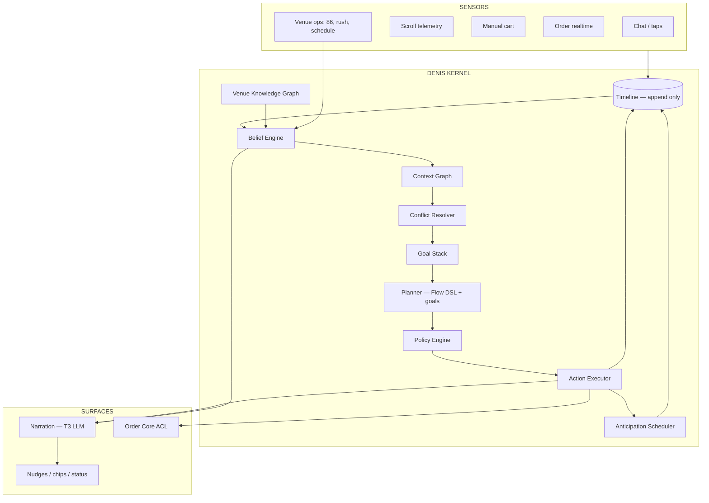
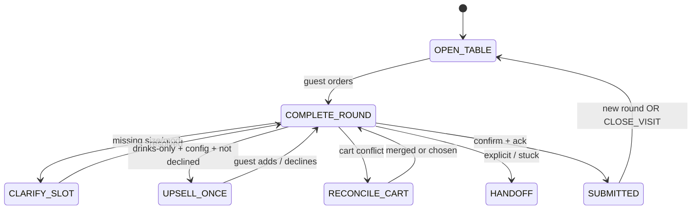
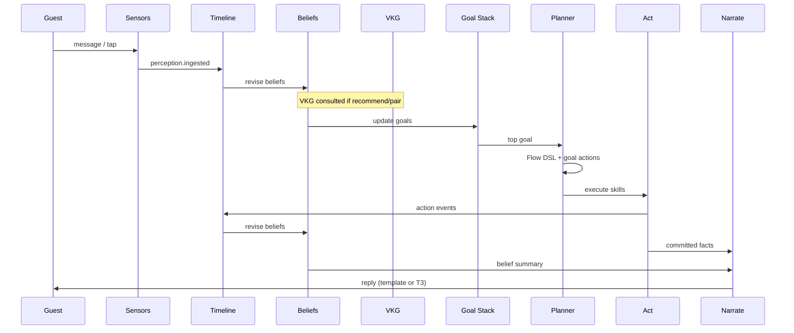

# ADR-004: Denis Kernel — Strong AI Waiter Architecture

| Field | Value |
|-------|-------|
| **Status** | **Proposed** — **Layer 2 (Kernel)** inside [ADR-005 Maximum](./ADR-005-denis-maximum.md) |
| **Date** | 2026-05-27 |
| **Codename** | **Denis** |
| **Depends on** | [ADR-001](./ADR-001-universal-ordering-platform.md) · [ADR-002](./ADR-002-ai-concierge-orchestrator.md) · [ADR-003](./ADR-003-denis-platform-v2.md) |

---

## 0. One sentence

**Denis Kernel** is a **situation-aware, goal-driven runtime** that turns venue data + guest signals into **safe actions** and **natural speech** — with LLM confined to the **language surface** only.

If ADR-003 added a pipeline and timeline, ADR-004 adds **mind structure**: beliefs, goals, knowledge, conflicts, and anticipation.

---

## 1. Why ADR-003 still feels “not enough”

ADR-003 improved ** plumbing** (PPAN, timeline, Flow DSL). It did not yet define ** cognition**:

| Missing | Guest feels |
|---------|-------------|
| No **belief model** | “Denis forgot what I said” |
| No **conflict resolution** | Chat cart ≠ manual cart ≠ kitchen |
| No **goal stack** | Random questions, no direction |
| No **venue knowledge graph** | Generic upsell, wrong pairings |
| No **correction protocol** | “Ne, ipak pivo” breaks flow |
| No **operating modes** | Same behavior at 22:00 rush vs quiet lunch |
| No **anticipation** | Reactive chatbot, not head waiter |
| No **durable waits** | Can't “watch order until ready” natively |

**Strong Denis** = waiter who **knows the room**, **pursues a goal**, **never hallucinates state**.

---

## 2. Denis Kernel — component model



**Kernel invariant:** Only `ACT` mutates external world (cart, orders, waiter calls).  
**Narration reads beliefs + last action results — never inventing.**

---

## 3. Belief Engine — what Denis “knows”

Beliefs are **typed, sourced, expiring facts** — not chat history.

```typescript
type BeliefSource =
  | "guest_said" | "guest_tapped" | "system_inferred"
  | "order_core" | "menu_catalog" | "staff_ops" | "config";

type Belief<T> = {
  key: string;
  value: T;
  confidence: 1.0 | 0.9 | 0.7 | 0.5;   // 1.0 = authoritative
  source: BeliefSource;
  observedAt: string;
  expiresAt: string | null;              // null = until contradicted
  evidenceEventSeq: number;              // timeline seq
};

type DenisBeliefs = {
  guest: {
    language: Belief<string>;
    allergies: Belief<string[]>;
    mood: Belief<string | null>;
    declined: Belief<{ food: boolean; dessert: boolean; pairing: boolean }>;
  };
  table: {
    sessionActive: Belief<boolean>;
    minutesSeated: Belief<number>;
    hasOpenOrders: Belief<boolean>;
    lastOrderStatus: Belief<OrderStatusView | null>;
  };
  cart: {
    authoritative: Belief<"ai_draft" | "manual" | "unified_view">;
    aiDraft: Belief<CartProjection>;
    manual: Belief<ManualCartView | null>;
    pendingClarification: Belief<PendingSlot | null>;
  };
  attention: {
    topProducts: Belief<Array<{ id: string; views: number }>>;
    lastUserIntent: Belief<GuestIntent | null>;
  };
  venue: {
    acceptingOrders: Belief<boolean>;
    operatingMode: Belief<"normal" | "rush" | "kitchen_closed" | "event">;
    unavailableProductIds: Belief<string[]>;
  };
};
```

### 3.1 Belief revision rules

On each timeline event, **Belief Engine** runs revision handlers:

| Event | Belief update |
|-------|---------------|
| `order.command.ack` | `table.hasOpenOrders = true`, confidence 1.0 |
| `realtime.order_status` | `table.lastOrderStatus` refresh |
| `intent.DONE` | `guest.declined.*` or goal complete signal |
| `policy.allergen_block` | mark product unsafe in session memory |
| `manual_cart.changed` | `cart.manual` update; trigger **Conflict Resolver** |

**Low-confidence beliefs** → Denis asks **one** clarifying question (T3), never loops.

---

## 4. Goal Stack — Denis always pursues something

Waiters are not stateless Q&A. They hold **intentions**.

```typescript
type DenisGoal =
  | { type: "OPEN_TABLE"; priority: 10 }           // welcome, first order
  | { type: "COMPLETE_ROUND"; priority: 90 }         // current cart → submit
  | { type: "CLARIFY_SLOT"; slot: PendingSlot; priority: 80 }
  | { type: "UPSELL_ONCE"; category: UpsellCategory; priority: 40 }
  | { type: "INFORM_STATUS"; orderId: string; priority: 50 }
  | { type: "RECONCILE_CART"; priority: 85 }       // conflict detected
  | { type: "HANDOFF"; kind: "waiter" | "payment"; priority: 95 }
  | { type: "CLOSE_VISIT"; priority: 20 };          // review, thank you

type GoalStack = DenisGoal[];  // sorted by priority desc
```

### 4.1 Goal lifecycle



**Planner** picks actions that **advance top goal** — not “whatever LLM said”.

Flow DSL (ADR-003) becomes **one implementation** of goal transitions; goals are the semantic layer owners understand.

---

## 5. Venue Knowledge Graph (VKG)

Pairing, substitutes, and allergens must not be LLM guesses.

### 5.1 Graph model

```typescript
type MenuNode = {
  id: string;                    // productId or categoryId
  kind: "product" | "category" | "tag";
  attrs: {
    menuSection: string;
    allergens: string[];
    price: number;
    aiDescription: string | null;
  };
};

type MenuEdge =
  | { type: "pairs_with"; weight: number; reason: string }
  | { type: "substitute_for"; reason: string }
  | { type: "contains_allergen"; allergen: string }
  | { type: "same_kitchen_route"; section: string }
  | { type: "upsell_after"; condition: "drinks_only" | "food_delivered" };
```

**Sources (layered):**

| Layer | Origin | Update |
|-------|--------|--------|
| L0 | `products`, `categories`, allergens | menu CRUD |
| L1 | `upsell_rules` table (existing) | admin |
| L2 | `ai_description` + tags | admin |
| L3 | Learned edges (optional B+) | `ai_insights` demand signals — **never auto-apply without review** |

### 5.2 VKG queries (deterministic)

| Query | Use |
|-------|-----|
| `pairingFor(orderItems)` | proactive + upsell |
| `safeForAllergies(allergens, candidates)` | policy + recommend |
| `substitute(productId, constraints)` | “nema cola” → suggest zero |
| `explain(productId)` | narration fact bundle for T3 |

LLM receives **VKG result as fact** — “Pairs with: Craft IPA (€5.50)” — not menu dump.

---

## 6. Conflict Resolver — one reality for the guest

**Problem:** AI draft, manual cart, and submitted orders can disagree.

```typescript
type CartConflict =
  | { kind: "duplicate_line"; ai: Line; manual: Line }
  | { kind: "ai_only" | "manual_only"; line: Line }
  | { kind: "price_drift"; productId: string; expected: number; actual: number };

type ResolutionStrategy =
  | "prefer_ai_for_submit"              // AI path submits ai_draft only
  | "offer_merge_recap"                 // Denis asks once: merge or separate
  | "manual_authoritative";              // rare venue config

type ConflictResolution = {
  conflicts: CartConflict[];
  strategy: ResolutionStrategy;
  guestPrompt: string | null;           // template, one shot
  unifiedView: UnifiedCartView;         // for narration only
};
```

**Strong Denis behavior:**

> “Vidim Colu u korpi i Espresso u chatu — da pošaljem oboje kao jednu narudžbinu?”

One question → goal `RECONCILE_CART` → then `COMPLETE_ROUND`.

Never silently merge. Never ignore manual cart if `config.context.manualCart`.

---

## 7. Correction Protocol — “ne, ipak…”

Waiters handle corrections constantly. Dedicated **T0 + goal** path:

| Utterance pattern | Intent | Action |
|-------------------|--------|--------|
| `ne ipak *` / `actually *` / `storniraj` | CORRECT | pop last line or replace slot |
| `ukloni *` / `remove *` | REMOVE | cart.remove skill |
| `promeni u *` | REPLACE | cart.replace skill |
| `duplo` / `još jednu` | ADD_MORE | quantity++ with guard |

**Undo stack** on cart projection (not LLM):

```typescript
type CartUndoEntry = { revision: number; diff: DraftDiff; at: string };
```

Max depth 5. Correction never requires re-parsing full session.

---

## 8. Operating Modes — venue reality

```typescript
type VenueOperatingMode =
  | "normal"
  | "rush"              // shorter narration, skip upsell, faster confirm
  | "kitchen_closed"    // drinks/desserts only suggestions
  | "event"             // fixed menu subset
  | "training";         // staff demo — no real submit

type ModeOverrides = {
  skipUpsell: boolean;
  maxWords: number;
  flowPresetId: string;               // e.g. rush → minimal flow
  allowedMenuNodeIds: string[] | null;
};
```

**Triggers:**

| Signal | Mode |
|--------|------|
| Admin toggle | manual |
| `orders` queue depth > threshold | auto `rush` (optional) |
| Kitchen KDS backlog API (future) | auto `rush` |
| Schedule outside kitchen hours | `kitchen_closed` |

Belief `venue.operatingMode` drives planner **before** Flow DSL.

---

## 9. Anticipation Scheduler — proactive as first-class

Not polling from client. **Kernel schedules future intents:**

```typescript
type ScheduledIntent =
  | { at: string; type: "EVALUATE_PAIRING"; orderId: string }
  | { at: string; type: "DESSERT_UPSELL"; afterOrderId: string }
  | { at: string; type: "SLOW_KITCHEN_CHECK"; orderId: string }
  | { at: string; type: "REVIEW_PROMPT" }
  | { at: string; type: "STATUS_FOLLOWUP"; orderId: string };
```

**Implementation options (pick one in C-track):**

| Option | Pros | Cons |
|--------|------|------|
| **A. Postgres `denis_schedules` + cron** | Simple, ADR-aligned | 1min granularity |
| **B. Vercel Workflow sleep** | Exact timing | Vendor lock |
| **C. Outbox delay events** | Unified with ADR-001 | Needs worker |

Recommendation: **A for v1**, B for premium latency.

Scheduler writes timeline → projection refresh → optional push/nudge API.

---

## 10. Strong PPAN+ — pipeline with beliefs & goals



**Turn budget:** Kernel targets **≤1 T2 call** and **≤1 T3 call** per guest turn; often **0 LLM**.

---

## 11. Narration Contract — T3 can never lie

T3 input schema (strict):

```typescript
type NarrationFacts = {
  persona: { name: string; tone: string; maxWords: number };
  language: string;
  goal: DenisGoal["type"];
  committed: {
    cartSummary?: string;
    addedItems?: string[];
    blockedReason?: string;
    orderNumber?: number;
    statusSummary?: string;
    pairingSuggestion?: { name: string; price: string; vkgReason: string };
    conflictQuestion?: string;
  };
  forbidden: string[];              // must not mention
};
```

**Post-check:** lint narration against facts (regex + small validator). If T3 mentions product not in `committed` → discard → template fallback.

This is how Denis stays **strong** under model variance.

---

## 12. Multi-guest table (v2.1 — design now, build later)

```typescript
type TablePartyModel = {
  activeDeviceCount: number;
  devices: Array<{
    fingerprint: string;
    aiSessionId: string | null;
    lastActiveAt: string;
  }>;
  sharedTableOrders: boolean;         // always true from order core
  perDeviceAiDraft: boolean;          // false → one shared ai draft per table_session
};
```

**Config:** `partyMode: "shared_cart" | "per_device"`.

Strong default for restaurants: **shared_cart** at submit, per-device chat OK.

---

## 13. Staff coupling — Denis hears the house

| Staff action | Kernel belief update |
|--------------|---------------------|
| Order → rejected | notify guest if they asked status |
| Product 86'd | `venue.unavailableProductIds` |
| Rush mode ON | `venue.operatingMode = rush` |
| Staff note on table (future) | `staff.hint` belief → narration |

Denis is not isolated from dashboard — **ops plane** feeds beliefs.

---

## 14. Data architecture (consolidated)

| Store | Role |
|-------|------|
| `denis_timeline` | Source of truth (ADR-003) |
| `ai_sessions` | Session index + denormalized cache for fast load |
| `denis_schedules` | Anticipation jobs |
| `menu_knowledge_edges` | VKG edges (L1 admin + rules) |
| `locations.ai_concierge_config` | Config bundle |
| Redis | menu, config, VKG snapshot |
| Order Core | fiscal/commerce truth |

**Projection cache on `ai_sessions`:**

```json
{
  "beliefs_snapshot": { "...": "trimmed" },
  "goal_top": "COMPLETE_ROUND",
  "flow_node": "recap",
  "cart_revision": 7,
  "last_context_hash": "abc..."
}
```

Full replay still from timeline.

---

## 15. API surface (kernel-native)

| Endpoint | Purpose |
|----------|---------|
| `POST /api/denis/turn` | Unified PPAN+ entry (replaces fat chat handler) |
| `POST /api/denis/sense` | Ingest realtime/manual cart/scroll without chat |
| `POST /api/denis/schedules/tick` | Cron worker for anticipation |
| `GET /api/denis/session/:id/graph` | Admin debug: beliefs + goals + timeline |
| `POST /api/denis/session/:id/replay` | Re-fold from seq |

Guest-facing routes remain thin aliases for compatibility.

---

## 16. Quality system — “strong” means measured

### 16.1 Kernel metrics

| Metric | Strong Denis target |
|--------|---------------------|
| Belief contradictions / session | 0 |
| Cart conflict unresolved > 1 turn | < 1% |
| LLM calls / guest turn (p50) | ≤ 0.5 |
| Correction success rate | ≥ 98% |
| Upsell acceptance (when shown) | tracked per VKG edge |
| Narration lint failures | < 0.1% → template fallback |

### 16.2 Red-team suite

- Allergen bait prompts  
- Price manipulation attempts  
- Prompt injection in guest message  
- Conflicting manual + AI cart  
- Double confirm / double submit  
- Rush mode upsell suppression  

### 16.3 Shadow mode

Run Kernel alongside legacy chat; compare actions without guest impact → cutover when ≥99% action parity on fixtures.

---

## 17. Implementation roadmap (strong path)

**Do not build ADR-002 phase machine.** Start Kernel spine:

| Phase | Tracks | Outcome |
|-------|--------|---------|
| **K0** | Approve ADR-004 | — |
| **K1** | Timeline + belief revision (minimal keys) | replay works |
| **K2** | Goal stack + Flow DSL | directed conversations |
| **K3** | T0 reflex + correction protocol | strong handling |
| **K4** | VKG v1 (pairs_with from upsell_rules) | smart pairing |
| **K5** | Conflict resolver | unified reality |
| **K6** | PPAN+ wired to guest chat | Denis live |
| **K7** | Anticipation scheduler + sense API | proactive brain |
| **K8** | Narration contract + lint | trustworthy speech |
| **K9** | Eval + shadow mode | safe cutover |
| **K10** | Admin graph debugger + mode toggles | operability |

Parallel: **ConciergeConfig** (ADR-002 A2) — required for K1.

---

## 18. Comparison — evolution of specs

| Dimension | ADR-002 | ADR-003 | **ADR-004 Kernel** |
|-----------|---------|---------|---------------------|
| Mental model | Router + phase | PPAN + timeline | **Beliefs + goals** |
| Menu intelligence | Prompt dump | Menu slice | **VKG queries** |
| Cart truth | Single draft | Projections | **Conflict resolver** |
| Corrections | Ad hoc | Slot extract | **Correction protocol + undo** |
| Proactive | Bolt-on | Sensory plane | **Anticipation scheduler** |
| Venue chaos | Ignored | Operating flags | **Operating modes** |
| Speech safety | Hope | T3-only | **Narration contract + lint** |
| Ops integration | Weak | Status snapshot | **Ops → beliefs** |

---

## 19. Approval checklist

- [ ] Denis Kernel (beliefs + goals + VKG) accepted as north star  
- [ ] LLM restricted to T2 slots + T3 narration with lint  
- [ ] Timeline + projections remain source of truth  
- [ ] Conflict resolver required before GA  
- [ ] K1–K10 replace A3–A5 + C5 as primary build sequence  

---

## 20. Operator prompt

```
ADR Denis Kernel mode. Read ADR-004-denis-kernel.md (+ ADR-003 timeline sections).
Implement next open K-track (K1–K10). One PR per track. Shadow mode until K9 green.
Session report at end. Do not commit unless asked.
```

---

**Kernel is required for Maximum Denis** — see [ADR-005](./ADR-005-denis-maximum.md) for Venue OS, surfaces, learning, and full M1–M20 roadmap. Without sci-fi: no AGI, no unbounded agents, no cross-venue memory without consent.
