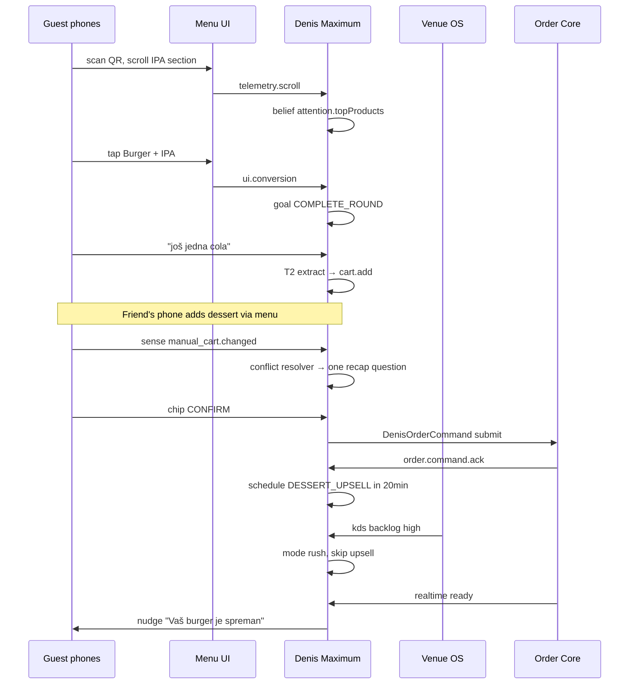

# ADR-005: Denis Maximum — Complete AI Waiter Platform

| Field | Value |
|-------|-------|
| **Status** | **Proposed** — **ultimate north star** (supersedes [ADR-004](./ADR-004-denis-kernel.md) as product ceiling) |
| **Implementation map** | [denis-implementation-map.md](./denis-implementation-map.md) — layers, M-tracks, `pnpm verify:denis` |
| **Date** | 2026-05-27 |
| **Codename** | **Denis** |
| **Depends on** | [ADR-001](./ADR-001-universal-ordering-platform.md) · [ADR-002](./ADR-002-ai-concierge-orchestrator.md) · [ADR-003](./ADR-003-denis-platform-v2.md) · [ADR-004](./ADR-004-denis-kernel.md) |

---

## 0. One sentence

**Denis Maximum** = one **event-sourced runtime** that runs the **Kernel mind** (beliefs, goals, VKG) at **table scope**, the **Venue OS** at **house scope**, and **Learning + Eval** at **product scope** — with LLM only on **T2 slots** and **T3 narration**, never on money or truth.

This is the **strongest Denis we should build**. Everything beyond this is sci-fi or a different product.

---

## 1. Document map — how the ADRs stack

| ADR | Role in Maximum Denis |
|-----|------------------------|
| ADR-002 | Config schema, capabilities V1–V18, bootstrap tracks A2 |
| ADR-003 | PPAN, timeline, Flow DSL, Context Graph, T0–T3 |
| ADR-004 | **Kernel** — beliefs, goals, VKG, conflicts, anticipation |
| **ADR-005** | **Integration** — Venue OS, Party, House, Learn, Surfaces, UI-first, full roadmap |

**Rule:** ADR-004 is not discarded — it is **Layer 1 (Kernel)** inside ADR-005.

---

## 2. Maximum Denis — five layers

```
┌─────────────────────────────────────────────────────────────────────────────┐
│ L5 — PRODUCT EXCELLENCE                                                     │
│ Eval harness · shadow mode · red-team · outcome learning · venue sim        │
└───────────────────────────────────────┬─────────────────────────────────────┘
                                        │
┌───────────────────────────────────────▼─────────────────────────────────────┐
│ L4 — SURFACES (one runtime, many channels)                                  │
│ Guest chat · UI chips · nudges · voice · kiosk · staff copilot                │
└───────────────────────────────────────┬─────────────────────────────────────┘
                                        │
┌───────────────────────────────────────▼─────────────────────────────────────┐
│ L3 — VENUE OS (house scope)                                                 │
│ Floor graph · party model · ops beliefs · staff hints · rush orchestration  │
└───────────────────────────────────────┬─────────────────────────────────────┘
                                        │
┌───────────────────────────────────────▼─────────────────────────────────────┐
│ L2 — DENIS KERNEL (table scope) — ADR-004                                   │
│ Beliefs · goals · VKG · conflict · correction · modes · scheduler           │
└───────────────────────────────────────┬─────────────────────────────────────┘
                                        │
┌───────────────────────────────────────▼─────────────────────────────────────┐
│ L1 — PLATFORM SPINE — ADR-003                                               │
│ Timeline · PPAN+ · Flow DSL · Policy · ACL → Order Core                     │
└─────────────────────────────────────────────────────────────────────────────┘
```

**Invariant (unchanged):** Only `ACT` + Order Core ACL mutate commerce. T3 never decides.

---

## 3. Design philosophy — maximum without sci-fi

| Principle | Maximum Denis behavior |
|-----------|------------------------|
| **UI-first, AI-second** | 80% of orders via tap/chips; Denis fills gaps, never fights the menu |
| **Facts before speech** | Beliefs + VKG + order core → narration; lint every T3 reply |
| **One reality** | Conflict resolver merges AI draft, manual cart, kitchen truth |
| **Lowest cognitive tier wins** | T0 reflex → T1 skills → T2 extract → T3 speak |
| **House-aware** | Rush, 86, KDS backlog, staff hints feed beliefs before planner |
| **Measured strength** | Shadow mode, fixtures, metrics — not prompt hope |
| **Consent for memory** | Returning guest prefs only with explicit opt-in |
| **Human override** | Staff can pause Denis, add hint, approve high-risk suggestions |

**Explicitly out of scope (not “next ADR”):**

- Unbounded agent (“do whatever guest asks”)
- Cross-venue guest profiling without consent
- LLM as router / planner
- Autonomous payment or fiscal actions
- Replacing human floor staff

---

## 4. Layer 2 recap — Kernel (ADR-004, required)

Kernel is **non-negotiable** for Maximum Denis. Summary:

| Component | Guest feels |
|-----------|-------------|
| Belief Engine | “Denis remembers my allergy / decline” |
| Goal Stack | “Denis is leading me to order, not random Q&A” |
| VKG | “This pairing makes sense for *this* menu” |
| Conflict Resolver | “Chat and cart match” |
| Correction Protocol | “Ne, ipak pivo” just works |
| Operating Modes | “Short answers in rush, no upsell when kitchen dying” |
| Anticipation Scheduler | “Denis noticed my food is ready / suggested dessert at right time” |
| Narration Contract + lint | “Denis never invented a dish I didn’t order” |

See [ADR-004 §3–§11](./ADR-004-denis-kernel.md) for full types and rules.

---

## 5. Layer 3 — Venue OS (house scope)

Kernel sees **one table**. Venue OS gives Denis **the room**.

### 5.1 Floor Graph

```typescript
type FloorGraph = {
  locationId: string;
  at: string;
  tables: Array<{
    tableId: string;
    tableSessionId: string | null;
    seatedMinutes: number | null;
    openOrderCount: number;
    lastGuestActivityAt: string | null;
    aiSessionId: string | null;
    operatingHint: "needs_attention" | "ready_for_dessert" | "idle" | null;
  }>;
  house: {
    operatingMode: VenueOperatingMode;
    kdsBacklogMinutes: number | null;
    activeOrderCount: number;
    staffOnFloor: number | null;
  };
};
```

**Refresh:** Realtime (orders, table_sessions) + cron 30s for aggregates. Cached in Redis per location.

**Use:** Staff copilot prioritization; auto `rush` when `kdsBacklogMinutes > threshold`; floor-wide proactive (“kitchen running 25min — set expectations”).

### 5.2 Party Model (multi-device table)

```typescript
type TablePartyModel = {
  tableSessionId: string;
  partyMode: "shared_cart" | "per_device";   // default: shared_cart
  devices: Array<{
    deviceFingerprint: string;
    aiSessionId: string | null;
    displayName: string | null;             // "Phone 1" / guest label optional
    lastActiveAt: string;
    isPrimary: boolean;                     // who gets confirm recap
  }>;
  sharedAiDraftId: string | null;           // one draft when shared_cart
};
```

**Maximum behavior:**

- Multiple chats, **one authoritative cart** at submit (default).
- Device B adds via menu → timeline `manual_cart.changed` → Kernel on **table session**, not siloed per phone.
- Confirm recap goes to **primary device** or last active; others see read-only sync.
- Conflict: “Tvoj drug je dodao Colu — da uključim u narudžbinu?”

### 5.3 Ops → Beliefs (full coupling)

| Ops signal | Belief key | Kernel effect |
|------------|------------|---------------|
| Product 86'd | `venue.unavailableProductIds` | substitute via VKG |
| Rush ON (manual/auto) | `venue.operatingMode = rush` | skip upsell, shorter T3 |
| Order rejected | `table.lastOrderStatus` + notify | goal `INFORM_STATUS` |
| KDS backlog high | `venue.kdsStress = high` | empathy nudge, no food upsell |
| Staff table note | `staff.hint` | narration fact only |
| Kitchen closed schedule | `venue.operatingMode = kitchen_closed` | drinks/dessert only |
| Event fixed menu | `venue.allowedMenuNodeIds` | planner filter |

Staff note schema:

```typescript
type StaffTableHint = {
  tableId: string;
  text: string;                    // "VIP — comp dessert if asked"
  visibility: "denis_only" | "guest_safe";  // guest_safe → may paraphrase to guest
  expiresAt: string;
};
```

### 5.4 Staff Copilot (Denis House)

Same timeline + beliefs, **different narration channel**:

| Input | Output |
|-------|--------|
| `staff.message` “what’s table 7 doing?” | Internal summary from Floor Graph |
| `staff.message` “suggest wine for table 3 order” | VKG query + draft suggestion (no auto-add) |
| `staff.approve` on Denis draft | Guest-facing message sent via guest channel |
| `staff.override` pause AI on table | `config.aiPaused = true` belief |

Staff never bypasses Order Core — copilot **drafts**, humans **commit** when configured (`house.staffApprovalRequired`).

---

## 6. Layer 4 — Surfaces (unified runtime)

One `DenisRuntime` instance per **table session** (not per HTTP request). Surfaces are **perception formatters**:

| Surface | Channel | T-tier bias | Notes |
|---------|---------|-------------|-------|
| Guest chat sheet | `chat.message` | T0–T3 | Primary |
| Menu AI button | `chat.message` | same session | |
| Smart nudge banner | `system.proactive_tick` | T1 template | Kernel scheduler |
| Quick reply chips | `ui.quick_reply` | T0 | Never LLM |
| Product card tap | `ui.conversion` | T1 | Adds to cart |
| Scroll telemetry | `telemetry.scroll` | T1 | Attention beliefs |
| Manual cart sync | `telemetry.manual_cart` | T1 | Triggers conflict |
| Order realtime | `realtime.order_status` | T1 | Status goals |
| Voice (optional) | `voice.transcript` / `voice.tts` | T0 heavy | Same kernel |
| Kiosk | `ui.quick_reply` only | T0/T1 | No free text default |
| Staff copilot | `staff.message` | T1 + internal T3 | No guest leakage |

**API:**

```
POST /api/denis/turn      { surface, channel, payload, aiSessionId }
POST /api/denis/sense     { channel, payload }  // no chat, still timeline
```

Guest legacy routes → thin wrapper over `/api/denis/turn`.

### 6.1 UI-first maximum UX

Denis Maximum **does not** mean “guest must chat”. Target split:

| Path | Share of successful orders |
|------|----------------------------|
| Direct menu tap + checkout | 60–70% |
| Chips / quick replies | 15–20% |
| Free-text chat (T2 extract) | 10–15% |
| Proactive nudge → tap | 5–10% |

**UI rules:**

- Every T3 reply includes **action chips** when next step is enumerable (confirm, decline, size pick).
- Recap is **visual cart + one sentence**, not paragraph.
- Denis opens **collapsed**; expands on intent or nudge.
- Voice is opt-in per location (`surfaces.voiceEnabled`).

---

## 7. Layer 5 — Learning & quality (what beats the market)

Architecture alone is not maximum — **closed-loop quality** is.

### 7.1 Venue Knowledge Graph — four layers

| Layer | Source | Auto-apply |
|-------|--------|------------|
| L0 | Menu catalog | yes |
| L1 | `upsell_rules`, admin edges | yes |
| L2 | `ai_description`, tags | yes |
| L3 | **Learned edges** from outcomes | **review queue only** |

Learned edge candidate:

```typescript
type LearnedEdgeCandidate = {
  type: "pairs_with" | "upsell_after";
  fromProductId: string;
  toProductId: string;
  impressions: number;
  accepts: number;
  acceptRate: number;
  suggestedWeight: number;
  status: "pending" | "approved" | "rejected";
};
```

**Pipeline:** timeline events → nightly aggregate → admin “Denis Insights” approve → L3 edge promoted.

Never auto-change allergens, prices, or policy — learn **pairing weights** only.

### 7.2 Consented guest memory

```typescript
type GuestMemoryConsent = {
  guestToken: string;              // opaque, per org, not PII in logs
  consentedAt: string;
  scopes: ("allergies" | "favorites" | "language")[];
};

type GuestMemoryProjection = {
  favoriteProductIds: string[];
  allergenIds: string[];
  preferredLanguage: string;
  visitCount: number;
};
```

**Maximum opening (if consent + return visit):**

> “Dobro veče — prošli put ste uz burger uzeli craft pivo. Isto danas?”

One tap confirms via T0; no LLM required.

Storage: `guest_memory` table, RLS by org, TTL + delete API (GDPR).

### 7.3 Eval harness (production gate)

```
fixtures/timeline/*.jsonl       # anonymized real sessions
fixtures/scenarios/*.yaml         # golden: cola conflict, allergen block, rush
eval/fold.ts                      # replay → projections
eval/assert.ts                    # beliefs, goals, cart, policy
eval/score.ts                     # metrics regression
```

**CI:** PRs touching `src/lib/denis/**` must not regress score.

**Shadow mode (pre-GA):** Dual-run Kernel + legacy; diff actions; guest sees legacy until ≥99% parity on fixtures + 7d shadow.

### 7.4 Venue Sim (offline)

Replay historical timelines with **counterfactual config** (flow preset, upsell on/off) — predict metric delta before owner toggles.

Not ML simulation — deterministic re-fold with alternate planner inputs.

---

## 8. Maximum capability matrix (V1–V24)

Extends ADR-002 V1–V18:

| ID | Capability | Layer | Tier |
|----|------------|-------|------|
| V1–V18 | (existing) | Kernel + surfaces | per ADR-002 |
| V19 | Multi-device party / shared cart | Venue OS | T1 |
| V20 | Staff copilot + table hints | Venue OS | T1/T3 internal |
| V21 | Auto rush from KDS stress | Venue OS | T1 |
| V22 | Learned pairing (approved L3) | Learning | T1 |
| V23 | Consented return-guest memory | Learning | T0/T3 |
| V24 | Voice in/out (optional) | Surface | T0-heavy |

All V19–V24 still obey: **no LLM on submit path**.

---

## 9. Data architecture (maximum)

| Store | Scope | Role |
|-------|-------|------|
| `denis_timeline` | table session | Source of truth |
| `ai_sessions` | session | Index + projection cache |
| `denis_schedules` | table/location | Anticipation jobs |
| `menu_knowledge_edges` | location | VKG L1 |
| `menu_knowledge_learned` | location | VKG L3 queue |
| `guest_memory` | org + guest_token | Consented prefs |
| `staff_table_hints` | table | Ops notes |
| `denis_eval_runs` | platform | CI regression history |
| `locations.ai_concierge_config` | location | Full config bundle |
| Redis | location | menu, config, VKG, floor snapshot |
| Order Core | — | Fiscal/commerce truth |

**Floor snapshot key:** `denis:floor:{locationId}` TTL 30s.

---

## 10. Config bundle (maximum)

```typescript
type DenisMaximumConfig = {
  // ADR-002 ConciergeConfig (persona, upsell, policy, context flags)
  platform: ConciergeConfig;
  organization: Partial<ConciergeConfig>;
  location: Partial<ConciergeConfig>;

  // ADR-003
  flow: FlowDefinition;
  playbook: string;
  examples: AiExampleRow[];

  // ADR-005 extensions
  venue: {
    partyMode: "shared_cart" | "per_device";
    autoRushKdsMinutes: number | null;
    staffApprovalRequired: boolean;
  };
  surfaces: {
    voiceEnabled: boolean;
    kioskMode: boolean;
    proactiveMaxPerSession: number;
  };
  learning: {
    learnedEdgesEnabled: boolean;
    minAcceptRateForSuggestion: number;
  };
  memory: {
    returnGuestEnabled: boolean;
    consentPromptTemplate: string;
  };
};
```

Config version stamped on each timeline event for replay debugging.

---

## 11. Cognitive model (maximum — unchanged spine)

```
T0 REFLEX     → confirm, decline, done, chips, corrections
T1 ROUTINE    → cart, VKG query, policy, conflict, status, party merge
T2 COGNITIVE  → slot extract only ("dva piva i burger medium")
T3 NARRATION  → speak committed facts + lint
```

**Turn budget (maximum targets):**

| Metric | Target |
|--------|--------|
| p50 LLM calls / guest turn | ≤ 0.5 |
| p99 LLM calls / guest turn | ≤ 2 |
| T0 hit rate on order flow | ≥ 40% |
| Template narration rate | ≥ 60% |

---

## 12. End-to-end — maximum Denis evening (one table)



---

## 13. Module layout (target codebase)

```
src/lib/denis/
├── platform/           # L1 — timeline, fold, replay
├── kernel/             # L2 — beliefs, goals, vkg, conflict, correction, scheduler
├── venue/              # L3 — floor graph, party, ops beliefs, staff copilot
├── runtime/            # PPAN+ entry, run-turn.ts
├── surfaces/           # L4 — chat, nudge, voice, kiosk formatters
├── learning/           # L5 — edge candidates, guest memory
├── eval/               # fixtures, score (also /eval at repo root)
└── acl/                # DenisOrderCommand → order core
```

Replace fat `chat-service.ts` with thin `POST /api/denis/turn` → `runDenisTurn()`.

---

## 14. Implementation roadmap — maximum path

**One PR per track. Shadow until green. No ADR-002 phase enum.**

### Phase A — Kernel spine (ADR-004, required first)

| Track | Deliverable |
|-------|-------------|
| **M0** | Approve ADR-005 + ADR-004 |
| **M1** | A2 ConciergeConfig schema + merge |
| **M2** | K1 Timeline + minimal beliefs |
| **M3** | K2 Goals + Flow DSL |
| **M4** | K3 T0 + correction protocol |
| **M5** | K4 VKG v1 |
| **M6** | K5 Conflict resolver |
| **M7** | K6 Guest chat wired (`/api/denis/turn`) |
| **M8** | K7 Scheduler + sense API |
| **M9** | K8 Narration contract + lint |
| **M10** | K9 Eval + shadow mode cutover |

### Phase B — Maximum extensions

| Track | Deliverable |
|-------|-------------|
| **M11** | UI-first chips on all templates |
| **M12** | Party model + shared cart |
| **M13** | Ops beliefs (86, rush manual, staff hints) |
| **M14** | Floor graph + auto rush |
| **M15** | Staff copilot (dashboard) |
| **M16** | Learned edges queue + admin UI |
| **M17** | Guest memory + consent |
| **M18** | K10 Admin debugger (beliefs/goals/timeline graph) |
| **M19** | Voice surface (optional flag) |
| **M20** | Venue sim + experiment toggles |

**GA definition for “Maximum Denis”:** M0–M10 + M11–M14 + M18. M15–M20 are **premium tier** but specified now so data model doesn’t block them.

---

## 15. Success metrics — maximum Denis

| Metric | GA target | Premium target |
|--------|-----------|----------------|
| Belief contradictions / session | 0 | 0 |
| Cart conflict unresolved > 1 turn | < 1% | < 0.5% |
| Correction success | ≥ 98% | ≥ 99% |
| Narration lint failure | < 0.1% | < 0.05% |
| Order completion via UI-only | ≥ 60% | ≥ 70% |
| Upsell accept (when shown) | tracked | +10% vs baseline via L3 |
| Shadow parity | ≥ 99% | — |
| Guest “Denis helped” CSAT | ≥ 4.2/5 | ≥ 4.5/5 |

---

## 16. What we deliberately do NOT build

| Idea | Why not |
|------|---------|
| “Fully autonomous waiter” | Liability, guest trust, staff culture |
| LLM chooses submit timing | Fiscal/order core must stay deterministic |
| Cross-venue guest tracking | GDPR, creepy, not our moat |
| Infinite chat memory in prompt | Beliefs + timeline only |
| Generic ChatGPT in menu | Commodity; VKG + venue OS is moat |

---

## 17. Approval checklist

- [ ] ADR-005 accepted as **ultimate north star**
- [ ] ADR-004 Kernel remains **required Layer 2** (not optional)
- [ ] UI-first is product requirement, not nice-to-have
- [ ] Venue OS (M12–M15) on roadmap after Kernel GA
- [ ] Learning (M16) never auto-applies without admin approve
- [ ] Guest memory (M17) requires explicit consent
- [ ] M1–M10 before any M15–M19 work

---

## 18. Operator prompt

```
ADR Denis Maximum mode.
Read ADR-005-denis-maximum.md (+ ADR-004 kernel sections + ADR-003 timeline).
Implement next open M-track only. One PR per track.
Shadow mode until M10 green. Do not commit unless asked.
Session report: track completed, metrics, next track.
```

---

## 19. Summary — this IS the ceiling

| Question | Answer |
|----------|--------|
| Strongest guest brain? | **Kernel (ADR-004)** inside Maximum |
| Strongest whole product? | **ADR-005** — Kernel + Venue OS + Surfaces + Learn |
| Can we go higher? | Only execution quality and data — not another architecture layer |
| What makes us beat competitors? | Deterministic order path + VKG + eval loop + house-aware Denis |

**Maximum Denis** = head waiter **for the table**, floor captain **for the house**, accountant **for the money**, poet **only for the words** — and a **scientist** measuring every turn.

---

**Related:** [ADR-004 Kernel](./ADR-004-denis-kernel.md) · [ADR-003 Platform](./ADR-003-denis-platform-v2.md) · [ADR-002 Orchestrator](./ADR-002-ai-concierge-orchestrator.md)
