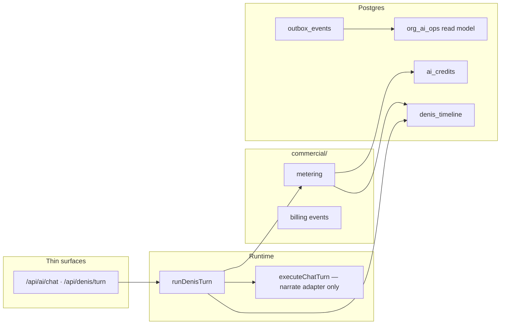

# ADR-009: Atomic Turn & Commercial Spine

| Field | Value |
|-------|-------|
| **Status** | **Accepted** — implementation track F1–F7 |
| **Date** | 2026-05-27 |
| **Depends on** | [ADR-005](./ADR-005-denis-maximum.md) · [ADR-006](./ADR-006-denis-control-plane.md) · migration `00046` (ai_credits) · `00087` (denis_timeline) |

---

## 0. One sentence

**Every Denis turn debits credits and appends a billing timeline event in one DB transaction; all AI APIs enter through `runDenisTurn`; commercial truth lives in `src/lib/denis/commercial/`.**

---

## 1. Problem

| Today | Risk |
|-------|------|
| `executeChatTurn` debits credits; `runDenisTurn` writes timeline | Debit without timeline (or reverse) on partial failure |
| Admin reads `ai_credits`; ops reads `denis_timeline` | No single commercial + ops picture |
| Legacy chat owns metering | Denis spine cannot observe billing |

---

## 2. Target (ceiling)



**Invariants**

1. Guest/staff AI chat **never** calls `executeChatTurn` directly — only `runDenisTurn`.
2. `executeChatTurn` **never** debits credits when called from Denis runtime (`skipCreditMetering`).
3. Metering finalize uses **`finalize_denis_turn_metering` RPC** (debit + `billing.turn_debited` + session `credits_used` — one transaction).
4. Low balance side effects go through **outbox**, not inline push.
5. `org_ai_ops` is a **projection** — not source of truth.

---

## 3. Implementation tracks

| Track | Scope | Done when |
|-------|-------|-----------|
| **F0** | Denis M0–M27 spine | ✅ (pre-req) |
| **F1** | All AI chat APIs → `runDenisTurn`; legacy adapter only | `executeChatTurn` single caller; chat-service ≤ budget |
| **F2** | Turn-as-transaction RPC | `finalize_denis_turn_metering` wired in `runDenisTurn` |
| **F3** | `commercial/` module | metering + billing event types; runtime imports commercial |
| **F4** | Outbox handlers | `billing.low_balance` (+ optional staff hint) |
| **F5** | Read model | `org_ai_ops` table + refresh RPC |
| **F6** | Cutover | `denis_only` rollout; retire dual-write paths |
| **F7** | Web/docs | Admin + landing copy aligned with credit model |

Each track = **one PR**, standalone, passes `pnpm verify:denis`, `pnpm eval:denis`, `pnpm type-check`.

---

## 4. F2 — `finalize_denis_turn_metering`

```sql
finalize_denis_turn_metering(
  p_org_id UUID,
  p_ai_session_id UUID,
  p_amount INTEGER,
  p_trace_id TEXT
) RETURNS INTEGER  -- new balance, or -1 if insufficient
```

Single transaction:

1. `decrement_ai_credits` logic (inline — same semantics as `00046`)
2. `append_denis_timeline_event` → `billing.turn_debited`
3. `UPDATE ai_sessions SET credits_used = credits_used + p_amount`

---

## 5. Billing timeline events

| event_type | When |
|------------|------|
| `billing.turn_debited` | After successful turn finalize (F2 RPC) |
| `billing.low_balance` | Enqueued via outbox when balance ≤ threshold (F4) |
| `billing.credits_purchased` | Future — Stripe webhook wrapper (F3+ / F7) |

Payload shape (turn debited):

```json
{
  "type": "billing.turn_debited",
  "amount": 1,
  "balanceAfter": 42,
  "traceId": "…"
}
```

---

## 6. Rollout safety

- Pre-check balance in `runDenisTurn` **before** LLM (fail fast, no OpenAI cost).
- Finalize **after** timeline append (best-effort parity with PPAN events).
- If finalize fails: log `commercial.finalize_failed`; guest response still returns (LLM already ran) — alert via ops projection.
- Shadow / legacy rollout modes unchanged until F6.

---

## 7. Verification checklist (per track)

```bash
pnpm type-check
pnpm verify:denis
pnpm eval:denis
grep -rn "executeChatTurn" src/   # F1: only run-denis-turn.ts
grep -rn "decrement_ai_credits" src/  # F2: commercial + stripe script only
```

---

## 8. References

- [denis-implementation-map.md](./denis-implementation-map.md) — update §3 after each track
- [ADR-001 outbox](../architecture/ADR-001-universal-ordering-platform.md) — F4 handlers follow same processor
- `src/lib/denis/commercial/` — module home (F3)
