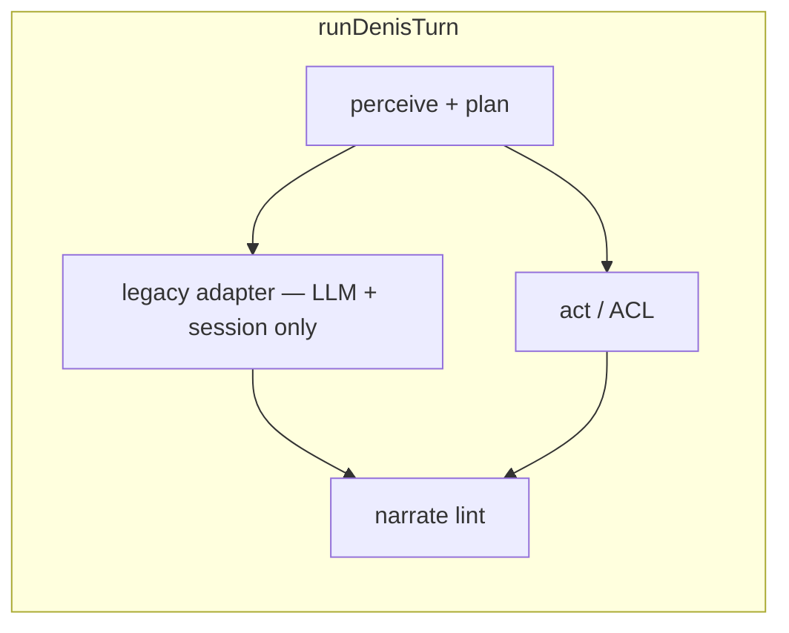

# ADR-010: Denis Ordering Cutover & GA Gate

| Field | Value |
|-------|-------|
| **Status** | **Accepted** — implementation track F8-1…F8-4 |
| **Date** | 2026-05-27 |
| **Depends on** | [ADR-005](./ADR-005-denis-maximum.md) · [ADR-006](./ADR-006-denis-control-plane.md) · [ADR-009](./ADR-009-atomic-turn-commercial-spine.md) · M0–M27 · F1–F7 |

---

## 0. One sentence

**Retire `execute-chat-turn.ts` as the ordering brain** — kernel plan + act/ACL own cart and submit; legacy file becomes a thin session/LLM adapter; rollout promotion is gated by GA checks and turn observability.

---

## 1. Problem

| Today | Risk |
|-------|------|
| `execute-chat-turn.ts` (~1000 lines) owns OpenAI, ordering, session | Duplicate cart logic vs kernel/act; hard to test cutover |
| Rollout modes exist but promotion is manual | Ops enables `actSubmitEnabled` without parity evidence |
| Turn latency opaque | No structured phase timings in logs |

F1–F7 fixed **commercial** spine. F8 fixes **ordering** spine.

---

## 2. Target architecture



**Invariants (unchanged from ADR-009):**

1. Only `runDenisTurn` calls `executeChatTurn`.
2. Credits finalize only via `finalize_denis_turn_metering`.
3. R5 submit only via `acl/executeDenisOrderCommand` when `actSubmitEnabled`.

---

## 3. Implementation tracks

| Track | Scope | Done when |
|-------|-------|-----------|
| **F8-1** | GA gate + turn observability | `evaluateGaGate`, structured turn logs, admin panel hints | ✅ |
| **F8-2** | Legacy adapter slim | Ordering paths removed from legacy; reflex+act own cart mutations | ✅ |
| **F8-3** | Act submit cutover | `actSubmitEnabled` on pilot venues; legacy submit disabled | ✅ |
| **F8-4** | Legacy delete | `execute-chat-turn.ts` session+LLM only; ordering via kernel bridge in `runDenisTurn` | ✅ |

Each track = **one PR**, `pnpm verify:denis`, `pnpm eval:denis`, `pnpm type-check`.

---

## 4. GA gate (F8-1)

Promotion ladder (location config):

| From | To | Required checks |
|------|-----|-----------------|
| `legacy` | `shadow` | AI concierge enabled |
| `shadow` | `canary` | Timeline on; act submit off |
| `canary` | `denis_only` | `narrateWithLlm`; shadow parity ≥99% when metrics available |
| `denis_only` | act submit live | `actLayerEnabled`, `!actDryRun`, `actSubmitEnabled`; eval green |

Code: `src/lib/denis/runtime/ga-gate.ts` — pure functions for admin UI + tests.

---

## 5. Turn observability (F8-1)

Structured log event `denis.turn.completed` with:

- `traceId`, `rolloutMode`, `locationId`, `channel`
- Phase ms: `context`, `legacy`, `act`, `narrate`, `timeline`, `metering`, `total`
- `guestUsesLegacy`, `lintPassed`, `narrationTier`, `creditsCharged`
- Optional `shadowParityScore`

Aligns with ADR-006 §5 envelope (latencyMs).

---

## 6. Rollout presets (ops)

Existing presets in `rollout-cutover.ts`. **Do not** enable `actSubmitEnabled` until F8-3 gate green.

New preset (F8-3): `denis_act_submit_pilot` — only after GA gate + venue sign-off.

When `actSubmitEnabled` + `!actDryRun`:

1. `runDenisTurn` runs `order.submit` via ACL (`executeDenisOrderCommand`).
2. Guest API returns `submitOrder: false` — client must **not** call `/api/ai/order/submit`.
3. `orderNumber` flows into narration facts (template: „Narudžbina #N je poslata.“).
4. Kernel cart draft is refreshed after F8-2 bridge before act phase.

Code: `resolve-act-submit-outcome.ts`, `run-denis-turn.ts` act block.

---

## 8. Legacy adapter slim (F8-4)

`execute-chat-turn.ts` is **session + LLM only**:

- OpenAI structured response → `deferredOrdering`
- Session persist (messages, tokens); **no** cart mutations in legacy file
- `runDenisTurn` always runs `applyPostLlmOrdering` when `deferredOrdering` is present

---

## 9. Verification

```bash
pnpm verify:denis
pnpm eval:denis
pnpm test:run src/__tests__/denis-ga-gate.test.ts
grep -rn "executeChatTurn" src/   # run-denis-turn + legacy file only
```

---

**Related:** [Implementation map](./denis-implementation-map.md) · [ADR-006 Control Plane](./ADR-006-denis-control-plane.md)
