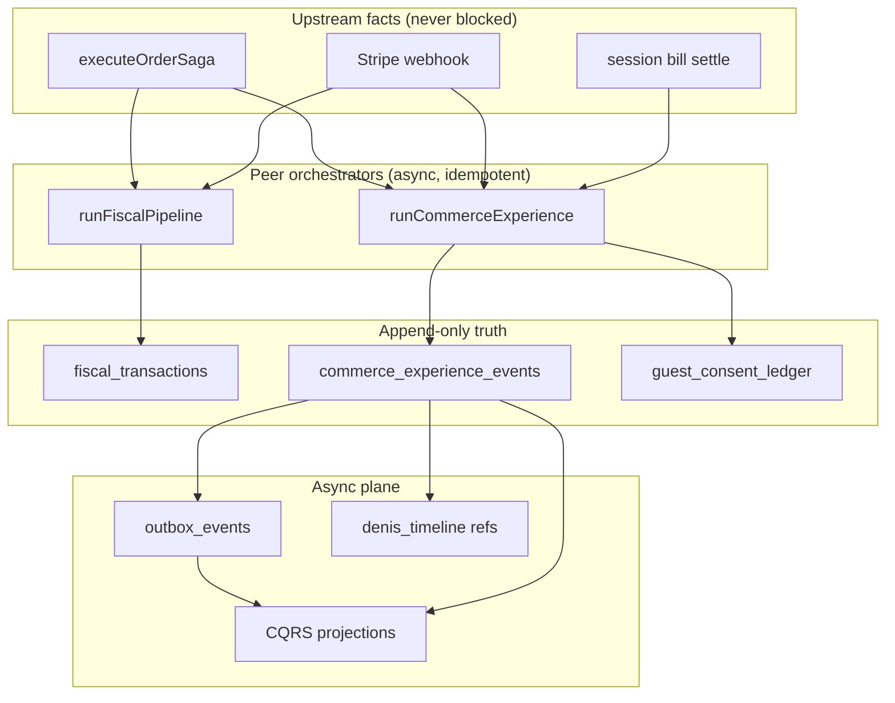

# ADR-014: Commerce Experience Platform (Enterprise)

| Field | Value |
|-------|-------|
| **Status** | **Proposed** — enterprise ceiling over [ADR-013](./ADR-013-competitive-guest-journey.md) |
| **Date** | 2026-05-27 |
| **Depends on** | [ADR-005](./ADR-005-denis-maximum.md) · [ADR-009](./ADR-009-atomic-turn-commercial-spine.md) · [ADR-012](./ADR-012-fiscal-journal-spine.md) · [ADR-013](./ADR-013-competitive-guest-journey.md) |
| **Audience** | Multi-location chains, franchise ops, compliance, platform engineering |

---

## 0. One sentence

**Four peer spines — Order, Fiscal, Commerce, Denis — each with one orchestrator, append-only truth, and async projections** — so guest monetization scales to franchise without forking fulfillment or mixing legal rows with marketing logic.

---

## 1. Platform quartet (why this is enterprise)

ADR-013 is a **product MVP** (`runGuestExperiencePipeline`). Enterprise means the same structural move we already made for fiscal and Denis commercial:

| Spine | Orchestrator | Source of truth | Read models |
|-------|--------------|-----------------|-------------|
| **Order** | `executeOrderSaga` | `orders`, `order_items` | dashboard, KDS |
| **Fiscal** | `runFiscalPipeline` | `fiscal_transactions` (ADR-012) | Beleg, DSFinV-K |
| **Denis commercial** | `runDenisTurn` → RPC | `denis_timeline` + `ai_credits` | `org_ai_ops` |
| **Commerce experience** | **`runCommerceExperience`** | **`commerce_experience_events`** | session state, menu view, inbox, KPIs |



**Hard rule:** Payment and fiscal finalize **complete before** commerce handlers run — same defer pattern as `fiscal.tse_sign` today. Commerce never holds a lock on `orders`.

### 1.1 Why ADR-013 is not enough

| ADR-013 gap | Enterprise requirement |
|-------------|----------------------|
| One orchestrator function | **Capability registry** — plug-in modules, A/B, per-tier flags |
| `experience_events` side table | **Versioned event catalog** — audit + rebuild + chain analytics |
| Settings in one JSON table | **Policy engine** — versioned rules, rollout, shadow mode (ADR-006) |
| Guest memory as afterthought | **Consent ledger** — provable GDPR, scope grants/revokes |
| Menu projection ad hoc | **CQRS read models** — rebuilt, cached, drift-detectable |
| Feedback extend-in-place | **Session aggregate** — one write model per `table_session` |
| No experiment framework | **Assignment table + metrics** — review CTR, reorder rate, tip lift |

---

## 2. Three-plane architecture

```
┌─────────────────────────────────────────────────────────────────────────┐
│ QUERY PLANE (read-only, cacheable, CDN-friendly where possible)         │
│  guest_session_commerce_state · menu_commerce_projection                │
│  venue_capacity_snapshot · experience_analytics_daily · feedback_inbox  │
└───────────────────────────────▲─────────────────────────────────────────┘
                                │ projections (async, idempotent workers)
┌───────────────────────────────┴─────────────────────────────────────────┐
│ EVENT PLANE (append-only source of truth)                               │
│  commerce_experience_events · guest_consent_ledger                      │
│  outbox domain `commerce` → projection refresh · alerts · rollups       │
│  denis_timeline fan-out (reference pointer — §5.3)                      │
└───────────────────────────────▲─────────────────────────────────────────┘
                                │ commands via runCommerceExperience
┌───────────────────────────────┴─────────────────────────────────────────┐
│ COMMAND PLANE (sync API — accepts intent, never blocks order/fiscal)    │
│  POST /api/commerce/commands/* · saga hooks · session bill · guest UI   │
└─────────────────────────────────────────────────────────────────────────┘
```

### 2.1 Bounded contexts

| Context | Owns | Must not own |
|---------|------|--------------|
| Order Core | status, items, payment_status | Google review prompts, tip UX |
| Fiscal Journal | TSE, Beleg, DSFinV-K | Feedback sentiment |
| Commerce Experience | feedback moments, reorder intent, tip policy, menu commerce view | Kitchen queue state |
| Venue OS | rush, 86, capacity beliefs | Persisting guest PII without consent |
| Denis Kernel | conversation, cart ACL | Direct Stripe calls |

Order Core and Fiscal Journal are **upstream peers**. Commerce **subscribes** to their facts; it never mutates orders for marketing logic.

---

## 3. Single orchestrator — `runCommerceExperience`

Mirrors `runFiscalPipeline` / `finalize_denis_turn_metering` — **one entry**, typed triggers, RPC atomic write.

```typescript
// src/lib/commerce/runtime/run-commerce-experience.ts

export type CommerceTrigger =
  | { kind: "payment_settled"; orderId: string; sessionId: string }
  | { kind: "order_delivered"; orderId: string; sessionId: string }
  | { kind: "session_bill_settled"; sessionId: string }
  | { kind: "guest_command"; sessionId: string; command: GuestCommerceCommand }
  | { kind: "floor_tick"; locationId: string };

export async function runCommerceExperience(
  admin: SupabaseClient,
  trigger: CommerceTrigger,
  opts: { idempotencyKey: string; traceId?: string }
): Promise<{ eventId: string | null; skipped: boolean; reason?: string }> {
  // 1. Load session + location + policy snapshot
  // 2. evaluateCommercePolicy → active capabilities (+ shadow log)
  // 3. resolveCommerceIntent(trigger, sessionProjection) → command | none
  // 4. If none → return { skipped: true }
  // 5. RPC finalize_commerce_experience_command (atomic — §4)
  // 6. Return event id
}
```

**Only callers** (grep before adding new ones):

| Caller | Trigger |
|--------|---------|
| `order-saga` after `payment_status=paid` | `payment_settled` |
| Order status → delivered (webhook / saga) | `order_delivered` |
| `session-bill/route.ts` settle | `session_bill_settled` |
| Guest API routes (feedback, reorder tap, review click) | `guest_command` |
| M14 floor cron | `floor_tick` |

**Delete over time:** inline feedback triggers, Denis scheduler `REVIEW_PROMPT` without policy gate, ad-hoc menu personalization in menu API.

### 3.1 Intent resolution (when to show what)

Same business rules as ADR-013 `resolveExperienceMoment`, but **inside** orchestrator using projection + policy:

```typescript
type CommerceIntent =
  | { type: "emit"; command: "RecordPaymentSettled" | "RecordOrderDelivered" | ... }
  | { type: "none"; reason: string };

function resolveCommerceIntent(
  trigger: CommerceTrigger,
  state: SessionCommerceProjection,
  policy: CommercePolicy
): CommerceIntent;
```

| Moment | Condition | Guest surface |
|--------|-----------|---------------|
| `checkout_thanks` | paid, meal not complete | Denis danke only — no survey |
| `feedback_eligible` | paid + (delivered or session bill settled) | Feedback v2 capability |
| `another_round_visible` | session active + last round delivered + policy on | FAB / chip |
| `capacity_banner` | snapshot level ≥ threshold | Menu banner (read model) |

Session bill: **one feedback per `table_session`**, not per order — aggregate root is session.

---

## 4. Atomic RPC — `finalize_commerce_experience_command`

Same contract as ADR-012 `finalize_fiscal_sale`: **no event without outbox; no outbox without event**.

```sql
-- finalize_commerce_experience_command(
--   p_org_id, p_location_id, p_session_id, p_order_id,
--   p_command_type, p_payload JSONB, p_idempotency_key, p_trace_id
-- ) RETURNS UUID  -- commerce_experience_events.id

-- Single transaction:
--   1. SELECT ... FOR UPDATE on guest_session_commerce_state (or session row)
--   2. Assert idempotency: no row with (session_id, idempotency_key)
--   3. Assert command preconditions (e.g. feedback once per session)
--   4. INSERT commerce_experience_events
--   5. INSERT outbox_events domain='commerce' event_type='commerce.projection.refresh'
--   6. Optional: INSERT denis_timeline reference row (§5.3)
--   7. RETURN event id
```

Handlers **never** INSERT into `commerce_experience_events` directly — only this RPC (service role + RLS bypass pattern same as fiscal).

---

## 5. Event store — `commerce_experience_events`

Parallel to fiscal journal — **append-only**, tenant-scoped, auditable.

```sql
CREATE TABLE commerce_experience_events (
  id UUID PRIMARY KEY DEFAULT gen_random_uuid(),
  org_id UUID NOT NULL REFERENCES organizations(id),
  location_id UUID NOT NULL REFERENCES locations(id),
  session_id UUID NOT NULL REFERENCES table_sessions(id),
  order_id UUID REFERENCES orders(id),

  command_type TEXT NOT NULL,           -- RecordPaymentSettled | SubmitFeedback | ...
  event_type TEXT NOT NULL,             -- payment.settled | feedback.submitted | ...
  schema_version SMALLINT NOT NULL DEFAULT 1,
  payload JSONB NOT NULL DEFAULT '{}',

  idempotency_key TEXT NOT NULL,
  trace_id TEXT,
  created_at TIMESTAMPTZ NOT NULL DEFAULT now(),

  UNIQUE (session_id, idempotency_key)
);

CREATE INDEX idx_ce_events_location_time
  ON commerce_experience_events (location_id, created_at DESC);

CREATE INDEX idx_ce_events_type_time
  ON commerce_experience_events (org_id, event_type, created_at DESC);
```

### 5.1 Event catalog (versioned payloads)

| event_type | schema_version | payload (minimum) |
|------------|----------------|-------------------|
| `payment.settled` | 1 | `{ orderId, amountCents, paymentMethod }` |
| `order.delivered` | 1 | `{ orderId }` |
| `session.bill_settled` | 1 | `{ billTotalCents, orderIds[] }` |
| `feedback.submitted` | 1 | `{ rating, sentiment, category, guestTokenHash }` |
| `review.google_clicked` | 1 | `{ feedbackEventId }` |
| `reorder.initiated` | 1 | `{ sourceOrderId, itemCount }` |
| `tip.selected` | 1 | `{ tipCents, presetKey, smartDefaultUsed }` |
| `capacity.level_changed` | 1 | `{ level, backlogMinutes, acceptingOrders }` |
| `preorder.scheduled` | 1 | `{ slotAt, orderId }` |

Breaking payload changes → bump `schema_version`; projection workers handle both during dual-write.

### 5.2 Fan-out (via outbox — not inline in request path)

| Outbox event | Handler |
|--------------|---------|
| `commerce.projection.refresh` | Update projection(s) for `aggregate_id = session_id` |
| `commerce.alert.staff` | Copilot negative feedback + optional notify |
| `commerce.memory.sync` | Guest memory write **only if** consent effective |
| `commerce.analytics.rollup` | Increment `experience_analytics_daily` |
| `commerce.preorder.release` | Kitchen release at slot |

All handlers: **idempotent** on `(session_id, idempotency_key)` or `(event_id, handler_name)`.

### 5.3 Denis timeline — reference, not duplicate

Do **not** copy full commerce payloads into `denis_timeline`. Append a **thin reference**:

```json
{
  "type": "experience.feedback.submitted",
  "commerceEventId": "uuid",
  "sessionId": "uuid",
  "sentiment": "negative"
}
```

Kernel fold reads reference → loads projection / event if needed. Keeps Denis timeline small and commerce rebuildable without touching AI audit.

---

## 6. Consent ledger (GDPR enterprise)

Separate from guest memory blob — **legal record**, append-only.

```sql
CREATE TABLE guest_consent_ledger (
  id UUID PRIMARY KEY DEFAULT gen_random_uuid(),
  org_id UUID NOT NULL REFERENCES organizations(id),
  guest_token TEXT NOT NULL,
  scope TEXT NOT NULL,                -- personalization | tips | feedback_memory | marketing
  action TEXT NOT NULL CHECK (action IN ('granted','revoked')),
  ip_hash TEXT,
  user_agent_hash TEXT,
  created_at TIMESTAMPTZ NOT NULL DEFAULT now()
);

CREATE INDEX idx_consent_guest_scope
  ON guest_consent_ledger (org_id, guest_token, scope, created_at DESC);
```

**Effective consent** = latest row per `(org_id, guest_token, scope)`.

`GuestMemoryProjection` built **only** from scopes with effective `granted`. UI shows explicit opt-in — never infer consent from order history alone.

**Chain GA gate:** export RPC for DSAR (`guest_token` → consent rows + commerce events by hash).

---

## 7. Policy engine — capabilities, not if/else

Declarative config per location (extends `concierge_config`, not replaces):

```typescript
// src/lib/commerce/policy/commerce-policy.schema.ts

type CommerceCapabilityId =
  | "feedback.flow.v2"
  | "reorder.another_round"
  | "tips.smart_defaults"
  | "menu.personalization"
  | "menu.trending"
  | "kitchen.capacity_banner"
  | "preorder.scheduled";

type CommercePolicy = {
  version: number;
  capabilities: Record<CommerceCapabilityId, {
    enabled: boolean;
    rollout: ConciergeRolloutSchema;     // shadow | canary | live — ADR-006
    experimentKey?: string;
    params: Record<string, unknown>;
  }>;
  moments: {
    feedbackDelaySeconds: number;
    feedbackRequiresBillSettled: boolean;
    googleReviewMinSentiment: "positive";
  };
};
```

### 7.1 Experiment assignments

```sql
CREATE TABLE commerce_experiment_assignments (
  id UUID PRIMARY KEY DEFAULT gen_random_uuid(),
  org_id UUID NOT NULL,
  experiment_key TEXT NOT NULL,
  guest_token TEXT NOT NULL,
  variant TEXT NOT NULL,
  assigned_at TIMESTAMPTZ NOT NULL DEFAULT now(),
  UNIQUE (org_id, experiment_key, guest_token)
);
```

Stable bucket per guest for A/B; metrics join `commerce_experience_events` on `experiment_key` in payload.

**Shadow mode:** orchestrator logs `commerce.shadow.would_emit` to observability — no guest UI — same as Denis GA gate.

---

## 8. CQRS read models (query plane)

| Projection | Built from | Serves |
|------------|------------|--------|
| `guest_session_commerce_state` | latest events per session | Tracker, FAB, moment resolver |
| `menu_commerce_projection` | VKG + trending + memory (consent) | `GET /api/commerce/menu-view` |
| `venue_capacity_snapshot` | floor tick + KDS backlog | Banner, Denis facts |
| `experience_analytics_daily` | rollup cron | Admin KPIs, chain dashboard |
| `feedback_inbox` | `feedback.submitted` | Manager response queue |

**Rebuild contract:**

1. Nightly full rebuild from event store (drift detection alert)
2. On-demand rebuild per `location_id` after policy change
3. Projections are **never** updated from guest UI directly

### 8.1 Menu commerce view

```
Cron (15 min) + on order.created:
  refresh_trending_products(location_id, window_hours)

GET /api/commerce/menu-view?sessionToken=:
  base menu (existing)
  + trending slice (projection)
  + for_you IF consent.personalization
  + dietary_mask IF consent + allergy scopes
  + capacity banner from venue_capacity_snapshot
```

Cache key: `{locationId, menuVersion, guestTokenHash, consentHash}` — invalidate on 86 via Realtime tag.

---

## 9. Capability modules (plugin architecture)

Each feature = one module — **no 800-line orchestrator**.

```
src/lib/commerce/
  runtime/
    run-commerce-experience.ts      # sole trigger entry
    finalize-command-rpc.ts         # RPC wrapper
    evaluate-policy.ts
    resolve-commerce-intent.ts
  capabilities/
    feedback-v2/
      eligibility.ts
      on-projection-refresh.ts
      denis-facts.ts
      admin-queries.ts
    another-round/
    smart-tips/
    menu-personalization/
    kitchen-capacity/
    scheduled-pickup/
  projections/
    refresh-session-state.ts
    refresh-menu-view.ts
    rollup-analytics.ts
  policy/
    commerce-policy.schema.ts
    defaults.ts
  consent/
    ledger.ts
    effective-scopes.ts
```

```typescript
const CAPABILITY_REGISTRY: Record<CommerceCapabilityId, CapabilityModule> = {
  "feedback.flow.v2": feedbackV2Module,
  "reorder.another_round": anotherRoundModule,
  // ...
};
```

Adding a 2027 feature = new folder + registry + policy schema — not editing a monolith.

---

## 10. Denis integration (enterprise — not bolt-on)

```
commerce_experience_events
  → denis_timeline ref (experience.feedback.negative)
  → belief patch: session.feedbackSentiment, session.usualRound
  → planner: skipUpsell if negative feedback this session
  → narrate facts from projections — single reality with menu API
```

| Surface | Integration |
|---------|-------------|
| Guest chat | `runDenisTurn` loads `guest_session_commerce_state` + effective consent |
| UI chips | Same projection as menu — **one reality** |
| Staff copilot | `feedback_inbox` + `commerce.alert.staff` |
| Scheduler | Policy `feedback.flow.v2` replaces raw `REVIEW_PROMPT` timer |

**Invariant:** Denis never writes commerce events — UI/API emits commands; Kernel reads projections.

---

## 11. Feature mapping (ADR-013 → ADR-014)

| Feature | ADR-013 | ADR-014 enterprise |
|---------|---------|-------------------|
| **F1 Feedback** | Extend `order_feedback` | `order_feedback` = **projection** of `feedback.submitted`; dual-write until CE-2 cutover |
| **F2 Reorder** | `get-last-round.ts` | Capability `another-round`; command `InitiateReorder`; reuse `/reorder` API |
| **F3 Tips** | `smart-tip-defaults.ts` | Capability + consent scope `tips` |
| **F4 Menu** | inline projection | `menu_commerce_projection` + cache |
| **F5 Throttle** | venue ops only | `venue_capacity_snapshot`; Order Core reads `acceptingOrders` flag |
| **F6 Pre-order** | columns on orders | `preorder.scheduled` + slot aggregate; fiscal at pickup pay (ADR-012) |

---

## 12. Invariants (mandatory)

| ID | Invariant |
|----|-----------|
| C1 | Commerce commands **only** via `runCommerceExperience` + RPC — no direct event INSERT from routes |
| C2 | Payment/fiscal saga **never awaits** commerce handlers |
| C3 | `(session_id, idempotency_key)` unique — retries safe |
| C4 | Feedback at most **once per session** enforced in RPC preconditions |
| C5 | Guest PII in events = **hashed token** unless explicit consent scope |
| C6 | Projections rebuildable from `commerce_experience_events` alone |
| C7 | Consent effective = ledger latest row — not memory flags |
| C8 | Denis timeline stores **references** to commerce events — not full payloads |
| C9 | Policy shadow mode **never** mutates guest-visible state |
| C10 | Chain analytics read **rollups** — not scan raw events in admin UI |
| C11 | Throttle gate: `acceptingOrders` on projection — Order Core rejects create when false |
| C12 | Pre-order fiscal moment follows ADR-012 — not order create |

---

## 13. Anti-patterns (reject in review)

| Anti-pattern | Why |
|--------------|-----|
| `UPDATE commerce_experience_events` | Breaks audit / rebuild |
| Marketing logic in `create-order.ts` | Order Core boundary violation |
| Personalization without consent ledger row | GDPR |
| Second feedback system parallel to events | Drift |
| `runGuestExperiencePipeline` + `runCommerceExperience` both live after CE-4 | Delete old path same PR |
| Full payload duplicate in `denis_timeline` | Bloat + coupling |

---

## 14. Outbox domain `commerce`

```sql
-- Extend outbox_events.domain CHECK to include 'commerce'
```

| event_type | aggregate_id |
|------------|--------------|
| `commerce.projection.refresh` | `session_id` |
| `commerce.alert.staff` | `session_id` |
| `commerce.memory.sync` | `guest_token_hash` |
| `commerce.analytics.rollup` | `location_id` |
| `commerce.preorder.release` | `order_id` |

---

## 15. Enterprise non-functionals

| NFR | Target |
|-----|--------|
| **Multi-tenant isolation** | RLS on all commerce tables; `org_id` on every row |
| **Idempotency** | Unique `(session_id, idempotency_key)` |
| **Audit** | Append-only events + consent ledger |
| **Observability** | `trace_id` on events; metrics: `commerce.feedback.submitted`, `commerce.reorder.conversion`, `commerce.projection.lag_ms` |
| **Rollout** | `ConciergeRolloutSchema` per capability |
| **DR** | Event store backup + projection rebuild runbook |
| **Performance** | Query plane from projections; menu-view cache 60s |
| **SLO** | `runCommerceExperience` p99 < 150ms (RPC only); projection lag p99 < 30s |

### 15.1 Failure modes

| Failure | Behavior |
|---------|----------|
| RPC timeout after event insert | Idempotent retry — unique key prevents duplicate |
| Projection worker down | Guest reads stale projection; alerts on lag metric |
| Policy load failure | Fail closed — no new capabilities; existing projection served |
| Outbox backlog | Commerce moments delayed — **never** block payment |

---

## 16. Migration strategy (strangler)

| Phase | Scope | Exit criteria |
|-------|-------|---------------|
| **CE-1** | Event store + RPC + `runCommerceExperience` skeleton + policy schema | `payment_settled` → one event + outbox row in staging |
| **CE-2** | Feedback v2 + projections + copilot alert | Dual-write to `order_feedback`; inbox from projection |
| **CE-3** | Another round + smart tips | UI reads projections only |
| **CE-4** | Menu commerce projection + menu-view API | Delete inline menu personalization |
| **CE-5** | Capacity snapshot + `acceptingOrders` gate | Order create respects projection |
| **CE-6** | Consent ledger + DSAR export | **Required before EU chain GA** |
| **CE-7** | Pre-order + slots | P2 |

**Hard gate:** Franchise GA = CE-6 + projection rebuild runbook documented + `pnpm test:run` commerce package.

### 16.1 CE-1 deliverables (first PR)

| Artifact | Path |
|----------|------|
| Migration | `supabase/migrations/00098_commerce_experience_events.sql` |
| RPC | `finalize_commerce_experience_command` |
| Runtime | `src/lib/commerce/runtime/run-commerce-experience.ts` |
| Hook | `order-saga.ts` → `runCommerceExperience({ kind: 'payment_settled' })` **after** saga commit |
| Tests | `src/__tests__/commerce/run-commerce-experience.test.ts` |
| Verify | `pnpm test:run commerce` · `pnpm type-check` |

No guest UI in CE-1 — foundation only.

---

## 17. Comparison

| | ADR-013 | ADR-014 |
|--|---------|---------|
| Orchestrator | `runGuestExperiencePipeline` | `runCommerceExperience` + capability registry |
| Truth | Mixed tables | Event store + projections |
| GDPR | Scope flags on memory | Consent ledger |
| Denis | Facts injected ad hoc | Timeline refs → beliefs |
| Experiments | None | Assignments + rollout |
| Chain ops | Per-location settings | Analytics rollups + inbox |
| Add feature | Edit orchestrator | Register capability module |
| Complexity | Lower (weeks) | Higher (months) — **enterprise** |

---

## 18. Recommendation

| Stage | Use |
|-------|-----|
| **Pilot / single venue** | ADR-013 UX specs; implement on CE projections if possible |
| **Franchise / chain / diligence** | ADR-014 CE-1…CE-6 — **mandatory** |
| **Long-term codebase** | ADR-014 — ADR-013 becomes feature checklist inside capabilities |

**Do not** build ADR-013 monolith then rewrite. **CE-1 first**, then ship ADR-013 UI on projections.

---

## 19. References

- [ADR-013](./ADR-013-competitive-guest-journey.md) — feature specs, UX flows
- [ADR-005 §2](./ADR-005-denis-maximum.md) — L3 Venue OS, L4 Surfaces
- [ADR-006](./ADR-006-denis-control-plane.md) — rollout, shadow mode
- [ADR-009](./ADR-009-atomic-turn-commercial-spine.md) — outbox + RPC pattern
- [ADR-012](./ADR-012-fiscal-journal-spine.md) — parallel journal pattern
- [ADR-001-safe-rollout](./ADR-001-safe-rollout.md) — migration push
