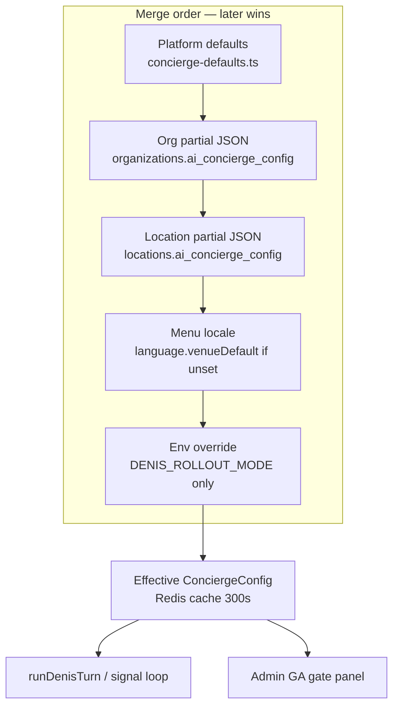
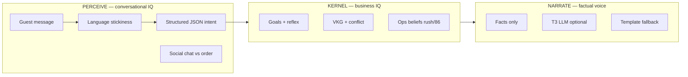

# ADR-021: Denis Concierge Tuning — Optimal Configuration Architecture

| Field | Value |
|-------|-------|
| **Status** | **Accepted** — ops + implement reference |
| **Date** | 2026-05-29 |
| **Depends on** | [ADR-006](./ADR-006-denis-control-plane.md) · [ADR-019](./ADR-019-denis-unified-brain.md) · [ADR-020](./ADR-020-denis-table-operating-system.md) · [denis-implementation-map](./denis-implementation-map.md) |
| **Code** | `src/lib/denis/config/*` · `src/lib/admin/denis-rollout-actions.ts` · `/admin/settings` Denis rollout panel |

---

## 0. One sentence

**ConciergeConfig** is the single control surface for how smart, multilingual, and autonomous Denis feels at a venue — tuned through **profiles**, a **rollout ladder**, and **LLM tiers**, not ad-hoc prompt edits.

---

## 1. Problem

Denis can feel “dumb” even when the model is capable because:

| Symptom | Root cause (config / ops) |
|---------|---------------------------|
| “Ne razumem” on Serbian | `language.followGuest` not wired; weak detection; venue/conversation locale mixed in prompt |
| Robotic order bot, no banter | Default `shadow` + ordering-heavy perceive; `maxWordsPerReply: 45`, tone `efficient` |
| English order → German refusal | Session stickiness + `venueDefault: de` without explicit switch handling |
| Slow / generic replies | `gpt-4o-mini`, `narrateWithLlm: false`, guest on legacy path |
| Double submit / race | `actSubmitEnabled` before `denis_only` + eval green |

This ADR defines **how to tune Denis correctly** — venue by venue, with gates.

---

## 2. Configuration stack



| Layer | Storage | Who sets |
|-------|---------|----------|
| Platform | `CONCIERGE_PLATFORM_DEFAULTS` | Engineering |
| Org | `organizations.ai_concierge_config` | Platform admin (future) |
| Location | `locations.ai_concierge_config` | Owner via `/admin/settings` |
| Menu locale | `locations.menu_locale` | Admin menu settings |
| Env | `DENIS_ROLLOUT_MODE` | Vercel — **overrides rollout.mode only** |

**Rule:** Never tune Denis by editing `build-system-prompt.ts` for one venue. Use `ConciergeConfig` + playbook examples.

---

## 3. The seven tuning axes

Each axis maps to a config block. Change **one axis per ops session**; re-run smoke before stacking.

### 3.1 Persona — *how Denis sounds*

| Field | Default | Smart / warm | Premium quiet | Fast QSR |
|-------|---------|--------------|---------------|----------|
| `persona.tone` | `warm_short` | `playful_luxury` | `formal` | `efficient` |
| `persona.greetingStyle` | `offer_drink_or_food` | `venue_story` | `welcome_only` | `offer_drink_or_food` |
| `persona.maxWordsPerReply` | 45 | 60 | 35 | 25 |
| `persona.emoji` | false | true (casual venues) | false | false |
| `persona.forbiddenPhrases` | platform list | + venue-specific | + no slang | + no upsell words |

**Principle:** Perceive (LLM) owns conversation warmth; narrate (T3) only speaks **committed facts** (order number, status). Persona fields feed narration facts + lint bounds.

### 3.2 Language — *multilingual without embarrassment*

| Field | Recommended | Notes |
|-------|-------------|-------|
| `language.venueDefault` | Match `menu_locale` | Auto from menu when location override absent |
| `language.followGuest` | **`true`** | Schema exists; **must be wired in runtime** (see §8) |
| `language.fallbackWhenUnknown` | `venue` for DE/AT; `english` for international airports |

**Supported codes:** `de`, `en`, `sr`, `hr`, `tr`, `fr`, `es`, `it`, `ru`, `ar` — see `AI_SUPPORTED_LANGUAGES`.

**Behaviour target:**

1. Guest writes in supported language → reply in **that** language (sticky session).
2. Guest asks “auf Serbisch” / “na srpskom” → **immediate switch**, persist to session + guest memory.
3. Neutral confirms (“yes please”, “da”, “0.5”) → **keep session language**, not menu splash.
4. Never claim “I only speak German/English” when `sr` is supported.

**Detection:** `resolveStickyGuestLanguage()` + explicit preference patterns — not UI splash locale alone.

### 3.3 LLM tier — *intelligence vs cost*

| Profile | `llm.model` | `llm.narrateWithLlm` | `llm.slotExtractWithLlm` | Use when |
|---------|-------------|----------------------|--------------------------|----------|
| **Economy** | `null` → env `gpt-4o-mini` | false | false | Shadow observe only |
| **Standard pilot** | `gpt-4o-mini` | true | false | Canary / first pilot |
| **Premium pilot** | `gpt-4o` | true | true | Table OS pilot, high ARPU |
| **Deterministic-heavy** | mini | true | false + `skipLlmWhenPossible: true` | Rush hours, cost cap |

Env fallbacks: `OPENAI_MODEL`, `OPENAI_FALLBACK_MODEL` — location `llm.model` overrides when set.

**Temperature:**

| Task | Field | Range |
|------|-------|-------|
| Ordering / JSON perceive | `temperatureOrdering` | 0.1–0.3 |
| Recommend / browse | `temperatureRecommend` | 0.4–0.6 |

### 3.4 Rollout — *what guests actually see*

Ladder (never skip steps on production venue):

```
legacy → shadow → canary (10%) → denis_only → table_os_pilot
```

| Mode | Guest sees | Kernel | When |
|------|------------|--------|------|
| `shadow` | Legacy chat | Timeline + shadow diff | Default platform; safe observe |
| `canary` | Denis for cohort % | Full | After 99% shadow parity |
| `denis_only` | Denis narration | Full | Marketing-ready single venue |
| + act submit | ACL live orders | Full + F8-3 | After `pnpm eval:denis` green |

**Admin presets** (`rollout-cutover.ts`):

| Preset ID | Purpose |
|-----------|---------|
| `shadow_observe` | Zero guest behaviour change |
| `shadow_instrumented` | + T2 slot extract on timeline |
| `canary_10` | 10% Denis guest path |
| `denis_guest_narration` | Full Denis voice, act dry-run |
| `denis_act_submit_pilot` | Live ACL submit |
| **`table_os_pilot`** | **Recommended first production pilot** |

**GA gate** (`evaluateGaGate`) — blocking before risky cutover:

- `denis_only` → requires `narrateWithLlm: true`
- `denis_only` + act submit → requires pilot eval pass
- Remove `DENIS_ROLLOUT_MODE` env before location-level cutover

### 3.5 Ordering & act — *correct commerce*

| Field | Pilot | Production |
|-------|-------|------------|
| `ordering.slotExtractEnabled` | true | true |
| `ordering.actLayerEnabled` | true | true |
| `ordering.actDryRun` | true → **false** at pilot | false |
| `ordering.actSubmitEnabled` | false → **true** at pilot | true |
| `ordering.requireExplicitConfirm` | true | true (legal clarity) |
| `ordering.flow` | `denis_short` | `denis_short` or `classic_chatty` |

**Invariant:** Only ACL + act layer create orders when `actSubmitEnabled` — no guest `/api/ai/order/submit`.

### 3.6 Proactive & upsell — *helpful, not annoying*

| Venue type | `proactive.enabled` | `upsell.maxUpsellsPerSession` | `ops.rushSkipUpsell` |
|------------|---------------------|-------------------------------|----------------------|
| Fine dining | true | 1 | true |
| Bar / high volume | true | 2 | true |
| Hotel breakfast | false | 0 | true |
| Pilot (first week) | **false** | 0 | true |

Enable dessert / pairing proactive **after** ordering path is stable (week 2+).

### 3.7 Memory & learning — *return guests*

| Field | Pilot | Mature |
|-------|-------|--------|
| `memory.returnGuestEnabled` | true (with consent UI) | true |
| `learning.learnedEdgesEnabled` | false | true after 30d data |
| `ops.floorGraphEnabled` | false | true multi-floor venues |

---

## 4. Venue profiles (copy-paste patches)

Save as `locations.ai_concierge_config` partial JSON. Version must be `1`.

### 4.1 Table OS pilot (recommended first go-live)

Matches admin preset `table_os_pilot`. Use after `pnpm eval:denis` green.

```json
{
  "version": 1,
  "language": {
    "venueDefault": "de",
    "followGuest": true,
    "fallbackWhenUnknown": "venue"
  },
  "llm": {
    "model": "gpt-4o",
    "narrateWithLlm": true,
    "slotExtractWithLlm": false,
    "temperatureOrdering": 0.2,
    "temperatureRecommend": 0.5
  },
  "rollout": { "mode": "denis_only", "canaryPercent": 10 },
  "ordering": {
    "slotExtractEnabled": true,
    "actLayerEnabled": true,
    "actDryRun": false,
    "actSubmitEnabled": true
  },
  "memory": { "returnGuestEnabled": true },
  "proactive": { "enabled": false },
  "persona": {
    "tone": "warm_short",
    "maxWordsPerReply": 55
  }
}
```

### 4.2 Serbian diaspora / Balkan guest-heavy

For venues where guests switch DE ↔ SR ↔ EN mid-session.

```json
{
  "version": 1,
  "language": {
    "venueDefault": "de",
    "followGuest": true,
    "fallbackWhenUnknown": "english"
  },
  "persona": {
    "tone": "playful_luxury",
    "maxWordsPerReply": 60,
    "forbiddenPhrases": [
      "I only speak German",
      "I can only answer in German or English",
      "ne razumem srpski"
    ]
  },
  "llm": {
    "model": "gpt-4o",
    "narrateWithLlm": true
  },
  "rollout": { "mode": "denis_only" }
}
```

### 4.3 Shadow observe (zero risk)

```json
{
  "version": 1,
  "rollout": { "mode": "shadow" },
  "llm": { "narrateWithLlm": false },
  "ordering": {
    "actLayerEnabled": false,
    "actSubmitEnabled": false
  }
}
```

### 4.4 Premium quiet dining

```json
{
  "version": 1,
  "persona": {
    "tone": "formal",
    "greetingStyle": "welcome_only",
    "maxWordsPerReply": 35,
    "emoji": false
  },
  "upsell": { "maxUpsellsPerSession": 1 },
  "proactive": {
    "enabled": true,
    "minMinutesBetweenProactive": 8,
    "pairing": true,
    "dessert": false
  },
  "llm": { "narrateWithLlm": true, "model": "gpt-4o" }
}
```

---

## 5. Intelligence model — perceive vs narrate

Denis “smartness” is not one knob. Split responsibilities:



| Guest moment | Smart behaviour | Config levers |
|--------------|-----------------|---------------|
| “Denis legendo gde si” | Warm banter, `intent: chat`, SR reply | `followGuest`, `gpt-4o`, persona tone |
| “1x Cola” | Order flow, size clarify | `ordering.flow`, slot extract |
| “auf Serbisch bitte” | Instant language switch | language detection + memory |
| Order ready | Same text: push = transcript | WORLD phase (no config) |
| Rush kitchen | No dessert upsell | `ops.rushSkipUpsell` |

**Anti-pattern:** Cranking temperature alone — does not fix language or ordering bugs.

---

## 6. Ops runbook — first pilot week

### Day 0 — prep

```bash
pnpm verify:denis && pnpm eval:denis
```

- [ ] Pick **one** location
- [ ] `/admin/settings` → preset **Table OS pilot** → Save
- [ ] Confirm no `DENIS_ROLLOUT_MODE` env override
- [ ] Set `llm.model` to `gpt-4o` if budget allows

### Day 1 — smoke ([ADR-019 verification §C–D](./ADR-019-verification-checklist.md))

- [ ] Network: only `/api/denis/signal` + `/api/denis/view`
- [ ] EN order → SR chat → SR reply
- [ ] Waiter chip → signal, not REST
- [ ] Order status → push = transcript

### Day 2–7 — tune one axis

| Day | Tune | Watch |
|-----|------|-------|
| 2 | `persona.maxWordsPerReply` | Guest drop-off in chat |
| 3 | `proactive.enabled: true` | Nudge frequency |
| 4 | `upsell.maxUpsellsPerSession` | Revenue vs annoyance |
| 5 | `learning.learnedEdgesEnabled` | Admin insights queue |
| 7 | Canary 25% → 100% | Shadow parity logs |

### Rollback

1. Preset `shadow_observe` → Save
2. Or env `DENIS_ROLLOUT_MODE=shadow` (emergency only — overrides all locations)

---

## 7. Quality metrics

| Metric | Source | Target |
|--------|--------|--------|
| Shadow parity | `denis_timeline` shadow diff logs | ≥ 99% before `denis_only` |
| Pilot eval | `pnpm eval:denis` | 7/7 green |
| Language switch | Manual smoke + eval fixture | SR/DE/EN switch without refusal |
| Order success | ACL act submit | 100% pilot orders via Denis path |
| Credits burn | `org_ai_ops` | Within budget per cover |
| Guest CSAT | Post-delivery review prompt | Baseline after week 2 |

---

## 8. Implementation gaps (engineering — not ops)

These are **required** for “best tuning” to work as documented:

| Gap | Config field | Action |
|-----|--------------|--------|
| `followGuest` unused | `language.followGuest` | ✅ Wired in `resolveStickyGuestLanguage` + perceive |
| Social chat → clarify | — | ✅ `conversation-leadership.ts` + prompt LEAD block |
| Venue vs conversation locale | — | ✅ `buildSystemPrompt({ venueMenuLocale })` |
| Playbook SR examples | `experiments.exampleSetId` | Add Serbian casual examples per profile 4.2 |
| Per-location model cost | `llm.model` | Admin UI field (today: JSON patch only) |

Track as **ADR-021 implementation** — one PR per gap, same gates as ADR-019.

---

## 9. Environment variables

| Variable | Scope | Effect |
|----------|-------|--------|
| `OPENAI_MODEL` | Platform | Default perceive model when `llm.model` null |
| `OPENAI_FALLBACK_MODEL` | Platform | Failover |
| `DENIS_ROLLOUT_MODE` | Platform | **Overrides** `rollout.mode` for all locations — avoid in pilot |
| `CRON_SECRET` | Platform | Denis scheduler / floor / learned-edges crons |

---

## 10. Decision summary

| Question | Answer |
|----------|--------|
| Where do I tune Denis? | `locations.ai_concierge_config` + `/admin/settings` |
| Best first production config? | Profile **4.1 Table OS pilot** |
| How to fix “dumb” multilingual? | Profile **4.2** + ship §8 gaps |
| Cheapest safe start? | Profile **4.3 shadow** |
| When act submit live? | `denis_only` + eval green + GA gate |
| Can I skip shadow? | **No** on production remote |

---

## 11. References

- [ADR-006](./ADR-006-denis-control-plane.md) — rollout ladder, R0–R5
- [ADR-010](./ADR-010-denis-ordering-cutover.md) — act submit cutover
- [ADR-019-operator.md](./ADR-019-operator.md) — implement prompts
- [denis-implementation-map.md](./denis-implementation-map.md) — as-built code map
- Code: `src/lib/denis/config/rollout-cutover.ts` — preset definitions
- Code: `src/lib/denis/runtime/ga-gate.ts` — promotion readiness
