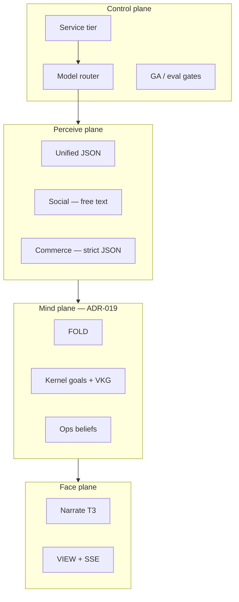

# ADR-022: Denis Elite Enterprise — Intelligence Architecture

| Field | Value |
|-------|-------|
| **Status** | **Superseded** by [ADR-023](./ADR-023-denis-maximum-runtime.md) — tier/LLM sketch retained for reference |
| **Date** | 2026-05-29 |
| **Depends on** | [ADR-019](./ADR-019-denis-unified-brain.md) · [ADR-020](./ADR-020-denis-table-operating-system.md) · [ADR-021](./ADR-021-denis-concierge-tuning.md) · [ADR-009](./ADR-009-atomic-turn-commercial-spine.md) |
| **Code** | `src/lib/denis/elite/*` · `ConciergeConfig.elite` |

---

## 0. One sentence

**Elite Enterprise Denis** routes every turn through a **service tier** (standard → enterprise) that selects **models**, **perceive pipeline**, and **context depth** — so a Hamburg fine-dining group and a Belgrade diaspora bar both get Denis, but not the same brain budget.

---

## 1. Why not “just gpt-4o everywhere”

| Approach | Problem |
|----------|---------|
| One model for all | Cost explodes at scale; rush hours need deterministic paths |
| One prompt for all | Order JSON kills banter; banter kills order accuracy |
| Feature flags per venue | Unauditable; ops cannot reason about “what tier am I on” |
| Copilot-style chat | No ACL, no timeline, no fiscal — not Table OS |

Elite Enterprise = **productized intelligence tiers** with **gates**, **metering**, and **replay**.

---

## 2. Intelligence stack (four planes)



| Plane | Elite adds |
|-------|------------|
| **Control** | `elite.tier`, credit multipliers, sim-before-promote |
| **Perceive** | Split social/commerce models & prompts |
| **Mind** | Menu RAG, guest memory CRM, learned edges |
| **Face** | Tier-specific narrate model, persona packs |

---

## 3. Service tiers

| Tier | Target customer | Social model | Commerce model | Narrate | Pipeline | Menu RAG |
|------|-----------------|--------------|----------------|---------|----------|----------|
| **standard** | Default / shadow | mini | mini | mini | unified | off |
| **premium** | Single premium venue | 4o | mini | mini | **split** | off |
| **elite** | High ARPU, multi-language | 4o | 4o | mini | split | on |
| **enterprise** | Chain, white-label | 4o | 4o | 4o | split | on + org playbook pack |

Overrides per location via `ConciergeConfig.elite.models.*` and `llm.model`.

**Commercial:** tier maps to credit multiplier (future ADR-009 extension):

| Tier | Credits / turn (indicative) |
|------|----------------------------|
| standard | 1 |
| premium | 2 |
| elite | 3 |
| enterprise | 4 + proactive metered |

---

## 4. Split perceive pipeline

### 4.1 Classification

Every guest message → `classifyPerceiveMode()`:

| Mode | When | LLM output |
|------|------|------------|
| **social** | Banter, thanks, language switch, “what do you recommend” vague | **Free text** → wrapped as `intent: chat` |
| **commerce** | Order lines, confirm, size/modifier missing, menu browse with intent | **Strict JSON** (existing schema) |

Ordering regex + kernel `pendingSlot` force commerce.

### 4.2 Why split wins

| Unified (standard) | Split (premium+) |
|--------------------|------------------|
| One JSON schema for “gde si legendo” | Social model responds naturally |
| Model picks `clarify` for banter | Commerce model never sees banter |
| “Ne razumem” risk | Leadership sanitizer + social prompt |

Code: `src/lib/denis/elite/classify-perceive-mode.ts`, `resolve-elite-profile.ts`.

---

## 5. Context depth (elite+)

| Source | standard | elite | enterprise |
|--------|----------|-------|------------|
| Menu text (full) | ✅ | ✅ | ✅ |
| **Menu RAG** (top-k items) | ❌ | ✅ | ✅ + cross-location |
| Order history @ table | ✅ | ✅ | ✅ |
| Guest memory (consented) | optional | ✅ | ✅ + CRM fields |
| Ops (rush, 86, floor) | partial | ✅ | ✅ + staff hints feed perceive |
| Playbook examples | 5 | 12 | 20 + org pack |
| `maxContextTokens` | 2000 | 4000 | 8000 |

**Menu RAG (E2):** embedding search on `products` → inject only relevant items into perceive prompt (reduces hallucination, lowers tokens).

Stub: `src/lib/denis/elite/menu-rag.ts` — interface only until E2.

---

## 6. Enterprise control plane

### 6.1 Promotion gates (extends ADR-006)

| Gate | standard → premium | premium → elite | elite → enterprise |
|------|-------------------|-----------------|---------------------|
| `pnpm eval:denis` | ✅ | ✅ | ✅ + custom org scenarios |
| Shadow parity | ≥ 99% | ≥ 99% | ≥ 99.5% |
| Venue sim | optional | ✅ 24h replay | ✅ multi-location |
| Credit budget | owner sign-off | ops sign-off | contract SLA |

### 6.2 Observability

Every turn logs (existing + elite fields):

```json
{
  "eliteTier": "elite",
  "perceiveMode": "social",
  "models": { "social": "gpt-4o", "commerce": "gpt-4o-mini" },
  "menuRagHits": 0,
  "creditsDebited": 3
}
```

Timeline event: `elite.turn_profile` (append-only metadata).

### 6.3 Multi-tenant

```
Platform defaults
  └── Org elite.tier ceiling (enterprise contract)
        └── Location elite.tier + overrides
              └── Guest session (language, memory)
```

Org cannot exceed contracted tier. Location can downgrade, not upgrade past org ceiling.

---

## 7. Persona packs (enterprise)

White-label beyond `persona.name`:

| Pack | Fields |
|------|--------|
| **tone** | warm_short · formal · playful_luxury · efficient |
| **greetingStyle** | offer_drink · welcome_only · venue_story |
| **forbiddenPhrases** | brand/legal |
| **playbookPackId** | org-level example set |

Stored: `organizations.ai_concierge_config.elite.playbookPackId` (E3).

---

## 8. Config reference

Location partial JSON (`ai_concierge_config`):

```json
{
  "version": 1,
  "elite": {
    "tier": "elite",
    "perceivePipeline": "split",
    "menuRagEnabled": true,
    "models": {
      "social": "gpt-4o",
      "commerce": "gpt-4o",
      "narrate": "gpt-4o-mini"
    }
  },
  "llm": { "narrateWithLlm": true },
  "rollout": { "mode": "denis_only" },
  "memory": { "returnGuestEnabled": true },
  "learning": { "learnedEdgesEnabled": true },
  "context": { "maxContextTokens": 4000 }
}
```

**Recommended enterprise profile:** tier `enterprise` + [ADR-021 §4.1](./ADR-021-denis-concierge-tuning.md) rollout flags.

---

## 9. Implementation phases

| Phase | Deliverable | Status |
|-------|-------------|--------|
| **E0** | `elite` config block, tier resolver, split perceive wire, social text OpenAI path | ✅ this ADR |
| **E1** | Narrate model from elite profile; turn observability fields | Next |
| **E2** | Menu RAG (embeddings + Redis cache) | Planned |
| **E3** | Org tier ceiling + playbook packs | Planned |
| **E4** | Credit multiplier by tier; enterprise SLA dashboard | Planned |
| **E5** | Custom eval suites per org; sim CI on promote | Planned |

---

## 10. Invariants (elite)

| Rule | Reason |
|------|--------|
| Commerce path always JSON + ACL | Order correctness |
| Social path never `submitOrder: true` without commerce re-classify | Safety |
| Tier downgrade is instant; upgrade requires GA gate | Ops safety |
| Menu RAG never replaces price truth — snapshots at order time | ADR-001 |
| Enterprise data: guest memory = consent only | GDPR |

---

## 11. Acceptance (elite tier smoke)

1. Banter “Denis legendo gde si” → social model, SR reply, no JSON error.
2. “1x Cola 0,5L” → commerce model, `intent: order`, ACL path.
3. `elite.tier: elite` → logs show split + 4o commerce.
4. Tier `standard` → unified mini (backward compatible).
5. `pnpm eval:denis` + `pnpm verify:denis` green after E0.

---

## 12. References

- [ADR-021](./ADR-021-denis-concierge-tuning.md) — ops profiles
- [ADR-009](./ADR-009-atomic-turn-commercial-spine.md) — metering
- [denis-implementation-map.md](./denis-implementation-map.md) — as-built
- Code: `src/lib/denis/elite/`
