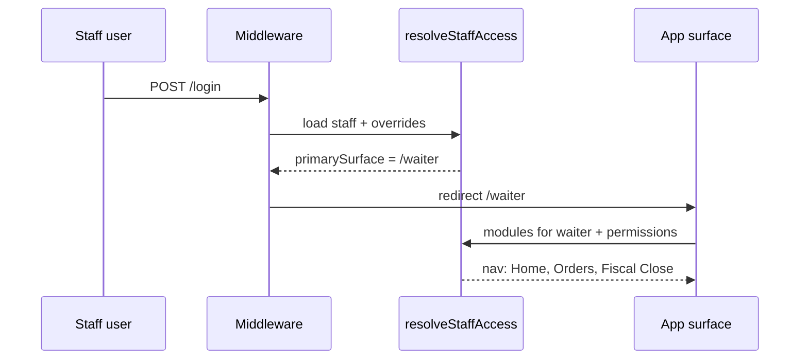

# ADR-024: Staff Duties, Surfaces & Permission Access

| Field | Value |
|-------|--------|
| **Status** | **Accepted** — staff access ceiling |
| **Date** | 2026-05-29 |
| **Depends on** | [ADR-011](./ADR-011-fiscal-compliance-spine.md) · [ADR-012](./ADR-012-fiscal-journal-spine.md) · `staff` / `staff_locations` (as-built) |
| **Related** | [ADR-001](./ADR-001-universal-ordering-platform.md) (multi-channel staff orders) · [denis-implementation-map.md](./denis-implementation-map.md) |
| **Implements in** | `src/lib/auth/` · route groups `(waiter)` · `(bar)` · `(kitchen)` · `(dashboard)` · `(admin)` |

---

## 0. Doctrine

**Everyone logs into their own system. Permissions extend that system — they do not dump people into someone else's app.**

- **Surface** = dedicated app shell (waiter PWA, bar, kitchen KDS, ops dashboard, admin back-office).
- **Permission** = atomic capability (read orders, close fiscal shift, collect payment).
- **Role** = **template only** — default permission bundle for fast invite; **never** the sole gate in code.
- **Fiscal duties** use the **same permission model** as floor ops — Z-Bon is a permission, not a manager role hack.

One login (Supabase). Many apps. One resolver: `resolveStaffAccess()`.

---

## 1. Problem (as-built)

| Gap | Risk |
|-----|------|
| Authorization is ad-hoc `staff.role === '…'` across middleware, layouts, sidebar, ~30 API routes | Inconsistent; waiter blocked in UI but API may allow |
| `waiter` redirected to `/waiter`; `kitchen` partial; no **bar** surface | Wrong UX; šanker uses generic dashboard |
| Z-Bon POST = `owner|manager`; Z-Bon GET = includes `staff|kitchen` | Compliance contradiction |
| No way to grant **one waiter** daily report or shift close without promoting to manager | Real venues rotate duties on floor |
| Sidebar hide ≠ security | URL bypass |
| RLS is **location-scoped only**, not action-scoped | Acceptable for v1; fiscal actions need app-layer + audit |

**Non-goal:** Replace Supabase Auth or build a second user directory.

---

## 2. Decision — three layers

```
┌─────────────────────────────────────────────────────────────┐
│ L3  SURFACES (apps)                                         │
│     /waiter · /bar · /kitchen · /dashboard · /admin · /fiscal│
│     Login → primary surface · modules visible = permissions   │
├─────────────────────────────────────────────────────────────┤
│ L2  AUTHORIZATION (single module)                           │
│     resolveStaffAccess() · PERMISSION_CATALOG · ROLE_TEMPLATES│
│     effective = template ∪ grants − revokes                   │
├─────────────────────────────────────────────────────────────┤
│ L1  IDENTITY (existing)                                     │
│     auth.users · staff · staff_locations · org/location scope │
└─────────────────────────────────────────────────────────────┘
                              │
                              ▼
┌─────────────────────────────────────────────────────────────┐
│ COMPLIANCE GUARDS (fiscal — ADR-011 L5 / ADR-012)           │
│     standalone mode · register bound · audit_log · closed_by  │
└─────────────────────────────────────────────────────────────┘
```

**Hard rules**

| ID | Rule |
|----|------|
| **SA-1** | No production check of `staff.role` except inside `ROLE_TEMPLATES` and login routing |
| **SA-2** | UI visibility and API enforcement use **the same** permission keys |
| **SA-3** | Primary surface is fixed per role template; extra powers = **modules in that app**, not auto-promotion to dashboard |
| **SA-4** | Cross-surface access requires explicit `surface.*` permissions |
| **SA-5** | Every mutating `fiscal.*` permission → `audit_log` + actor (`staff.id`, `user_id`) |
| **SA-6** | `owner` is omnipotent within org; cannot be permission-revoked |
| **SA-7** | Manager may grant/revoke only permissions they themselves hold (delegation lattice) |

---

## 3. Surfaces (staff apps)

Each surface is a **route group + layout shell + module registry**. Staff land on **one primary surface** after login.

| Surface | Path prefix | Primary roles | Device target |
|---------|-------------|---------------|---------------|
| **Waiter** | `/waiter` | `waiter`, optionally `staff` | Phone PWA |
| **Bar** | `/bar` | `bar` (new template role) | Tablet / phone at bar |
| **Kitchen** | `/kitchen` | `kitchen` | Tablet KDS full-screen |
| **Ops** | `/dashboard` | `staff`, `manager` | Tablet / desktop |
| **Admin** | `/admin` | `manager`, `owner` | Desktop |
| **Fiscal** | `/fiscal` | optional dedicated tablet | Cash desk (Phase S5) |

### 3.1 Primary surface map

| `staff.role` (template) | Login redirect | Blocked from |
|-------------------------|----------------|--------------|
| `waiter` | `/waiter` | `/dashboard`, `/admin` (unless `surface.dashboard.access`) |
| `bar` | `/bar` | `/waiter`, `/dashboard` (unless cross-surface grant) |
| `kitchen` | `/kitchen` | `/waiter`, `/dashboard` |
| `staff` | `/dashboard` | `/admin` (unless `surface.admin.access`) |
| `manager` | `/dashboard` | — |
| `owner` | `/dashboard` (prefer `/admin` for setup tasks) | — |

Existing `/waiter/login` stays for floor PWA; other surfaces may share `/login` with redirect.

### 3.2 Module injection (not app hopping)

When a `waiter` receives `fiscal.shift.close`, they **stay in `/waiter`**. A new nav module appears:

```
/waiter          → Home, Orders, Tables, Calls
/waiter/more     → optional modules gated by permissions
/waiter/fiscal   → Z-Bon flow (requires fiscal.shift.close)
```

Same pattern for bar/kitchen. **Do not** open full `/admin/fiscal` for floor staff by default.

### 3.3 Cross-surface permissions

| Permission | Effect |
|------------|--------|
| `surface.waiter.access` | May open waiter app (rare: manager floor help) |
| `surface.bar.access` | May open bar app |
| `surface.kitchen.access` | May open kitchen KDS |
| `surface.dashboard.access` | May open ops dashboard |
| `surface.admin.access` | May open admin back-office |
| `surface.fiscal.access` | May open dedicated `/fiscal` tablet app |

Without these, middleware **redirects back** to primary surface.

---

## 4. Permission catalog

Stable string keys: `domain.action` or `domain.scope.action`. Add new keys only via ADR amendment + test fixture.

### 4.1 Operations

| Key | Description |
|-----|-------------|
| `orders.read` | View orders at assigned locations |
| `orders.read.drinks` | Drink tickets only (bar station filter) |
| `orders.read.food` | Food tickets only (kitchen station filter) |
| `orders.update_status` | pending → preparing → ready → delivered |
| `orders.create` | Staff/waiter manual order |
| `orders.cancel` | Cancel before kitchen accept (policy-bound) |
| `tables.read` | View table map / sessions |
| `tables.manage` | PIN, transfer, device block |
| `calls.manage` | Waiter call queue |
| `sessions.read` | View open table sessions |
| `sessions.close` | Close session / bill |
| `payments.collect` | Terminal, card-at-table, cash mark-paid |
| `payments.refund` | Refund (high sensitivity) |
| `analytics.read` | History, revenue summaries |
| `denis.ops.read` | Denis ops / copilot panel |

### 4.2 Administration

| Key | Description |
|-----|-------------|
| `menu.read` | View menu |
| `menu.edit` | Menu CRUD |
| `staff.read` | View team list |
| `staff.manage` | Invite, activate, **edit permissions** |
| `settings.manage` | Location, printers, integrations |
| `billing.manage` | Stripe, subscription |

### 4.3 Fiscal & compliance (ADR-011 L5 / ADR-012)

| Key | Description | Legal / audit |
|-----|-------------|---------------|
| `fiscal.shift.read` | View shift totals, Z-Bon history | read-only |
| `fiscal.report.daily` | Operational daily report (no TSE sign) | read-only |
| `fiscal.shift.close` | **Tagesabschluss / Z-Bon** via `runFiscalPipeline(z_closing)` | **`closed_by`**, TSE, journal row |
| `fiscal.receipt.read` | Beleg / receipt preview | read-only |
| `fiscal.storno.execute` | Storno through fiscal pipeline | journal + audit |
| `fiscal.export.accounting` | DATEV export | audit |
| `fiscal.export.audit` | DSFinV-K export | audit |
| `fiscal.register.read` | TSE / register status | read-only |
| `fiscal.register.manage` | Provision, Kassenmeldung | audit |

**Distinction:** `fiscal.report.daily` ≠ `fiscal.shift.close`. A shift lead may read reports without closing the register.

### 4.4 Permission → fiscal API mapping (target)

| API / action | Required permission |
|--------------|---------------------|
| `POST /api/fiscal/daily-closing` | `fiscal.shift.close` |
| `GET …/z-bon` | `fiscal.shift.read` **or** `fiscal.shift.close` |
| `GET /api/export/dsfinvk` | `fiscal.export.audit` |
| `GET /api/export/datev` | `fiscal.export.accounting` |
| `POST /api/fiscal/kassenmeldung` | `fiscal.register.manage` |
| `POST /api/orders/…/storno` | `fiscal.storno.execute` (+ existing business rules) |

---

## 5. Role templates (defaults only)

Templates live in **code** (`ROLE_TEMPLATES`) — versioned, CI-tested. DB stores **overrides only**.

| Template `staff.role` | Default permissions (summary) | Primary surface |
|-----------------------|------------------------------|-----------------|
| **waiter** | `orders.*` floor, `tables.read`, `calls.manage`, `sessions.read`, `orders.create` | `/waiter` |
| **bar** | `orders.read.drinks`, `orders.update_status`, `payments.collect`, `orders.create` | `/bar` |
| **kitchen** | `orders.read.food`, `orders.update_status` | `/kitchen` |
| **staff** | waiter set + `tables.manage`, `sessions.close`, `payments.collect`, `analytics.read` | `/dashboard` |
| **manager** | staff + `menu.edit`, `staff.manage`, `settings.manage`, `fiscal.shift.read`, `fiscal.report.daily`, `fiscal.shift.close`, `fiscal.export.accounting`, `payments.refund`, `surface.admin.access` | `/dashboard` |
| **owner** | `*` (all permissions) | `/dashboard` |

New DB migration adds **`bar`** to `staff.role` check constraint (alongside existing `waiter` migration pattern `00083`).

**Invite flow:** pick template → UI pre-checks permissions → owner toggles grants/revokes → save overrides.

---

## 6. Effective access

```typescript
function resolveStaffAccess(staff: StaffRow, overrides: PermissionOverride[]): StaffAccess {
  const template = ROLE_TEMPLATES[staff.role] ?? [];
  const grants = overrides.filter(o => o.granted).map(o => o.permission);
  const revokes = new Set(overrides.filter(o => !o.granted).map(o => o.permission));

  let effective = new Set([...template, ...grants]);
  if (staff.role !== "owner") {
    for (const r of revokes) effective.delete(r);
  }

  return {
    permissions: effective,
    primarySurface: PRIMARY_SURFACE[staff.role],
    allowedSurfaces: computeAllowedSurfaces(effective, staff.role),
    modules: computeModulesForSurfaces(effective),
  };
}

function can(access: StaffAccess, permission: PermissionKey, ctx?: AccessContext): boolean {
  if (access.permissions.has(permission) === false) return false;
  if (ctx?.locationId && !staffHasLocation(staff, ctx.locationId)) return false;
  return runComplianceGuards(permission, ctx); // fiscal standalone, etc.
}
```

Public API:

- `resolveStaffAccess(staff)` — server components, layouts
- `assertPermission(permission, ctx?)` — API routes (throws 403)
- `can(permission)` — client via `StaffAccessProvider` context (UX only)

---

## 7. Module registry (surface × permission)

Central config: `src/lib/auth/staff-modules.ts`

| Surface | Module ID | Nav label | Required permission |
|---------|-----------|-----------|---------------------|
| waiter | `orders` | Orders | `orders.read` |
| waiter | `tables` | Tables | `tables.read` |
| waiter | `calls` | Calls | `calls.manage` |
| waiter | `new-order` | New order | `orders.create` |
| waiter | `fiscal-report` | Daily report | `fiscal.report.daily` |
| waiter | `fiscal-close` | Close shift | `fiscal.shift.close` |
| waiter | `payments` | Pay | `payments.collect` |
| bar | `queue` | Drink queue | `orders.read.drinks` |
| bar | `fiscal-close` | Close shift | `fiscal.shift.close` |
| kitchen | `kds` | KDS | `orders.read.food` |
| dashboard | `kitchen-link` | Prep display | `surface.kitchen.access` OR `orders.read` |
| admin | `tagesabschluss` | Tagesabschluss | `fiscal.shift.close` |
| admin | `dsfinvk` | DSFinV-K | `fiscal.export.audit` |

Layouts read the registry — **no hardcoded nav if/role chains**.

---

## 8. Compliance guards

Applied inside `can()` after permission check:

| Guard | Applies to | Rule |
|-------|------------|------|
| **Location scope** | all | `locationId ∈ getStaffAccessibleLocationIds()` |
| **Standalone fiscal** | `fiscal.shift.close`, `fiscal.storno.execute`, exports | `resolveFiscalBehavior(location) === 'standalone'` |
| **Register present** | `fiscal.shift.close` | location has active `fiscal_register` / TSS |
| **Idempotent close** | `fiscal.shift.close` | reject duplicate `business_date` (ADR-012 journal) |
| **Audit** | all mutating `fiscal.*` | `auditLog({ action, staffId, locationId, metadata })` |
| **Actor on close** | `fiscal.shift.close` | journal + `daily_closings.closed_by = auth.uid()` |
| **Dual control** (Phase S6, optional org flag) | `fiscal.shift.close` | requires second `manager` approval token when enabled |

Connects to [ADR-011 §2 Layer 5](./ADR-011-fiscal-compliance-spine.md) Compliance surface and [ADR-012 §8](./ADR-012-fiscal-journal-spine.md) Z-Bon journal truth.

---

## 9. Data model

### 9.1 Existing (unchanged)

- `staff.role` — template identifier
- `staff_locations` — location scope
- `staff.is_active`, soft delete

### 9.2 New — permission overrides

```sql
CREATE TABLE staff_permission_overrides (
  staff_id UUID NOT NULL REFERENCES staff(id) ON DELETE CASCADE,
  permission TEXT NOT NULL,
  granted BOOLEAN NOT NULL,
  granted_by UUID REFERENCES staff(id),
  created_at TIMESTAMPTZ NOT NULL DEFAULT now(),
  PRIMARY KEY (staff_id, permission)
);

CREATE INDEX idx_staff_permission_overrides_staff ON staff_permission_overrides(staff_id);
```

- `granted = true` → explicit grant (adds to template)
- `granted = false` → explicit revoke (removes from template)
- No row → inherit template default

RLS: owner/manager with `staff.manage` on same org; staff read **own** overrides only (for UI).

### 9.3 Optional Phase S6 — permission change audit

Append-only `staff_permission_audit` (who changed whose permissions when).

---

## 10. Enforcement map

| Layer | Mechanism |
|-------|-----------|
| **Middleware** | Auth + redirect to primary surface; block cross-surface without `surface.*` |
| **Layout** | `requireSurface()` + load `StaffAccessProvider` |
| **API** | `assertPermission()` at top of handler |
| **UI** | `can()` from context; hide module nav entries |
| **RLS** | Keep location scope; **do not** duplicate full permission matrix in PG for v1 |

Replace gradually:

```typescript
// ❌ legacy
if (!["owner", "manager"].includes(staff.role))

// ✅ ADR-024
await assertPermission(staff, "fiscal.shift.close", { locationId });
```

---

## 11. Admin UX (staff management)

Path: `/admin/staff` (or dashboard staff page migrated to admin).

**Invite / edit staff**

1. Name, email, locations (`staff_locations`)
2. Role template dropdown
3. Permission matrix (grouped: Operations · Payments · Fiscal · Admin)
4. Pre-filled from template; diffs saved as overrides
5. Preview: „Logs into: **Waiter app** · Extra modules: **Close shift**“

**Accountant invite (template preset)**

- Role: `staff` with revokes on ops; grants: `fiscal.shift.read`, `fiscal.export.accounting`, `fiscal.export.audit`, `surface.admin.access`
- Time-limited invite expiry (existing invite flow)

---

## 12. Login & session flow



Single Supabase session cookie works across surfaces **only if** `surface.*` permission allows navigation.

---

## 13. Migration from as-built

| Current | Target |
|---------|--------|
| `STAFF_ROLES` in constants | Keep; add `bar` |
| `requireAdmin()` | `assertPermission('menu.edit')` or keep as sugar |
| `FLOOR_STAFF_ROLES` arrays in APIs | Delete; use permissions |
| Waiter layout `WAITER_ALLOWED_ROLES` | `requireSurface('waiter')` |
| Dashboard redirect `waiter → /waiter` | Keep via `primarySurface` |
| `/admin/tagesabschluss` `requireAdmin()` | `assertPermission('fiscal.shift.close')` |
| Z-Bon GET allows kitchen | `fiscal.shift.read` only |

**Strangler:** S1 ships resolver + tests without changing all APIs; S2 migrates API routes in batches; S3 switches layouts.

---

## 14. Implementation tracks

One PR per step. Run `pnpm type-check` + `pnpm test:run` + permission fixture tests each PR.

| Track | Deliverable | Acceptance |
|-------|-------------|------------|
| **S0** | This ADR + `PERMISSION_CATALOG` + `ROLE_TEMPLATES` + tests | Fixture: waiter+grant close → effective set |
| **S1** | `resolveStaffAccess`, `assertPermission`, `StaffAccessProvider` | No user-facing change |
| **S2** | Middleware + layout surface guards | Waiter cannot hit `/dashboard` URL |
| **S3** | Migration `staff_permission_overrides` + admin matrix UI | Owner grants waiter `fiscal.shift.close` |
| **S4** | `/bar` surface + `bar` role migration | Bar staff login → `/bar` |
| **S5** | `/kitchen` standalone + module registry for waiter fiscal tab | Kitchen full-screen; waiter Z-Bon in-app |
| **S6** | Fiscal API migration + audit + remove role arrays | All fiscal routes use permissions |
| **S7** | Optional dual-control + permission audit log | Org setting |

**Do not combine S3 + S6** in one PR (schema + wide API sweep).

---

## 15. Verification (summary)

- [ ] Waiter default: no `/dashboard`, no `/admin`
- [ ] Waiter + `fiscal.shift.close`: Z-Bon works in `/waiter/fiscal`; `closed_by` set
- [ ] Waiter without close permission: POST daily-closing → 403
- [ ] Manager grants permission manager doesn't hold → 403
- [ ] Owner: all permissions; revoke ignored
- [ ] Bar login → `/bar`; sees drinks queue only
- [ ] Kitchen login → `/kitchen`; cannot GET Z-Bon without `fiscal.shift.read`
- [ ] DSFinV-K requires `fiscal.export.audit`
- [ ] `pnpm test:run src/__tests__/staff-access*.test.ts` green

Full checklist: [ADR-024-verification-checklist.md](./ADR-024-verification-checklist.md)

Implement: [ADR-024-session-prompts.md](./ADR-024-session-prompts.md) · Operator: [ADR-024-operator.md](./ADR-024-operator.md) · Parallel: [ADR-024-parallel-agents.md](./ADR-024-parallel-agents.md)

---

## 16. Non-goals (v1)

- Per-org custom role templates in DB (enterprise S7+)
- ABAC on table zones (“waiter section A only”) — use locations first
- Guest permission model — separate ACL ([ADR-019 ACT](./ADR-019-denis-unified-brain.md))
- Permission matrix in PostgreSQL RLS policies

---

## 17. Locked product decisions

| Decision | Choice |
|----------|--------|
| Permission vs role | **Permission-first**; role = template |
| Floor staff extra fiscal | **Module inside primary app** (waiter `/waiter/fiscal`) |
| Dedicated fiscal tablet | **`/fiscal`** surface Phase S5; optional via `surface.fiscal.access` |
| Z-Bon authority | **`fiscal.shift.close`** permission, not manager role |
| Daily report vs close | **Separate keys** `fiscal.report.daily` vs `fiscal.shift.close` |
| Cross-app access | **Explicit `surface.*` grants only** |

---

## 18. Code layout (target)

```
src/lib/auth/
  staff-access.ts           # resolveStaffAccess, can, assertPermission
  permission-catalog.ts     # PERMISSION_CATALOG, types
  role-templates.ts         # ROLE_TEMPLATES, PRIMARY_SURFACE
  staff-modules.ts          # surface module registry
  compliance-guards.ts      # fiscal standalone, register, idempotency hooks
  staff-access-context.tsx  # client provider (optional)
```

---

*End of ADR-024*
