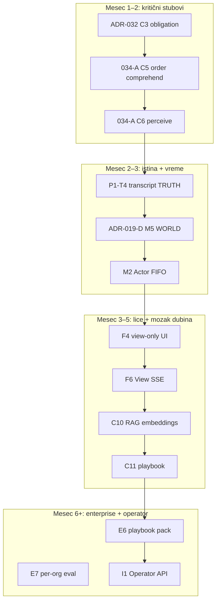

# ADR-035: Pillar Strengthening Plan — stub po stub

| Field | Value |
|-------|--------|
| **Status** | **Accepted** — detaljni plan ojačavanja **temelja**, ne mosta |
| **Date** | 2026-05-29 |
| **Metafora** | **Stub** = nosi teret · **Most** = ono što gost vidi (chat, chips, recap) |
| **Pravilo** | Prvo stub **SOLID**, tek onda novi most. Most na slabom stubu = puca pod opterećenjem |
| **Perfection** | [ADR-034](./ADR-034-denis-perfection-doctrine.md) |
| **Redosled rada** | [ADR-033-active-tracker.md](./ADR-033-active-tracker.md) |

---

## 0. One sentence

**Unapređujemo mostove tek kad ojačamo stubove ispod njih — svaki sloj arhitekture, stub po stub, nedeljama.**

---

## 1. Legenda snage stuba

| Oznaka | Značenje | Akcija |
|--------|----------|--------|
| 🟢 **SOLID** | Production-grade, eval pokriva, nema dual path | Održavaj, ne diraj bez razloga |
| 🟡 **PARTIAL** | Kod postoji, granica puca pod opterećenjem | **Ojačaj stub** — prioritet |
| 🔴 **STUB** | Šema/postoji fajl, ne drži produkciju | **Zameni ili dovrši** pre novog UX-a |
| ⚫ **OPEN** | Nije početo | Posle PARTIAL stubova istog sloja |

**Most** = feature koji gost oseti. **Ne graditi nov most** dok nosilac ispod nije min 🟡→🟢.

---

## 2. Pregled — svi stubovi (snapshot)

```
Sloj          Solid   Partial   Stub/Open
─────────────────────────────────────────
P1 TRUTH        4       2         2
P2 POLICY       6       2         2
P3 COGNITION    5       4         3
P4 TEMPORAL     2       3         3
P5 FACE         3       3         2
P6 ENTERPRISE   3       2         5
P7 INTEGRATION  1       2         4
```

**Najslabiji stubovi (rad prvo):** ARCH-1/2/3 (cognition), transcript dual-write (truth), view poll (face), actor off-by-default (temporal).

---

# P1 — TRUTH (temelj svega)

> *Ako TRUTH laže, savršen Denis je nemoguć — bez obzira na LLM.*

**Folder:** `platform/` · `denis_timeline` · Order Core read · `loop/load-order-facts`

| Stub | Danas | Most koji nosi | Poboljšanje (detaljno) | Nedelje | Track |
|------|-------|----------------|------------------------|---------|-------|
| **T1** `denis_timeline` append RPC | 🟢 | svaki turn, replay | Dodaj `mind.obligation_snapshot` event posle FOLD | 1 | P1-T1 |
| **T2** Order facts u FOLD | 🟢 | status, „gde je pivo“ | Uključi `order_items` notes u FOLD za kitchen truth | 1 | P1-T2 |
| **T3** `truthHash` + idempotency | 🟡 | actor dedupe | truthHash u svaki signal; actor reject stale | 2 | ADR-019-E |
| **T4** Transcript **jedan izvor** | 🟢 | chat UI | Timeline only — ARCH-4 SOLID (ADR-019-F COMPLETE) | — | ADR-019-F |
| **T5** Fiscal journal **read-only** u FSP | 🟡 | „da li je fiskalno“ | Pointer `fiscal.summary` u evidence — nikad LLM write | 2 | ADR-012 read |
| **T6** Guest memory TRUTH | 🟢 | return guest welcome | Memory u FOLD svaki turn; TTL + erase test | 1 | D-MEM verify |
| **T7** iota timeline fixtures | 🟡 | eval petlja | 7 replay scenarija + waiter parity +2 | 1 | ADR-032.1 CODE |

### P1 exit gate

- [x] `grep ai_sessions.messages` — guest path write = 0 (2026-06-07, Phase F)
- [x] Replay fixture → isti `TableSessionState` kao live
- [x] `pnpm eval:denis` + timeline replay test

---

# P2 — POLICY (pravila bez LLM-a)

> *Stubovi koji odlučuju BEZ GPT-a — konobarovo znanje kuće.*

**Folder:** `kernel/` · `venue/` · `platform/flow-engine`

| Stub | Danas | Most koji nosi | Poboljšanje | Nedelje | Track |
|------|-------|----------------|-------------|---------|-------|
| **K1** Flow DSL + node transitions | 🟢 | faza porudžbine | — | — | — |
| **K2** Reflex T0 + handoff ACL | 🟢 | Kellner, račun | — | — | — |
| **K3** Goal stack (conflict, upsell) | 🟢 | rush skip dessert | Eval: rush → no upsell | 0.5 | D-NUDGE |
| **K4** VKG L0 catalog + L1 upsell | 🟢 | preporuke | — | — | — |
| **K5** VKG L3 learned edges | 🟡 | pairing | Nightly aggregate → admin approve → VKG | 3 | M16 harden |
| **K6** Party / multi-device cart | 🟢 | dva telefona | Actor + party conflict eval | 1 | ADR-019-E |
| **K7** Venue ops (rush, KDS, 86) | 🟢 | slow kitchen tell | Ops u beliefs svaki FOLD — test | 0.5 | M13 verify |
| **K8** Floor graph | 🟡 | staff copilot | Floor snapshot u FSP za enterprise | 2 | M14 |
| **K9** Conflict resolution | 🟢 | peer manual merge | — | — | — |
| **K10** Scheduler / proactive triggers | 🟢 | watcher cron | — | — | — |

### P2 exit gate

- [ ] Beliefs `venue.rush`, `venue.skip_upsell` u 100% FOLD na pilotu
- [ ] Learned edge **nikad** auto bez admin

---

# P3 — COGNITION (mozak — najkritičniji stubovi)

> *Ovde su ARCH-1/2/3 — dva mozga. Most (recap) stoji na dva stuba.*

**Folder:** `cognition/` · `runtime/perceive/` · `lib/ai/ordering` (**ukloniti**)

| Stub | Danas | Most koji nosi | Poboljšanje | Nedelje | Track |
|------|-------|----------------|-------------|---------|-------|
| **C1** `compileBeliefs()` | 🟢 | TDE, jezik, faza | + obligation beliefs (DONE) | — | MR-1 |
| **C2** `decideTurnPlan()` TDE | 🟢 | reflex vs LLM | gap_blocks_confirm (DONE) | — | MR-2 |
| **C3** **Waiter Obligation** | 🟢 | ne ćuti, pivo | iota fixtures + deploy (DONE) | — | ADR-032 COMPLETE |
| **C4** Situation Pack (FSP) | 🟢 | LLM kontekst | Uvek `guest.memory` kad consent | 1 | D-MEM |
| **C5** **Order comprehend** | 🟢 | porudžbina | `applyOrderComprehend` + runtime wire (DONE) | — | ADR-034-A COMPLETE |
| **C6** **Perceive ingress** | 🟢 | razume poruku | `cognition/perceive` canonical (DONE) | — | ADR-034-A COMPLETE |
| **C7** Evidence pointers + budget | 🟡 | token cap | Tier budget u `plan-evidence.ts` + test | 2 | F1.1 |
| **C8** Template TELL catalog | 🟢 | 0 token odgovori | + waiter_gap templates (DONE) | — | — |
| **C9** Narrate LLM (T3) | 🟡 | lep ton | Facts-only lint; tier iz manifest | 2 | E1 |
| **C10** Menu RAG | 🟡 | „nešto lagano“ | Keyword → **embeddings** + Redis | 4–6 | E2 |
| **C11** Playbook examples | ⚫ | chain ton | `playbookPackId` + loader u perceive | 3–4 | MR-9 |
| **C12** L3 InterpretationTask | ⚫ | goal-directed | `topGoal → schema perceive` (Table OS L3) | 4–8 | ARCH-7 |

### P3 redosled ojačavanja (ne preskači)

```
C3 (032) → C5+C6 (034-A) → C7 → C10 → C11 → C12
```

### P3 exit gate

- [x] `grep kernel-ordering-bridge` u runtime = 0
- [x] Jedan perceive entry
- [x] Obligation samo u `cognition/waiter`
- [ ] waiter parity ≥ 95%, 60+ scenarija

---

# P4 — TEMPORAL (vreme — Denis radi dok gost ćuti)

> *Stub: session actor + watcher + world. Most: push, proactive, „spremno je“.*

**Folder:** `actor/` · `runtime/run-session-watcher` · `ingress/world` · `loop/tell-world-order`

| Stub | Danas | Most koji nosi | Poboljšanje | Nedelje | Track |
|------|-------|----------------|-------------|---------|-------|
| **M1** `POST /api/denis/signal` | 🟢 | guest write | — | — | Phase C |
| **M2** Table Session Actor FIFO | 🟡 | 2 telefona | Enable pilot; Redis lock; multi-device eval | 3–4 | ADR-019-E |
| **M3** Signal dedupe (`signalId`) | 🟢 | no double submit | — | — | — |
| **M4** Session watcher cron | 🟢 | autonomous tell | obligation tell priority (DONE) | — | ADR-032 |
| **M5** **WORLD** order status ingress | 🟡 | kitchen → guest | Outbox → signal → TELL; **isti tekst** push+chat | 3–4 | ADR-019-D |
| **M6** Proactive brain loop | 🟡 | welcome, dessert | Playbook u templates; phase guards (DONE) | 2 | D-PRO |
| **M7** Scheduler ticks | 🟢 | bill prompt, delay | — | — | M8 |
| **M8** View SSE on turn complete | ⚫ | no poll | Push view version guest layer | 2–3 | F3.4 |
| **M9** Continuous mind merge | 🟡 | „živi“ Denis | Watcher + world + turn = jedan obligation state | 2 | ARCH-6 |

### P4 exit gate

- [ ] ready order: push text === transcript line (word match eval)
- [ ] Actor on pilot: 2 phones race test PASS
- [ ] Guest poll interval ≥ 30s samo fallback

---

# P5 — FACE (šta gost vidi)

> *Most je lep — ali ako React merge-uje 5 izvora, stub VIEW puca.*

**Folder:** `loop/project-view*` · `components/guest/*` · `GET /api/denis/view`

| Stub | Danas | Most koji nosi | Poboljšanje | Nedelje | Track |
|------|-------|----------------|-------------|---------|-------|
| **F1** `projectTableSessionView()` | 🟢 | jedan read model | — | — | Phase B |
| **F2** View layers (banner, chips) | 🟡 | obligation banner | waiter_gap banner (DONE) | — | ADR-032 |
| **F3** Chrome headline / markState | 🟢 | dock stanje | TELL → headline jedan izvor | 1 | Phase D |
| **F4** **Guest UI view-only** | 🟡 | menu-view | Ukloni merge cart+scene+chat u React | 3 | G1 harden |
| **F5** Transcript render | 🟢 | chat sheet | `view.transcript` bootstrap — ARCH-4 SOLID | — | ADR-019-F |
| **F6** View SSE subscription | 🟢 | instant update | `useDenisView` SSE primary, poll fallback ≥30s | — | ADR-019-E |
| **F7** Scene ↔ view konzistencija | 🟡 | chips, sheet | Jedan PROJECT piše layers | 2 | ADR-017 |

### P5 exit gate

- [ ] Guest komponente: `grep manualCartSnapshot merge` — business logic out
- [ ] Jedan `GET /api/denis/view` — nema parallel fetch order+scene za isti state

---

# P6 — ENTERPRISE (kvalitet, lanac, prodaja)

> *Stubovi koji čine „enterprise“ — ne feature, već garancija.*

**Folder:** `cognition/manifest/` · `eval/` · `config/rollout*`

| Stub | Danas | Most koji nosi | Poboljšanje | Nedelje | Track |
|------|-------|----------------|-------------|---------|-------|
| **E1** Quality contract eval | 🟢 | 0% refusal | Per-org extension | 2 | E5 |
| **E2** Venue manifest schema | 🟡 | tier, policy | Org ceiling merge | 2 | E3 |
| **E3** Sim-before-promote | 🟢 | safe rollout | CI blokira promote na regression | 2 | MR-8 CI |
| **E4** `pnpm eval:denis` CI | 🟢 | no regression | + iota timeline u CI | 1 | C7 fixtures |
| **E5** Rollout ladder | 🟢 | shadow→denis_only | Pilot jedna lokacija locked | 1 | F0 |
| **E6** Playbook pack | ⚫ | Marriott ≠ Skyline | MR-9 full | 3–4 | F4 |
| **E7** Per-org eval suite | ⚫ | chain SLA | `eval/runs` per org_id | 3 | E5 |
| **E8** SLA dashboard | ⚫ | prodaja | p95, llm_rate, gap_rate | 3 | E4 |
| **E9** Credit tier multiplier | ⚫ | billing | ADR-009 + tier profile | 2 | E4 |

### P6 exit gate

- [ ] Manifest promote blokiran ako sim red
- [ ] Elite venue dashboard pokazuje `waiter.gap_rate`

---

# P7 — INTEGRATION (operator most — Viktor, POS)

> *Ne dira guest stub. Samo egress/ingress na TRUTH granici.*

| Stub | Danas | Most koji nosi | Poboljšanje | Nedelje | Track |
|------|-------|----------------|-------------|---------|-------|
| **I1** Operator API read | 🟡 | Viktor metrics | Komplet + audit log | 4 | F5.1 |
| **I2** `denis.*` webhooks | ⚫ | session.updated | Outbox versioned payload | 3 | F5.2 |
| **I3** OpenAPI + contract tests | ⚫ | partner onboarding | CI contract | 2 | F5.3 |
| **I4** Ingress POS world signal | ⚫ | spoljni KDS | Normalized → loop signal | 4 | I6 |
| **I5** Viktor skill read-only | ⚫ | Slack Q&A | ADR-028 V4 | 6+ | F8 |

**Pravilo:** P7 **posle** P3+C3 i P1-T4 solid — inače Viktor čita lažnu istinu.

---

## 3. Master redosled ojačavanja stubova

Ne po „lepom feature-u“, nego po **nosivosti temelja**:



---

## 4. Jedan stub = jedan PR (session prompt šablon)

```
ADR-035 pillar [STUB_ID]. Pročitaj ADR-035-pillar-strengthening-plan.md §[sloj].
Ojačaj stub [STUB_ID] iz [PARTIAL/STUB] u [SOLID].
Jedan PR. Dodaj eval ako stub nema test. Ne gradi nov most.
pnpm eval:denis PASS. Session report. Ne commit-uj.
```

**Primer:**

```
ADR-035 pillar C5. Ojačaj stub C5 order comprehend — cognition/order/, ukloni bridge iz runtime.
ADR-034-A korak 034-A.1. eval:denis. Ne commit-uj.
```

---

## 5. Mapiranje stub → ACTIVE ADR tracker

| Tracker ADR | Stubovi koje pokriva |
|-------------|----------------------|
| ADR-032 | C3, T7, M4, F2 |
| ADR-034-A | C5, C6, ARCH-1/2/3 |
| ADR-019-D | M5, F3 |
| ADR-019-E | M2, M8, F6, T3 |
| ADR-019-F | T4, F5 |
| F4 / MR-9 | C11, E6 |
| F5 / ADR-029 | I1–I5 |

---

## 6. Operator

Sve u MD. Chat = jedna linija prompta.

| Fajl | Uloga |
|------|-------|
| [ADR-033-active-tracker.md](./ADR-033-active-tracker.md) | ACTIVE ADR + sledeći PR # |
| [ADR-035](./ADR-035-pillar-strengthening-plan.md) | stub ID + šta ojačati |
| [ADR-033-operator.md](./ADR-033-operator.md) | copy-paste prompt |
| [ADR-033-session-prompts.md](./ADR-033-session-prompts.md) | detaljni prompt po ADR |

---

*End of ADR-035*
