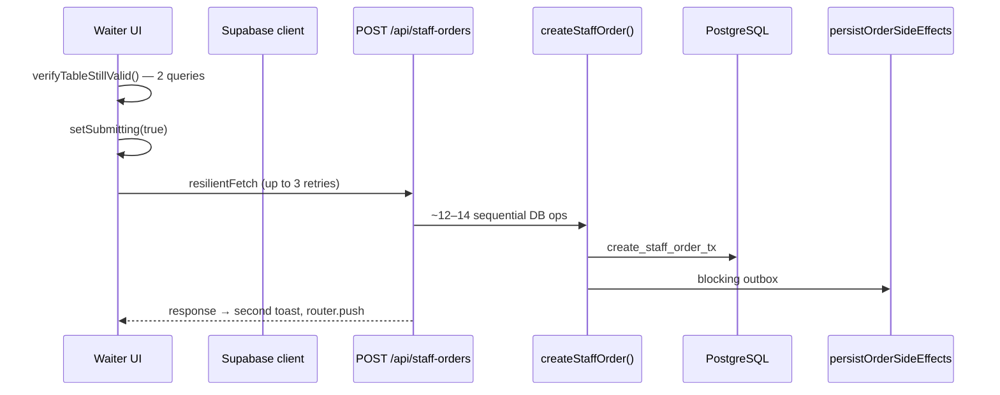
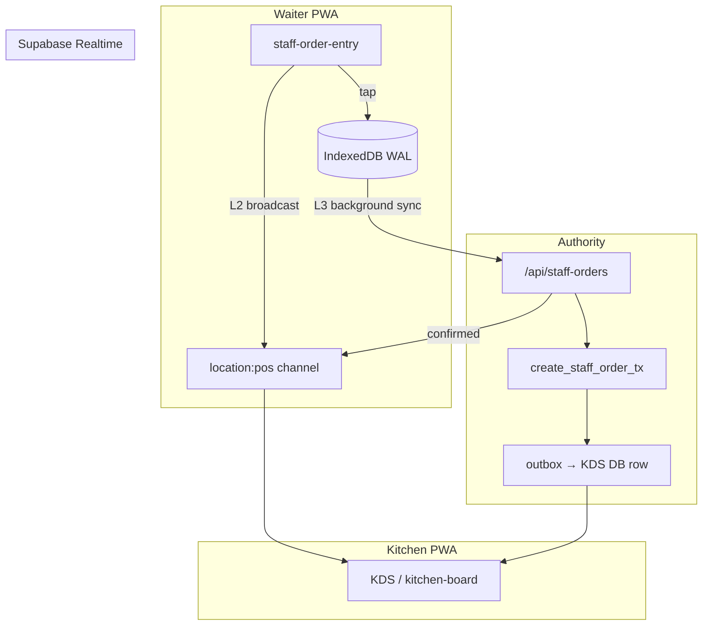

# POS Speed — Maximum Architecture for Staff Ordering (Kasa)

| Field | Value |
|-------|--------|
| **Status** | **Proposed** — design reference for waiter POS latency |
| **Date** | 2026-05-29 |
| **Problem** | Waiter taps “Order” → 1–2+ seconds before confirmation feels done |
| **Depends on** | [ADR-001](./ADR-001-universal-ordering-platform.md) · [ADR-011](./ADR-011-fiscal-compliance-spine.md) · [ADR-012](./ADR-012-fiscal-journal-spine.md) · [ADR-019](./ADR-019-denis-unified-brain.md) · [ADR-024](./ADR-024-staff-duties-access.md) |
| **Scope** | Staff/waiter POS (`/waiter`, `/dashboard/new-order`) — not guest QR checkout |

---

## 0. Executive summary

**Diagnosis:** Slowness is a **cloud-first** model — ~12–14 DB round trips + blocking outbox before HTTP response. UI toast is optimistic; button, kitchen, and trust are not.

**Competitor pattern:** Square, Toast, SumUp, Lightspeed — **device first**, background sync, fiscal at **payment**. Kitchen often via **LAN** (not internet round trip).

**What “maximum” means for us:** Not the fastest diagram on paper. Maximum = best **weighted** outcome across:

| Criterion | Weight | Why |
|-----------|--------|-----|
| Waiter tap UX | High | Core pain — lunch rush |
| Kitchen sees order quickly | High | Lost orders = lost trust |
| Offline resilience | Medium | DE venues have flaky guest WiFi / uplink |
| Fiscal / KassenSichV safety | **Non-negotiable** | Legal + audit |
| Security (no price fraud, no duplicates) | **Non-negotiable** | Enterprise buyers |
| Ops complexity (support, deploy) | High | Small team — cannot run Toast hardware fleet |
| Denis / Table OS alignment | Medium | Differentiator vs Square |
| Time to first pilot | High | Must ship in phases |

**Decision — “Vera Maximum POS” (target state):**

```
M0 (today)  →  M1 (local-first PWA)  →  M2 (+ kitchen provisional)  →  [M3/M4 enterprise tier]
     ❌              ✅ ship first              ✅ product maximum           optional ceiling
```

- **M1 + M2 = our maximum for 95% of venues** — instant waiter, kitchen ~100–300 ms, cloud authority, no hardware.
- **M3/M4 = enterprise ceiling** — venues that pay for offline-days + LAN-grade kitchen; not required for GA.

We **do not** pursue: client-side TSE, CRDT/full Postgres sync, or a second order engine. We **do** reuse IndexedDB, outbox, Denis, and fiscal-at-payment.

---

## 1. Problem statement

During service, a waiter at Kasa must:

- Tap items quickly across many tables
- Get **immediate** confirmation that the order is “in”
- **Trust that kitchen saw it** — without re-checking the screen

Today all three depend on a full cloud round trip (commonly **800 ms–2 s+**).

**Non-goals:** Guest QR path · fiscal timing change · big-bang native rewrite.

---

## 2. Diagnosis — tap to confirmation

### 2.1 End-to-end path (as-built)



### 2.2 Latency budget (warm path)

| Stage | Cost | Blocks UX? |
|-------|------|------------|
| Client pre-flight (`verifyTableStillValid`) | 100–400 ms | Yes |
| Vercel cold start | 0–800 ms | Yes |
| Sequential validation queries | 200–500 ms | Yes |
| Session + RPC | 90–270 ms | Yes |
| Blocking `persistOrderSideEffects` | 100–250 ms | Yes |
| Retries (5xx) | 0–7+ s | Yes |

**Root cause:** Confirmation = server commit + side effects, not captured intent.

### 2.3 UX bugs amplifying slowness

`src/components/dashboard/staff-order-entry.tsx`:

1. Toast before fetch, but **button blocked** until network returns
2. **Double toast** + `router.push("/dashboard/orders")` from `/waiter` routes
3. Offline queue = **failure-only**, not happy path
4. KDS uses `postgres_changes` → full refetch — kitchen always cloud-lagged

### 2.4 Not the cause

| Concern | Verdict |
|---------|---------|
| TSE at create | **No** — FC-2 in `buildOutboxEvents` |
| Denis on staff create | **Missing** (guest has it) — not latency |
| Stripe at create | **No** for bar/table payment methods |

---

## 3. What we already have

| Asset | Path | Today | Gap |
|-------|------|-------|-----|
| IndexedDB queue | `order-queue.ts` | Offline fallback | Not primary WAL |
| Sync manager | `sync-manager.ts` | Replay on `online` | No idempotency |
| Menu in memory | `staff-order-entry.tsx` | On mount | Not persisted / versioned |
| Atomic RPC | `create_staff_order_tx` | ✅ | Surrounded by slow path |
| Outbox | ADR-001 | ✅ | **Blocks response** |
| Degradation L0–5 | `degradation/status.ts` | ✅ | L5 = failure, should = normal |
| KDS realtime | `use-kds-orders.ts` | Postgres changes | Cloud-only |

**Leverage: ~60% built. Missing: intent (local-first) + kitchen provisional + idempotency.**

---

## 4. Architecture maturity levels (M0–M4) — full tradeoffs

Every option below was evaluated for **good, bad, and fit for Vera**. No free lunch.

### 4.1 Comparison matrix

| Level | Name | Waiter UX | Kitchen UX | Offline | Security | Ops cost | Denis fit | Ship effort |
|-------|------|-----------|------------|---------|----------|----------|-----------|-------------|
| **M0** | Cloud-first (today) | ❌ 1–2 s | ❌ 1–2 s | ❌ | ✅ Strong | ✅ Low | ✅ | — |
| **M1** | Local-first PWA | ✅ <50 ms | ⚠️ 300–800 ms | ⚠️ Hours | ✅ Server validates | ✅ Low | ✅ | **Low** |
| **M2** | M1 + kitchen provisional | ✅ <50 ms | ✅ ~100–300 ms | ⚠️ Hours | ✅ Signed broadcast | ✅ Low | ✅✅ | **Medium** |
| **M3** | Location Actor (warm cloud) | ✅ <100 ms | ✅ ~200 ms online | ⚠️ Hours | ✅ Single writer | ⚠️ Medium | ✅✅ | Medium–High |
| **M4** | Venue Cell (LAN node) | ✅✅ <20 ms | ✅✅ <20 ms | ✅ Days | ✅ Node validates | ❌ High | ✅✅✅ | High |
| ~~M5~~ | LAN P2P mesh (no box) | ✅ | ✅ | ✅ | ⚠️ Flaky pairing | ❌ Very high | ⚠️ | **Reject** |
| ~~M6~~ | CRDT / PowerSync | ✅ | ✅ | ✅ Days | ⚠️ Complex conflicts | ❌ Very high | ⚠️ | **Reject** |
| ~~M7~~ | Native SQLite only | ✅ | ❌ Still cloud KDS | ✅ | ✅ | ⚠️ App store | ✅ | Defer |

### 4.2 M0 — Cloud-first (today)

**Good:** Single source of truth; simple mental model; strong audit; no client trust issues.  
**Bad:** Unacceptable waiter UX; kitchen tied to internet; cold starts; 12+ queries on critical path.  
**Verdict:** Replace, don’t polish.

### 4.3 M1 — Local-first PWA

**Architecture:** IndexedDB write-ahead log → background sync → same `create_staff_order_tx`.

**Good:**

- Instant cart clear and confirmation (<50 ms)
- Reuses `order-queue.ts`, `sync-manager.ts`, menu already in React
- No hardware; no app store; one order engine (ADR-001 safe)
- Server still authoritative — client snapshot is hint only
- Fiscal unchanged (payment moment only)

**Bad:**

- Kitchen still waits for cloud commit + Realtime (~300–800 ms even after server optimization)
- Offline = hours (menu snapshot stale), not days
- IndexedDB cleared on browser data wipe — need sync retry UX
- Without idempotency → duplicate orders on retry (**must fix before GA**)

**Security:** Must add `clientOrderId` + server re-validation of every price line. Never trust client total.

**Verdict:** **Required foundation.** Ship first.

### 4.4 M2 — M1 + kitchen provisional ticket

**Architecture:** After local WAL write, staff client sends **signed** `pos.provisional_order` on Supabase Realtime Broadcast (`location:{id}:pos`). KDS shows orange “SYNC…” card immediately. Server commit upgrades same `clientOrderId` to green “#127” or red conflict.

**Good:**

- Closes biggest gap vs Toast **without hardware**
- Waiter gets **three-state trust UI**: Saved → Kitchen sees → Cloud confirmed
- Denis can consume confirmed orders only — no phantom beliefs
- Works with existing KDS hooks — extend `use-kds-orders.ts` to merge provisional + server rows

**Bad:**

- Provisional path is still **tablet → internet → cloud → KDS** (~100–300 ms, not 5 ms LAN)
- Phantom tickets if sync never completes — need **30 s timeout** + auto-hide
- Broadcast ACL must be tight (staff session, location scope, rate limit)
- Two UI states to test (provisional / confirmed / conflict)

**Security rules:**

| Rule | Why |
|------|-----|
| Broadcast requires valid staff JWT + `location_id` match | No cross-venue injection |
| Payload max size + rate limit per device | DoS protection |
| KDS never prints provisional tickets | Avoid kitchen cooking ghost orders |
| Server overwrites provisional — client cannot “confirm” itself | Anti-fraud |

**Verdict:** **This is Vera Maximum for standard tier.** Best balance of speed, safety, ops, Denis.

### 4.5 M3 — Location Actor (warm cloud per venue)

**Architecture:** One always-warm process per `location_id` (Fly Machine, Railway, etc.). WebSocket commands: `placeOrder` → in-memory validate against Redis menu cache → ACK → async Postgres + outbox.

**Good:**

- Eliminates Vercel cold start on sync path
- Single writer per location — clean ordering, simpler idempotency
- Menu in Redis (Upstash already in stack) — 12 queries → 1–2
- Natural home for Denis venue-level actor later

**Bad:**

- Still **internet-dependent** between tablet and actor — doesn’t fix dead uplink
- Per-location infra cost + monitoring
- WebSocket reconnect logic on tablets
- Another deployment surface (not just Vercel)

**Verdict:** **Phase after M2** for high-volume orgs or when p95 sync still >300 ms. Not day-one.

### 4.6 M4 — Venue Cell (LAN edge node)

**Architecture:** Always-on box on restaurant WiFi (Pi / old iPad / mini PC). Waiter + KDS connect via **local WebSocket**. SQLite queue on node. Cloud = async replica.

```
Konobar ──WiFi──► Venue Node ◄──WiFi── KDS
                      │
                 (sync when online)
                      ▼
                 Supabase + Denis + Fiskal (plaćanje)
```

**Good:**

- True Toast-class: **<20 ms** waiter + kitchen, works **without internet**
- Single writer — no race on order numbers at venue edge
- Offline for **days** with local menu snapshot
- Cloud outage = restaurant keeps operating

**Bad:**

- Hardware provisioning, updates, replacement, support calls
- Venue IT (WiFi quality, firewall, power loss)
- Split-brain if node dies mid-service — need cloud reconciliation UX
- Engineering team maintains edge software lifecycle
- Overkill for small cafés

**Verdict:** **Enterprise / DACH premium tier** (ADR future). Not GA blocker.

### 4.7 Rejected options (and why)

| Option | Why rejected |
|--------|--------------|
| **LAN P2P mesh (M5)** | mDNS/WebRTC flaky on restaurant WiFi; nightmare support; marginal gain over M4 with worse reliability |
| **CRDT / PowerSync (M6)** | 10× complexity for offline-days; Denis + fiscal still server-side; conflict UI harder than idempotency + server validate |
| **Client-side TSE (SumUp-style)** | Different compliance product; we use Fiskaly at payment — don’t fork fiscal spine |
| **Server-only optimization (no M1)** | Fixes p95 to ~600 ms but waiter still blocked; doesn’t match competitor UX bar |
| **Cloud-only broadcast without M1** | Kitchen faster, waiter still slow — half solution |
| **Second order engine** | Violates ADR-001; duplicate side effects risk |

---

## 5. Target architecture — Vera Maximum POS (M1 + M2)

### 5.1 Design principles

1. **Waiter confirmation ≠ server commit** — “captured” locally first.
2. **Kitchen awareness ≠ fiscal event** — provisional ticket is operational, not TSE.
3. **Server remains authoritative** — PostgreSQL + price snapshots on `order_items`.
4. **One order engine** — `create_staff_order_tx`; no parallel create path.
5. **Fiscal at payment only** — non-negotiable ([ADR-011](./ADR-011-fiscal-compliance-spine.md)).
6. **Idempotent sync** — `clientOrderId` everywhere.
7. **Progressive enhancement** — M1 ships before M2; M3/M4 optional.

### 5.2 Four-layer model (M1 + M2)

```
┌─────────────────────────────────────────────────────────────────┐
│ L1  INSTANT (client)                         target: <50 ms     │
│     IndexedDB WAL · cached menu · cart clear · haptic           │
│     Trust UI state 1: „Snimljeno ✓“                             │
├─────────────────────────────────────────────────────────────────┤
│ L2  PROVISIONAL (realtime broadcast)         target: <300 ms     │
│     pos.provisional_order → KDS orange card + sound             │
│     Trust UI state 2: „Kuhinja vidi ✓“                          │
├─────────────────────────────────────────────────────────────────┤
│ L3  AUTHORITY (server sync)                  target: <300 ms p95 │
│     Idempotent POST · fast RPC · defer outbox · Redis menu       │
│     Trust UI state 3: „Potvrđeno #127 ✓“                        │
├─────────────────────────────────────────────────────────────────┤
│ L4  RECONCILE (background)                   async              │
│     Conflict UI · Denis commerce.denis.world · print · push     │
└─────────────────────────────────────────────────────────────────┘
```

### 5.3 Layer 1 — Instant client write

On every “Order” tap (including online):

1. `clientOrderId` = UUID v4
2. Compute totals via shared pure fn from `src/lib/tax/vat.ts`
3. Write to IndexedDB (`order-queue.ts` extended)
4. Clear cart **immediately** — no `submitting` block for network
5. Show trust state 1
6. Trigger L2 broadcast + L3 background sync

**Menu cache:** Persist snapshot + `menuVersion` in IndexedDB on load.

### 5.4 Layer 2 — Kitchen provisional

**Channel:** `realtime:location:{locationId}:pos`  
**Event:** `provisional_order` | `order_confirmed` | `order_conflict`

KDS (`use-kds-orders.ts` / `kitchen-board.tsx`):

- Merge provisional rows (keyed by `clientOrderId`) with server orders
- Orange border + “SYNC…” until confirmed
- Sound on provisional (same as today’s new-order sound)
- Auto-remove provisional after **30 s** without server row → banner “Sync failed”

**Denis:** Signals only on L3 commit — never from L2.

### 5.5 Layer 3 — Fast authority sync

**API extensions:**

```typescript
{
  clientOrderId: zUuid(),
  menuVersion?: string,
  clientSnapshot?: { subtotal, taxAmount, total, items: [...] }
}
```

**Migration:** `staff_order_idempotency` — duplicate `clientOrderId` → 200 + existing order.

**Server quick wins (P0):**

- Parallelize table/location/org, products/categories
- Defer `persistOrderSideEffects` via `after()`
- Remove `verifyTableStillValid()` when flagged

**Server phase (P3):** `create_staff_order_fast_tx` — one RPC; outbox via trigger/`pg_notify`.

**Post-sync:** `scheduleDenisWorldSignal` for staff orders (parity with guest).

### 5.6 Layer 4 — Reconciliation

```
pending → syncing → synced (removed from queue)
                 → conflict → waiter action required
                 → failed → retry with backoff
```

Waiter UI: badge per order · conflict sheet · link pending count to `ConnectionBanner`.

### 5.7 Architecture diagram



### 5.8 Where we beat competitors (product maximum)

Square/Toast optimize **speed**. Vera Maximum also optimizes **trust + table context**:

| Feature | Square/Toast | Vera Maximum |
|---------|--------------|--------------|
| Instant waiter | ✅ | ✅ M1 |
| Kitchen fast | ✅ LAN | ✅ M2 (~100–300 ms); ✅✅ M4 LAN |
| “Did kitchen get it?” | Implicit | **Explicit 3-state UI** |
| Table / Denis brain | ❌ | ✅ ADR-019/020 after L3 |
| Permission surfaces | Basic roles | ✅ ADR-024 granular |
| DE fiscal cloud | Varies | ✅ ADR-011/012 payment moment |
| Zero hardware pilot | ❌ often needs kit | ✅ M1+M2 PWA only |

---

## 6. Conflict resolution

| Scenario | Detection | Resolution |
|----------|-----------|------------|
| Offline | No uplink | L1 + queue; L2 skipped; KDS via L3 when back |
| Product unavailable | Server 400 | Conflict; waiter fixes; provisional → red |
| Price drift | Server ≠ client | Server wins; toast adjustment |
| Menu stale | `menuVersion` mismatch | Force refresh before sync |
| Duplicate tap | Same `clientOrderId` | Idempotency → one row |
| Two waiters same table | Both sync | Allowed; same session reuse |
| Provisional timeout | 30 s no confirm | Hide orange; banner + retry |
| Card terminal | Stripe needs net | **Online-only** — no local queue |
| Venue Node down (M4) | Health check | Fallback to M2 cloud path |

---

## 7. Fiscal safety (non-negotiable)

| Moment | Fiscal | Code |
|--------|--------|------|
| L1 local write | **None** | — |
| L2 provisional | **None** | Not a Beleg, not TSE |
| L3 server commit | **None** | No `fiscal.tse_sign` at create |
| Payment settled | TSE + journal | `runFiscalPipeline` · `order-saga.ts` |

**Rules:** Price snapshots on `order_items` at L3 only · no client TSE · no fiscal outbox from client · card terminal online-only.

---

## 8. Migration plan

### 8.1 Feature flags

| Flag | Level |
|------|-------|
| `POS_DEFER_SIDE_EFFECTS` | P0 |
| `POS_LOCAL_FIRST` | M1 |
| `POS_IDEMPOTENT_SYNC` | M1 |
| `POS_KITCHEN_PROVISIONAL` | M2 |
| `POS_FAST_RPC` | M3 prep |
| `POS_LOCATION_ACTOR` | M3 |
| `POS_VENUE_CELL` | M4 |

Rollout: `location_id` allowlist → org → global. Disable `POS_LOCAL_FIRST` = instant rollback to network-first.

### 8.2 Phased delivery (recommended)

| Phase | Level | Deliverable | Waiter | Kitchen | Risk |
|-------|-------|-------------|--------|---------|------|
| **P0** | — | Defer outbox, parallel queries, UI fixes, no duplicate toast | ~40% faster | Same | Low |
| **P1** | M1 | IndexedDB first, idempotency, sync badge, shared tax calc | **Instant** | ~500 ms | Medium |
| **P2** | M2 | Provisional broadcast, KDS merge UI, 3-state trust | Instant | **~100–300 ms** | Medium |
| **P3** | M1+ | Fast RPC, Redis menu cache | Instant | ~100 ms | Higher |
| **P4** | M1+ | Denis staff signal, conflict UX polish | Instant | Fast | Low |
| **P5** | M3 | Location Actor pilot (1 org) | Instant | Fast online | Medium |
| **P6** | M4 | Venue Cell enterprise tier | **<20 ms** | **<20 ms LAN** | High |

**One PR per phase** — project rule.

### 8.3 Success metrics

| Metric | Baseline | M1 target | M2 target (maximum) |
|--------|----------|-----------|---------------------|
| Tap → cart cleared | 1–2 s | **<50 ms** p95 | <50 ms |
| Tap → KDS visible | 1–2 s | ~500 ms | **<300 ms** p95 |
| Tap → cloud confirmed | 1–2 s | <500 ms | <300 ms |
| Duplicate on retry | Possible | **0%** | 0% |
| Offline orders lost | 0 | 0 | 0 |
| Fiscal incidents | 0 | 0 | 0 |
| Phantom kitchen tickets >30 s | N/A | N/A | **0** |

### 8.4 Testing

- Unit: client/server tax parity · idempotency · provisional merge
- Integration: duplicate `clientOrderId` · unavailable product conflict
- Fiscal regression: staff create outbox **excludes** `fiscal.tse_sign`
- E2E: tap → cart <100 ms · KDS orange → green · provisional timeout
- Load: 50 concurrent staff orders / location

---

## 9. Key files

| Area | Files |
|------|-------|
| Waiter UI | `staff-order-entry.tsx` |
| API | `api/staff-orders/route.ts`, `create-staff-order.ts` |
| Offline | `order-queue.ts`, `sync-manager.ts` |
| KDS | `use-kds-orders.ts`, `use-kitchen-orders.ts`, `kitchen-board.tsx` |
| Fiscal | `run-fiscal-pipeline.ts`, `order-saga.ts`, `build-outbox-events.ts` |
| RPC | `00082_create_staff_order_tx.sql` |

---

## 10. Decision log

| Decision | Rationale |
|----------|-----------|
| **M1+M2 = Vera Maximum (standard tier)** | Best weighted score: speed, security, ops, Denis — without hardware |
| M4 Venue Cell = enterprise ceiling | True Toast parity offline; too heavy for GA |
| Reject CRDT / P2P mesh | Complexity >> benefit for our team size |
| Server authoritative always | Fiscal, audit, anti-fraud |
| Provisional ≠ Denis signal | No phantom beliefs |
| Idempotency before global M1 | Local-first implies retries |
| Defer outbox (P0) | Low-risk win before M1 |
| Card terminal online-only | Stripe Terminal requirement |

---

## 11. Open questions

1. **M2 broadcast:** Supabase Realtime Broadcast vs Postgres `INSERT` to `provisional_orders` staging table — staging adds audit but +latency; preference?
2. **Provisional print:** Block auto-print until L3 — confirm with pilot venues?
3. **M4 hardware:** Bundle Pi in enterprise package or BYOD iPad?
4. **Conflict policy:** Auto-remove unavailable lines vs always ask waiter?

---

## 12. Summary — answer to “can it be better?”

| Question | Answer |
|----------|--------|
| Better than today? | **Yes — M1 alone is 10× waiter UX** |
| Better than M1? | **Yes — M2 adds kitchen trust without hardware** |
| Better than M2? | **Yes for enterprise — M3/M4** — but higher ops cost |
| Better than M4? | Theoretically (P2P mesh, CRDT) — **not worth it for us** |
| **Our maximum?** | **M1 + M2** for product GA · **M4** optional for enterprise DACH |

**Ship M0→M1→M2. That is the maximum that fits Vera’s stack, team, fiscal model, and Denis differentiation. M3/M4 are the ceiling for buyers who pay for it — not the default.**

---

*Link from [ARCHITECTURE-INDEX.md](./ARCHITECTURE-INDEX.md) when implementation starts.*
