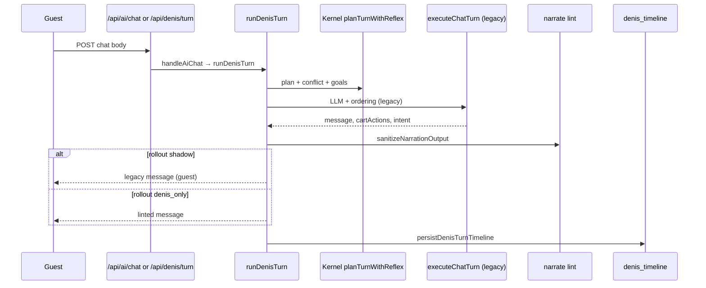

# Denis — Implementation Map & Compliance

| Field | Value |
|-------|-------|
| **Status** | Active — enforce on every Denis PR |
| **Architecture index** | [ARCHITECTURE-INDEX.md](./ARCHITECTURE-INDEX.md) — **read first** for full doc map |
| **As-built through** | **M27** (May 2026) — canary cohort rollout % |
| **North star** | [ADR-005 Maximum](./ADR-005-denis-maximum.md) |
| **Category vision** | [ADR-020 Table OS](./ADR-020-denis-table-operating-system.md) |
| **Engineering spine** | [ADR-019 Unified Brain](./ADR-019-denis-unified-brain.md) — loop + Truth·Mind·Face |
| **Kernel** | [ADR-004](./ADR-004-denis-kernel.md) |
| **Platform spine** | [ADR-003](./ADR-003-denis-platform-v2.md) |
| **Control plane** | [ADR-006](./ADR-006-denis-control-plane.md) |
| **Bootstrap** | [ADR-002 detail](./ADR-002-denis-architecture-detail.md) |

---

## 1. Purpose

This document is the **single operational map** between ADRs and code.  
Before writing Denis code, read ADR-005. Before merging, run **`pnpm verify:denis`** and **`pnpm eval:denis`**.

---

## 2. Layers → folders

| Layer | ADR | Folder | Owns |
|-------|-----|--------|------|
| **L1 Platform** | ADR-003 | `src/lib/denis/platform/` | timeline, fold, Flow DSL, sense request schema |
| **L2 Kernel** | ADR-004 | `src/lib/denis/kernel/` | beliefs, goals, VKG, conflict, correction, scheduler |
| **L3 Venue OS** | ADR-005 §5 | `src/lib/denis/venue/` | floor graph, party, ops beliefs, staff copilot |
| **Runtime** | ADR-003 PPAN+ | `src/lib/denis/runtime/` | `runDenisTurn`, sense, narrate lint, shadow diff |
| **L4 Surfaces** | ADR-005 §6 | `src/lib/denis/surfaces/` | chat API formatters (no business logic) |
| **L5 Learning** | ADR-005 §7 | `src/lib/denis/learning/` | learned edges queue, guest memory |
| **Eval** | ADR-005 §7.3 | `src/lib/denis/eval/` | fixtures, risk assert, CI harness |
| **ACL** | ADR-003 §8 | `src/lib/denis/acl/` | `DenisOrderCommand` → Order Core only |
| **Config** | ADR-002 §7 | `src/lib/denis/config/` | `ConciergeConfig`, merge, cache, rollout |
| **Architecture** | — | `src/lib/denis/architecture/` | import-matrix compliance engine |

---

## 3. As-built snapshot (M0–M27 ✅)

### 3.1 Request flow (production today)



### 3.2 Module inventory (implemented)

| Track | Code | Notes |
|-------|------|-------|
| M1 | `config/concierge-config.schema.ts`, merge, load, Redis cache | `rollout.mode` added M10 |
| M2 | `platform/append-timeline-event.ts`, `timeline-types.ts`, `fold-flow.ts`, RPC `append_denis_timeline_event` | migration `00087` |
| M3 | `platform/flow-engine.ts`, `flows/denis_short.flow.json`, `kernel/plan-turn.ts`, `goal-stack.ts`, `skill-registry.ts` | |
| M4 | `kernel/reflex-rules.ts`, `correction-protocol.ts`, `reflex-plan.ts`, `cart-projection.ts` | T0 + undo depth 5 |
| M5 | `kernel/vkg/*` | L0 catalog + L1 `upsell_rules`; Redis `ai:vkg:{locationId}` |
| M6 | `kernel/conflict/*` | `resolveCartConflict`, wired in `reflex-plan` |
| M7 | `runtime/run-denis-turn.ts`, `build-turn-context.ts`, `surfaces/chat/*` | `chat-service.ts` = 11-line wrapper |
| M8 | `kernel/scheduler/*`, `runtime/run-denis-sense.ts`, `process-scheduler-tick.ts` | migration `00088`; cron `GET /api/cron/denis-scheduler` |
| M9 | `runtime/narrate/*` | facts + lint + template fallback |
| M21 | `runtime/narrate/narrate-llm.ts`, `resolve-turn-narration.ts` | T3 facts-only LLM when `llm.narrateWithLlm` + `denis_only` |
| M22 | `runtime/perceive/slot-extract.ts`, heuristic + optional T2 LLM | timeline `slot.extracted`; legacy still orders |
| M23 | `acl/execute-denis-order-command`, `runtime/act/*` | `DenisOrderCommand` → Order Core; act dry-run default |
| M10 | `eval/*`, `runtime/shadow-diff.ts`, `config/rollout.ts` | default rollout `shadow`; `pnpm eval:denis` |
| M11 | `runtime/narrate/build-turn-quick-replies.ts`, `runtime/evaluate-proactive-tick.ts`, `lib/guest/manual-cart-snapshot.ts`, `hooks/use-denis-sense.ts` | T0 chips on templates; guest sends `manualCartSnapshot`; nudges via `/api/denis/sense` |
| M12 | `venue/party/*`, `kernel/conflict/peer-manual.ts`, `runtime/adapters/map-party-manual.ts` | multi-device party; shared ai draft; peer conflict prompt |
| M13 | `venue/ops/*`, `config.ops`, migration `00090` | 86 list, rush/KDS skip upsell, staff table hints |
| M14 | `venue/floor/*`, `config.ops.floorGraph*`, cron `/api/cron/denis-floor` | floor snapshot, Redis `denis:floor:{id}`, auto rush from KDS backlog |
| M15 | `venue/copilot/*`, `/dashboard/denis`, `/api/dashboard/denis-copilot` | staff copilot: rush/KDS, priority tables, table hints |
| M16 | `learning/*`, `denis_learned_edges`, `/admin/denis-insights`, cron aggregate | L3 pairing queue → approve → upsell_rules |
| M17 | `platform/guest-memory-types`, `learning/guest-memory/*`, `denis_guest_memory`, guest memory API | consented return-guest prefs + welcome T0 |
| M18 | `surfaces/voice/*`, `hooks/use-denis-voice`, guest mic UI | `inputSurface: voice`; timeline `voice.transcript` |
| M19 | `kernel/session-debug-graph`, `/admin/denis-debug`, session graph API | beliefs + goals + flow + timeline replay |
| M20 | `eval/run-venue-sim`, `/admin/denis-sim`, `POST /api/admin/denis-venue-sim` | counterfactual config replay on timeline |
| M24 | `eval/persist-eval-run.ts`, `/platform/denis-eval` | `pnpm eval:denis:record`; migration `00093` |
| M25 | `config/rollout-cutover.ts`, `denis-rollout-panel` on `/admin/settings` | ops ladder presets + per-location flags |
| M26 | `eval/record-eval-suite.ts`, CI workflow, `/platform/denis-eval/[runId]` | `verify:denis` + `eval:denis` in CI; optional persist on main |
| M27 | `resolveGuestLegacyPath`, `rollout.canaryPercent` | stable per-session cohort; preset Canary 10% |

### 3.3 API routes (actual)

| Route | Status | Handler |
|-------|--------|---------|
| `POST /api/ai/chat` | ✅ | `handleAiChat` → `runDenisTurn` |
| `POST /api/denis/turn` | ✅ | `runDenisTurn` (same as chat) |
| `POST /api/denis/sense` | ✅ | `runDenisSense` — telemetry without chat |
| `GET /api/cron/denis-scheduler` | ✅ | `processDenisSchedulerTick` (Bearer `CRON_SECRET`) |
| `GET /api/cron/denis-floor` | ✅ | `processDenisFloorTick` (Bearer `CRON_SECRET`) |
| `GET /api/dashboard/denis-copilot` | ✅ | staff copilot snapshot |
| `GET /api/cron/denis-learned-edges` | ✅ | aggregate learned pairing candidates |
| `POST /api/guest/denis-memory` | ✅ | load consented projection |
| `POST /api/guest/denis-memory/consent` | ✅ | grant consent + seed profile |
| `POST /api/guest/denis-memory/sync` | ✅ | sync allergies / record visit |
| `DELETE /api/guest/denis-memory` | ✅ | GDPR erase |
| `GET /api/denis/session/:id/graph` | ✅ | admin debugger — beliefs/goals/timeline (M19) |
| `POST /api/admin/denis-venue-sim` | ✅ | counterfactual kernel replay (M20) |
| `POST /api/denis/schedules/tick` | ❌ | not implemented (cron only) |

### 3.4 Database (migrations — verify push status locally)

| Migration | Table / object | Track |
|-----------|----------------|-------|
| `00086_ai_concierge_config.sql` | `locations.ai_concierge_config` JSONB | M1 |
| `00087_denis_timeline.sql` | `denis_timeline` + `append_denis_timeline_event` | M2 |
| `00088_denis_schedules.sql` | `denis_schedules` + `claim_due_denis_schedules` | M8 |
| `00089_denis_party.sql` | `denis_party_devices` + `upsert_denis_party_device` | M12 |
| `00090_denis_ops_beliefs.sql` | `denis_operating_mode`, `denis_kds_stress`, `denis_staff_table_hints` | M13 |
| `00091_denis_learned_edges.sql` | `denis_learned_edges` L3 queue | M16 |
| `00092_denis_guest_memory.sql` | `denis_guest_memory` consented prefs | M17 |
| `00093_denis_eval_runs.sql` | `denis_eval_runs` CI regression history | M24 |

### 3.5 Legacy bridge (post G4)

| Path | Role |
|------|------|
| `src/lib/denis/runtime/perceive/perceive-guest-chat-turn.ts` | **G4** — LLM perceive + session metadata only |
| `src/lib/denis/runtime/perceive/apply-structured-perception-ordering.ts` | Denis loop applies structured LLM → cart |
| `src/lib/ai/execute-chat-turn.ts` | Re-export shim (deprecated `executeChatTurn`) |
| `src/lib/ai/chat-request.schema.ts` | Guest chat request schema |
| `src/lib/ai/chat-service.ts` | thin export → `runDenisTurn` |
| `src/lib/ai/ordering/kernel-ordering-bridge.ts` | cart mutations (called from perceive apply) |

**OpenAI:** legacy adapter for structured LLM; optional T3 narration in `runtime/narrate/narrate-llm.ts` when `llm.narrateWithLlm` + rollout `denis_only`.

---

## 4. Not built yet (ADR vs code gaps)

Honest delta after M10 — do not assume these exist:

| ADR target | Status | Next track |
|------------|--------|------------|
| `runtime/perceive/slot-extract.ts` (T2) | ✅ opt-in (`ordering.slotExtractEnabled`) | ops enable per location |
| `runtime/narrate/narrate-llm.ts` (T3-only LLM) | ✅ opt-in (`llm.narrateWithLlm` + `denis_only`) | ops enable per location |
| `runtime/act/*` skill executor | ✅ dry-run default; submit via ACL when enabled | ops `actSubmitEnabled` |
| `src/lib/denis/acl/` DenisOrderCommand | ✅ `executeDenisOrderCommand` — sole Order Core path (G2) |
| `denis_eval_runs` table | ✅ migration `00093`; CI records on main when Supabase secrets set | push migration `00093` |
| Guest UI `manualCartSnapshot` on sense | ✅ | `menu-view` + `use-denis-sense` debounce |
| `use-smart-nudges` → server proactive | ✅ | `system.proactive_tick` via `fetchServerProactive` |
| Rollout `canary` / `denis_only` in production | ✅ Admin Settings → Denis rollout (M25) | enable per location; watch `DENIS_ROLLOUT_MODE` env |
| Guest language stickiness (SR chat → EN confirm) | ✅ `resolveStickyGuestLanguage` + `sr` `ai.order.*` i18n | follows conversation, not UI splash |
| Service Intelligence (dessert timing, rush ops) | 📋 ADR-005 extension only | M21+ after M8 scheduler |
| **Unified brain — signal/view, one loop, world events** | ✅ A–F built; **G2–G4 hybrid retire** in progress | [ADR-019-session-prompts](./ADR-019-session-prompts.md) §G1–G4 |
| **Concierge tuning (ops)** | 📋 [ADR-021](./ADR-021-denis-concierge-tuning.md) | venue profiles, LLM tiers, pilot week runbook |

---

## 7b. ADR-019 phases (replaces M29–M36 laundry list)

| Phase | Deliverable | Replaces |
|-------|-------------|----------|
| **A — FOLD** | Mind from TRUTH (`foldTableSessionState`) | scattered belief loads |
| **B — VIEW** | FACE API — `GET /api/denis/view` | scene + chat + poll |
| **C — SIGNAL** | `POST /api/denis/signal` | 3+ guest write APIs |
| **D — WORLD** | order/status → loop → TELL + guest push | passive guest UI |
| **E — ACTOR** | serialized Table Session Actor + view SSE + ADR-013 → signals | races, dual orchestrator, polling |
| **F — TRUTH** | transcript from timeline only; retire `ai_sessions` drift | dual-write, dispute replay |

Legacy wrappers deleted at end of Phase D. Pilot gate: `denis_only` on one venue. Scale gate: Phase E. Phase F after E.

**Operator:** [ADR-019-operator.md](./ADR-019-operator.md) · **Implement:** [ADR-019-session-prompts.md](./ADR-019-session-prompts.md) · **Review:** [ADR-019-verification-checklist.md](./ADR-019-verification-checklist.md) · **Tune (ops):** [ADR-021-denis-concierge-tuning.md](./ADR-021-denis-concierge-tuning.md)

---

## 5. Hard boundaries (invariants)

| Rule | Violation |
|------|-----------|
| Only **ACL** + legacy `order-executor.ts` may call Order Core create path | Direct `create-order` import elsewhere in AI |
| Only **ACT** / ACL mutates cart & orders | LLM handler writes draft without skill path |
| **T3 never decides** | `proposedItems` / submit in narration schema |
| **Timeline append-only** | UPDATE/DELETE on `denis_timeline` |
| **No module-level mutable state** | `new Map()` / `new Set()` at file scope in `src/lib/denis/` |
| **No duplicate side effects** | Old fire-and-forget + outbox for same event |
| **One PR = one M-track** | M11+ only after M0–M10 green |

---

## 6. Import matrix (enforced by `pnpm verify:denis`)

| Importer ↓ / Import → | config | platform | kernel | venue | runtime | surfaces | acl | learning | eval |
|-----------------------|--------|----------|--------|-------|---------|----------|-----|----------|------|
| config | — | | | | | | | | |
| platform | ✓ | — | | | | | | | |
| kernel | ✓ | ✓ | — | | | | | | |
| venue | ✓ | ✓ | ✓ | — | | | | | |
| runtime | ✓ | ✓ | ✓ | ✓ | — | ✓ | ✓ | | |
| surfaces | ✓ | | | | ✓ | — | | | |
| acl | | | | | | | — | | |
| learning | ✓ | ✓ | | | | | | — | |
| eval | ✓ | ✓ | ✓ | | ✓ | | | | — |

**OpenAI (compliance):** allowed paths under `src/lib/denis/` are `runtime/narrate/` and `runtime/perceive/` only. Legacy OpenAI adapter: `src/lib/ai/execute-chat-turn.ts` (session + LLM; F8-4).

**Shadow diff:** lives in `runtime/shadow-diff.ts` (not `eval/`) — import-matrix constraint.

---

## 7. M-track roadmap

| Track | Status | Deliverable |
|-------|--------|-------------|
| **M0** | ✅ | ADR-005 + this map |
| **M1** | ✅ | ConciergeConfig |
| **M2** | ✅ | Timeline + minimal beliefs |
| **M3** | ✅ | Goals + Flow DSL |
| **M4** | ✅ | T0 reflex + corrections |
| **M5** | ✅ | VKG v1 |
| **M6** | ✅ | Conflict resolver |
| **M7** | ✅ | `runDenisTurn` + surfaces |
| **M8** | ✅ | Scheduler + sense API |
| **M9** | ✅ | Narration contract + lint |
| **M10** | ✅ | Eval + shadow rollout |
| **M11** | ✅ | UI-first chips + guest sense + server nudges |
| **M12** | ✅ | Party model + shared cart |
| **M13** | ✅ | Ops beliefs (86, rush, staff hints) |
| **M14** | ✅ | Floor graph + auto rush, GA gate |
| **M15** | ✅ | Staff copilot (dashboard) |
| **M16** | ✅ | Learned edges queue + admin UI |
| **M17** | ✅ | Consented guest memory + return welcome |
| **M18** | ✅ | Voice in/out (premium, `surfaces.voiceEnabled`) |
| **M19** | ✅ | Admin debugger (beliefs/goals/timeline graph) |
| **M20** | ✅ | Venue sim + experiment toggles (counterfactual replay) |
| **M21** | ✅ | T3 `narrate-llm` facts-only path (opt-in cutover) |
| **M22** | ✅ | T2 slot extract (heuristic + optional LLM, timeline signal) |
| **M23** | ✅ | Act layer + `DenisOrderCommand` ACL (dry-run default) |
| **M24** | ✅ | `denis_eval_runs` + platform eval history UI |
| **M25** | ✅ | Admin rollout cutover panel + ladder presets |
| **M26** | ✅ | CI Denis gates + eval run detail UI |
| **M27** | ✅ | Canary cohort % (`rollout.canaryPercent`) |

**Unified brain ([ADR-019](./ADR-019-denis-unified-brain.md)):** Phase A→F — signal/view, one Denis loop.

**Maximum Runtime ([ADR-023](./ADR-023-denis-maximum-runtime.md)):** Belief→Policy→Language, TDE, venue manifest, MR-0–9 — production ceiling above phases A–F.

| Phase | Status | Deliverable |
|-------|--------|-------------|
| **A — FOLD** | ✅ | `foldTableSessionState()` before every DECIDE |
| **B — VIEW** | ✅ | `GET /api/denis/view` — single guest read model |
| **C — SIGNAL** | ✅ | `POST /api/denis/signal` — single guest write |
| **D — WORLD** | ✅ | Order/status events → loop → TELL + guest push |
| **E — ACTOR** | ✅ | Table Session Actor + view SSE (when Redis) |
| **F — TRUTH** | ✅ | Transcript from timeline; ai_sessions read-only |
| **G1 — unified READ** | ✅ | Guest UI → `useDenisView` only (no `/api/guest/scene`) |
| **G2 — unified SUBMIT** | ✅ | ACL submit in turn; `/api/ai/order/submit` removed |
| **G3 — pilot cutover** | ✅ | `table_os_pilot` preset + `runPilotGate()` SR eval |
| **G4 — legacy delete** | ✅ | `perceiveGuestChatTurn`; `execute-chat-turn.ts` re-export only |

**Next recommended:** G2 (submit) → G3 (pilot) → G4 (legacy delete). [ADR-020 §15–§20](./ADR-020-denis-table-operating-system.md).

See also §7b below.

---

## 8. Control plane (ADR-006)

| Concept | Code | Status |
|---------|------|--------|
| **R0–R5** | `platform/risk-levels.ts`, `skill-registry.ts` | ✅ |
| **traceId** | `denis_timeline.trace_id` | ✅ |
| **Rollout ladder** | `config/rollout.ts`, `ConciergeConfig.rollout` | ✅ default `shadow` |
| **Shadow diff** | `runtime/shadow-diff.ts` | ✅ logged per turn in shadow |
| **Timeline write** | `persistDenisTurnTimeline` via `runDenisTurn` | ✅ replaces old dual-write on chat route |

### Rollout modes (guest-visible behaviour)

| Mode | Guest message | Timeline | Shadow log |
|------|---------------|----------|------------|
| `legacy` | legacy | off | no |
| `shadow` | legacy | on | yes |
| `canary` | Denis if session in cohort % | on | `rollout.canaryPercent` (M27) |
| `denis_only` | linted Denis | on | optional |
| `simulation` | — | eval only | yes |

Override: env `DENIS_ROLLOUT_MODE`.

---

## 11. Commercial spine (ADR-009 F1–F5)

| Track | Scope | Status |
|-------|-------|--------|
| **F1** | All chat APIs → `runDenisTurn`; `executeChatTurn` adapter only | ✅ |
| **F2** | `finalize_denis_turn_metering` RPC (debit + timeline + session) | ✅ migration `00094` |
| **F3** | `src/lib/denis/commercial/` metering module | ✅ |
| **F4** | Outbox `billing.low_balance` + push handler | ✅ |
| **F5** | `org_ai_ops` projection + `refresh_org_ai_ops` | ✅ migration `00095` |
| **F6** | `denis_only` cutover; retire dual-write | ✅ removed `record-chat-turn-timeline`; metering only via commercial |
| **F7** | Stripe `applyCreditPurchase` + admin + landing copy | ✅ migration `00096`, pricing FAQ, `LandingDenisCreditsNote` |

**Verify F1:** `grep -rn executeChatTurn src/` → only `run-denis-turn.ts` + legacy file.

See **§13 F8** for ordering cutover (legacy adapter retirement).

---

## 9. Verification

```bash
pnpm verify:denis    # import matrix, paths, chat-service budget, flow JSON
pnpm eval:denis      # golden kernel scenarios (M10)
pnpm type-check
```

### PR checklist

- [ ] Code in correct layer folder  
- [ ] `pnpm verify:denis` pass  
- [ ] `pnpm eval:denis` pass (if kernel/planner touched)  
- [ ] `pnpm type-check` pass  
- [ ] One M-track scope only  
- [ ] This map updated if API, migrations, or rollout behaviour changed  

---

## 12. Design enterprise tracks (ADR-008 DE-01…DE-10)

| Track | Scope | Status |
|-------|-------|--------|
| DE-01 | Landing enterprise (hero, trust, 4× FeatureRow, pricing, FAQ) | ✅ |
| DE-02 | Auth split shell + showcase panel | ✅ |
| DE-03 | DenisPanel + DenisMessageBlock gramat | ✅ |
| DE-04 | `GuestProductRow` (menu + Denis + landing) | ✅ |
| DE-05 | Overview cockpit (`QrKpi`, floor, Denis strip) | ✅ |
| DE-06 | Admin full dark | ✅ |
| DE-07 | Dashboard Denis staff copilot drawer | ✅ |
| DE-08 | Landing Denis showcase | ✅ |
| DE-09 | ADR-007 appendix B component gallery | ✅ |
| DE-10 | Motion + a11y (48px, reduced-motion) | ✅ |

**Also:** Platform `(platform)/**` dark tokens aligned with `admin-theme` (May 2026).

**Doc:** [ADR-008](../design/ADR-008-web-design-architecture.md) · [ADR-007 Appendix B](../design/ADR-007-visual-system.md)

---

## 13. Ordering cutover (ADR-010 F8)

| Track | Scope | Status |
|-------|-------|--------|
| **F8-1** | GA gate (`ga-gate.ts`) + turn observability logs | ✅ |
| **F8-2** | Kernel ordering bridge in `runDenisTurn` | ✅ |
| **F8-3** | Live `actSubmitEnabled` pilot + legacy submit suppressed | ✅ |
| **F8-4** | Legacy adapter slim — session + LLM only | ✅ |

**Post-F8 ops:** shadow → canary → `denis_only` → `denis_act_submit_pilot`; `pnpm eval:denis` before act submit.

| Track | Scope | Status |
|-------|-------|--------|
| **F9** | Guest client act submit — `denis.actSubmitLive` meta, no legacy `/api/ai/order/submit` | ✅ |

**Remaining:** retire `order-executor.ts` + `/api/ai/order/submit` when all pilot venues on act submit.

**Doc:** [ADR-010](./ADR-010-denis-ordering-cutover.md) · ADR-006 accepted (May 2026)

---

## 10. Operator prompt (Phase A→F)

**Jovica (jedna linija):** [ADR-019-operator.md](./ADR-019-operator.md)

```
Denis brain operator mode. Pročitaj docs/architecture/ADR-019-session-prompts.md.
Uradi sledeću nedovršenu fazu (A→F). pnpm verify:denis && pnpm eval:denis.
Session report. Ne commit-uj osim ako kažem.
```

**Review (posle implement agenta):** [ADR-019-verification-checklist.md](./ADR-019-verification-checklist.md)
