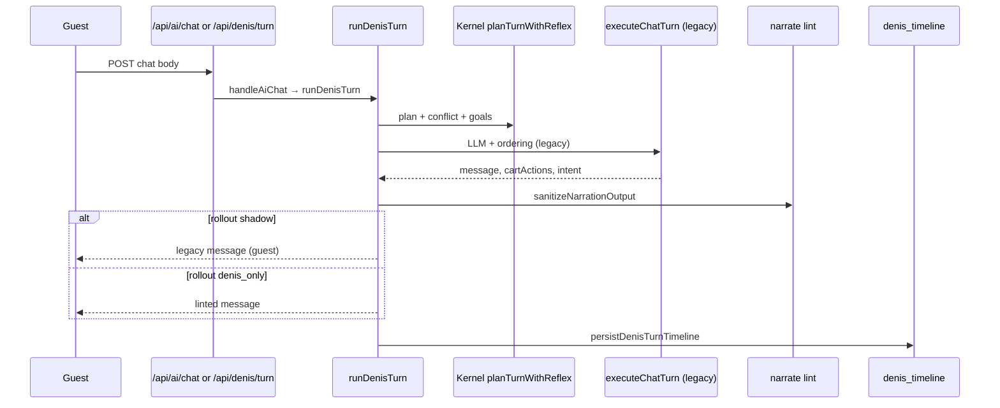

# Denis — Implementation Map & Compliance

| Field | Value |
|-------|-------|
| **Status** | Active — enforce on every Denis PR |
| **As-built through** | **M15** (May 2026) — staff copilot dashboard |
| **North star** | [ADR-005 Maximum](./ADR-005-denis-maximum.md) |
| **Kernel** | [ADR-004](./ADR-004-denis-kernel.md) |
| **Platform spine** | [ADR-003](./ADR-003-denis-platform-v2.md) |
| **Control plane** | [ADR-006](./ADR-006-denis-control-plane.md) |
| **Bootstrap** | [ADR-002 detail](./ADR-002-denis-architecture-detail.md) |

---

## 1. Purpose

This document is the **single operational map** between ADRs and code.  
Before writing Denis code, read ADR-005. Before merging, run **`pnpm verify:denis`** and **`pnpm eval:denis`**.

---

## 2. Layers → folders

| Layer | ADR | Folder | Owns |
|-------|-----|--------|------|
| **L1 Platform** | ADR-003 | `src/lib/denis/platform/` | timeline, fold, Flow DSL, sense request schema |
| **L2 Kernel** | ADR-004 | `src/lib/denis/kernel/` | beliefs, goals, VKG, conflict, correction, scheduler |
| **L3 Venue OS** | ADR-005 §5 | `src/lib/denis/venue/` | floor graph, party, ops beliefs, staff copilot |
| **Runtime** | ADR-003 PPAN+ | `src/lib/denis/runtime/` | `runDenisTurn`, sense, narrate lint, shadow diff |
| **L4 Surfaces** | ADR-005 §6 | `src/lib/denis/surfaces/` | chat API formatters (no business logic) |
| **L5 Learning** | ADR-005 §7 | `src/lib/denis/learning/` | learned edges queue, guest memory |
| **Eval** | ADR-005 §7.3 | `src/lib/denis/eval/` | fixtures, risk assert, CI harness |
| **ACL** | ADR-003 §8 | `src/lib/denis/acl/` | `DenisOrderCommand` → Order Core only |
| **Config** | ADR-002 §7 | `src/lib/denis/config/` | `ConciergeConfig`, merge, cache, rollout |
| **Architecture** | — | `src/lib/denis/architecture/` | import-matrix compliance engine |

---

## 3. As-built snapshot (M0–M15 ✅)

### 3.1 Request flow (production today)



### 3.2 Module inventory (implemented)

| Track | Code | Notes |
|-------|------|-------|
| M1 | `config/concierge-config.schema.ts`, merge, load, Redis cache | `rollout.mode` added M10 |
| M2 | `platform/append-timeline-event.ts`, `timeline-types.ts`, `fold-flow.ts`, RPC `append_denis_timeline_event` | migration `00087` |
| M3 | `platform/flow-engine.ts`, `flows/denis_short.flow.json`, `kernel/plan-turn.ts`, `goal-stack.ts`, `skill-registry.ts` | |
| M4 | `kernel/reflex-rules.ts`, `correction-protocol.ts`, `reflex-plan.ts`, `cart-projection.ts` | T0 + undo depth 5 |
| M5 | `kernel/vkg/*` | L0 catalog + L1 `upsell_rules`; Redis `ai:vkg:{locationId}` |
| M6 | `kernel/conflict/*` | `resolveCartConflict`, wired in `reflex-plan` |
| M7 | `runtime/run-denis-turn.ts`, `build-turn-context.ts`, `surfaces/chat/*` | `chat-service.ts` = 11-line wrapper |
| M8 | `kernel/scheduler/*`, `runtime/run-denis-sense.ts`, `process-scheduler-tick.ts` | migration `00088`; cron `GET /api/cron/denis-scheduler` |
| M9 | `runtime/narrate/*` | facts + lint + template fallback; **no** `narrate-llm.ts` yet |
| M10 | `eval/*`, `runtime/shadow-diff.ts`, `config/rollout.ts` | default rollout `shadow`; `pnpm eval:denis` |
| M11 | `runtime/narrate/build-turn-quick-replies.ts`, `runtime/evaluate-proactive-tick.ts`, `lib/guest/manual-cart-snapshot.ts`, `hooks/use-denis-sense.ts` | T0 chips on templates; guest sends `manualCartSnapshot`; nudges via `/api/denis/sense` |
| M12 | `venue/party/*`, `kernel/conflict/peer-manual.ts`, `runtime/adapters/map-party-manual.ts` | multi-device party; shared ai draft; peer conflict prompt |
| M13 | `venue/ops/*`, `config.ops`, migration `00090` | 86 list, rush/KDS skip upsell, staff table hints |
| M14 | `venue/floor/*`, `config.ops.floorGraph*`, cron `/api/cron/denis-floor` | floor snapshot, Redis `denis:floor:{id}`, auto rush from KDS backlog |
| M15 | `venue/copilot/*`, `/dashboard/denis`, `/api/dashboard/denis-copilot` | staff copilot: rush/KDS, priority tables, table hints |

### 3.3 API routes (actual)

| Route | Status | Handler |
|-------|--------|---------|
| `POST /api/ai/chat` | ✅ | `handleAiChat` → `runDenisTurn` |
| `POST /api/denis/turn` | ✅ | `runDenisTurn` (same as chat) |
| `POST /api/denis/sense` | ✅ | `runDenisSense` — telemetry without chat |
| `GET /api/cron/denis-scheduler` | ✅ | `processDenisSchedulerTick` (Bearer `CRON_SECRET`) |
| `GET /api/cron/denis-floor` | ✅ | `processDenisFloorTick` (Bearer `CRON_SECRET`) |
| `GET /api/dashboard/denis-copilot` | ✅ | staff copilot snapshot |
| `POST /api/denis/schedules/tick` | ❌ | not implemented (cron only) |

### 3.4 Database (migrations — verify push status locally)

| Migration | Table / object | Track |
|-----------|----------------|-------|
| `00086_ai_concierge_config.sql` | `locations.ai_concierge_config` JSONB | M1 |
| `00087_denis_timeline.sql` | `denis_timeline` + `append_denis_timeline_event` | M2 |
| `00088_denis_schedules.sql` | `denis_schedules` + `claim_due_denis_schedules` | M8 |
| `00089_denis_party.sql` | `denis_party_devices` + `upsert_denis_party_device` | M12 |
| `00090_denis_ops_beliefs.sql` | `denis_operating_mode`, `denis_kds_stress`, `denis_staff_table_hints` | M13 |

### 3.5 Legacy bridge (still active — intentional)

| Legacy path | Role until cutover |
|-------------|-------------------|
| `src/lib/ai/execute-chat-turn.ts` (~937 lines) | OpenAI, ordering, session persist, credits |
| `src/lib/ai/chat-service.ts` (11 lines) | thin export → `runDenisTurn` |
| `src/lib/ai/proactive-triggers.ts` | server evaluate via sense (M11) | legacy client fallback if no fingerprint |
| `src/lib/ai/ordering/order-executor.ts` | Order Core create (ACL allowlist) |

**OpenAI today:** only in `src/lib/ai/execute-chat-turn.ts`, **not** yet in `runtime/narrate/narrate-llm.ts`.

---

## 4. Not built yet (ADR vs code gaps)

Honest delta after M10 — do not assume these exist:

| ADR target | Status | Next track |
|------------|--------|------------|
| `runtime/perceive/slot-extract.ts` (T2) | ❌ stub folder only | post-M10 |
| `runtime/narrate/narrate-llm.ts` (T3-only LLM) | ❌ lint wraps legacy text | M9+ cutover |
| `runtime/act/*` skill executor | ❌ skills planned, not executed in Denis path | M7+ / ACL |
| `src/lib/denis/acl/` DenisOrderCommand | ❌ marker only | with act layer |
| `src/lib/denis/venue/` | ✅ party + ops + floor + copilot (M15) | M16 learning |
| `src/lib/denis/learning/` | ❌ README stub | M16+ |
| `menu_knowledge_edges` / L3 learned VKG | ❌ | M20+ |
| `denis_eval_runs` table | ❌ CI in-memory only | optional |
| Guest UI `manualCartSnapshot` on sense | ✅ | `menu-view` + `use-denis-sense` debounce |
| `use-smart-nudges` → server proactive | ✅ | `system.proactive_tick` via `fetchServerProactive` |
| Rollout `canary` / `denis_only` in production | ⚠️ config exists; ops must set explicitly | ops |
| Service Intelligence (dessert timing, rush ops) | 📋 ADR-005 extension only | M21+ after M8 scheduler |

---

## 5. Hard boundaries (invariants)

| Rule | Violation |
|------|-----------|
| Only **ACL** + legacy `order-executor.ts` may call Order Core create path | Direct `create-order` import elsewhere in AI |
| Only **ACT** / ACL mutates cart & orders | LLM handler writes draft without skill path |
| **T3 never decides** | `proposedItems` / submit in narration schema |
| **Timeline append-only** | UPDATE/DELETE on `denis_timeline` |
| **No module-level mutable state** | `new Map()` / `new Set()` at file scope in `src/lib/denis/` |
| **No duplicate side effects** | Old fire-and-forget + outbox for same event |
| **One PR = one M-track** | M11+ only after M0–M10 green |

---

## 6. Import matrix (enforced by `pnpm verify:denis`)

| Importer ↓ / Import → | config | platform | kernel | venue | runtime | surfaces | acl | learning | eval |
|-----------------------|--------|----------|--------|-------|---------|----------|-----|----------|------|
| config | — | | | | | | | | |
| platform | ✓ | — | | | | | | | |
| kernel | ✓ | ✓ | — | | | | | | |
| venue | ✓ | ✓ | ✓ | — | | | | | |
| runtime | ✓ | ✓ | ✓ | ✓ | — | ✓ | ✓ | | |
| surfaces | ✓ | | | | ✓ | — | | | |
| acl | | | | | | | — | | |
| learning | ✓ | ✓ | | | | | | — | |
| eval | ✓ | ✓ | ✓ | | ✓ | | | | — |

**OpenAI (compliance):** allowed paths under `src/lib/denis/` are `runtime/narrate/` and `runtime/perceive/` only. Legacy OpenAI remains in `src/lib/ai/execute-chat-turn.ts` until narrate cutover.

**Shadow diff:** lives in `runtime/shadow-diff.ts` (not `eval/`) — import-matrix constraint.

---

## 7. M-track roadmap

| Track | Status | Deliverable |
|-------|--------|-------------|
| **M0** | ✅ | ADR-005 + this map |
| **M1** | ✅ | ConciergeConfig |
| **M2** | ✅ | Timeline + minimal beliefs |
| **M3** | ✅ | Goals + Flow DSL |
| **M4** | ✅ | T0 reflex + corrections |
| **M5** | ✅ | VKG v1 |
| **M6** | ✅ | Conflict resolver |
| **M7** | ✅ | `runDenisTurn` + surfaces |
| **M8** | ✅ | Scheduler + sense API |
| **M9** | ✅ | Narration contract + lint |
| **M10** | ✅ | Eval + shadow rollout |
| **M11** | ✅ | UI-first chips + guest sense + server nudges |
| **M12** | ✅ | Party model + shared cart |
| **M13** | ✅ | Ops beliefs (86, rush, staff hints) |
| **M14** | ✅ | Floor graph + auto rush, GA gate |
| **M15** | ✅ | Staff copilot (dashboard) |
| **M16–M20** | ⬜ | Learning, voice (premium) |

**Next recommended:** **M16** — learned edges queue + admin UI.

---

## 8. Control plane (ADR-006)

| Concept | Code | Status |
|---------|------|--------|
| **R0–R5** | `platform/risk-levels.ts`, `skill-registry.ts` | ✅ |
| **traceId** | `denis_timeline.trace_id` | ✅ |
| **Rollout ladder** | `config/rollout.ts`, `ConciergeConfig.rollout` | ✅ default `shadow` |
| **Shadow diff** | `runtime/shadow-diff.ts` | ✅ logged per turn in shadow |
| **Timeline write** | `persistDenisTurnTimeline` via `runDenisTurn` | ✅ replaces old dual-write on chat route |

### Rollout modes (guest-visible behaviour)

| Mode | Guest message | Timeline | Shadow log |
|------|---------------|----------|------------|
| `legacy` | legacy | off | no |
| `shadow` | legacy | on | yes |
| `canary` | — | on | TBD |
| `denis_only` | linted Denis | on | optional |
| `simulation` | — | eval only | yes |

Override: env `DENIS_ROLLOUT_MODE`.

---

## 9. Verification

```bash
pnpm verify:denis    # import matrix, paths, chat-service budget, flow JSON
pnpm eval:denis      # golden kernel scenarios (M10)
pnpm type-check
```

### PR checklist

- [ ] Code in correct layer folder  
- [ ] `pnpm verify:denis` pass  
- [ ] `pnpm eval:denis` pass (if kernel/planner touched)  
- [ ] `pnpm type-check` pass  
- [ ] One M-track scope only  
- [ ] This map updated if API, migrations, or rollout behaviour changed  

---

## 10. Operator prompt (M11+)

```
Denis mode. Read docs/architecture/denis-implementation-map.md §3–4 (as-built + gaps).
M0–M10 done — implement next open track only (M11+). Run pnpm verify:denis && pnpm eval:denis.
Do not commit unless asked.
```
