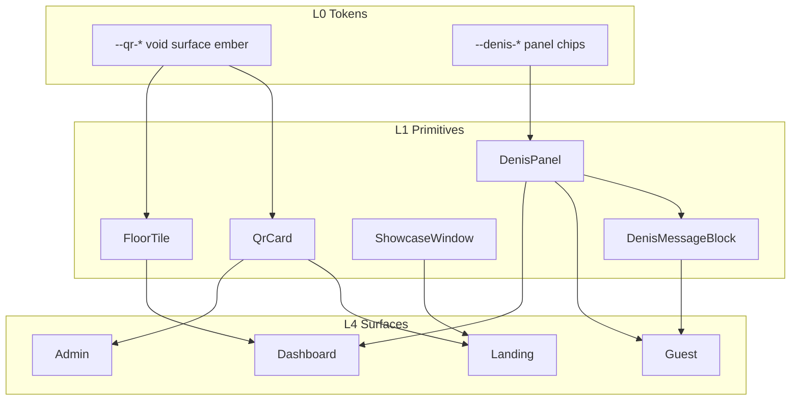

# ADR-008 — Web Design Architecture (Denis Enterprise)

| Field | Value |
|-------|--------|
| **Status** | **Draft — za odobrenje** (May 2026) |
| **Relates to** | [ADR-007](./ADR-007-visual-system.md), [Denis Spatial plan](./denis-spatial-implementation-plan.md) |
| **Supersedes** | DS-07 landing viziju, DS-06 guest chat bubble UX, delimični DS-08 admin |
| **North star** | Cursor / Raycast enterprise — crno, tiha tipografija, proizvod u prozoru, bez „SaaS plave“ i bez iMessage chat-a |

---

## 1. Zašto novi dokument

DS-01…DS-14 su u kodu, ali **vizuelni ishod nije jedan proizvod**:

| Problem | Simptom |
|---------|---------|
| Marketing ≠ ops | Landing ima mesh/indigo; dashboard ima zinc+ember; admin na main-u i dalje beli kartice |
| Denis = chatbot | Zaobljeni bubble-i, avatar red — ne enterprise concierge panel |
| Previše metafora | FloorTile hero na landing-u, tabovi, philosophy sekcije — buka umesto jedne priče |
| Niska skenabilnost | Overview i admin stranice vertikalni stack umesto cockpit rasporeda |

**ADR-008** definiše **kako svaki ekran izgleda**, **koje kartice postoje**, **koje dimenzije/spacing**, i **koji React primitive** ih gradi — pre nego što se piše još koda.

---

## 2. Dizajn sever (locked)

### 2.1 Jedna rečenica

> **Denis je tamni hospitality OS:** isti void, isti ember CTA, isti prozor (window chrome) na marketing-u i isti panel gramat na guest/admin/dashboard — razlikuje se samo **gustina** i **sadržaj kartice**.

### 2.2 Referenca (ne kopija)

| Element | Cursor/Raycast | Denis adaptacija |
|---------|----------------|------------------|
| Pozadina | `#000` / `#09090b` | `--qr-void` `#0a0908` |
| Tipografija | Veliki headline, tanki lead, malo boja | Inter, ivory `#f5f0eb`, bez gradient teksta |
| CTA | Bela pilula ili ember fill | **Ember** `#f97316` (→ `#e85d04` DS-10) |
| Proizvod | Screenshot u macOS prozoru | `ShowcaseWindow` + real `dashboard-theme` / `guest-theme` preview |
| Trust | Logo traka siva, bez animacije | 5–8 partner/logo, `opacity-40` |
| Feature red | Levo tekst / desno prozor, naizmenično | Isti pattern, hospitality copy |
| AI | Nije ljubičasti bot | **Denis panel** — strukturisane poruke, kartice proizvoda, ne bubble-i |

### 2.3 Brand (ne dirati)

| Sloj | Ime | Gde |
|------|-----|-----|
| Javni proizvod | **Denis** | Landing, guest Denis, auth, admin/platform sidebar lockup |
| Subline | **Part of Vera Group** | Ispod Denis, 11px muted |
| Tenant | Ime lokala | Dashboard sidebar (ne Denis) |
| Mark | **Table D** (`DenisTableMark`) | Denis chrome, ne Sparkles |
| Landing-only akcent | Vera indigo `#818cf8` | Samo mesh/gradient u hero pozadini — **ne u app shell-ovima** |

---

## 3. Slojevi arhitekture (L0 → L5)

```
L0  Tokens          globals.css — --qr-*, --denis-*, status boje
L1  Primitives      QrCard, QrButton, DenisChip, FloorTile, ShowcaseWindow
L2  Patterns        KPI strip, floor grid, Denis message block, pricing card
L3  Shells          Sidebar 260px + top bar + content max-width
L4  Screens         Route-level kompozicija (Overview cockpit, MenuView, …)
L5  Marketing story Landing sekcije, auth split, print QR kartica
```

**Pravilo:** L4 nikad ne uvodi novu boju ili radius — samo slaže L1–L3.

---

## 4. Tokeni i gustina (L0)

### 4.1 Paleta (product surfaces)

| Token | Hex | Upotreba |
|-------|-----|----------|
| `--qr-void` | `#0a0908` | App pozadina |
| `--qr-surface` | `#141210` | Kartica nivo 1 |
| `--qr-elevated` | `#1c1917` | Kartica nivo 2, input, Denis block |
| `--qr-border` | `#232329` | Default ivica |
| `--qr-border-subtle` | `#1a1a1f` | Sekcijski divider |
| `--qr-ivory` | `#f5f0eb` | Primarni tekst |
| `--qr-muted` | `#9c958c` | Meta, labele |
| `--qr-ember` | `#f97316` | Primary CTA, active nav, occupied tile bar |
| `--qr-ember-muted` | `rgba(249,115,22,0.12)` | Selected bg |
| `--qr-ember-glow` | `rgba(249,115,22,0.22)` | Focus, Denis halo |

### 4.2 Gustina profili

| Profil | Card padding | Grid gap | Min touch | Gde |
|--------|--------------|----------|-----------|-----|
| **compact** | 12px (`p-3`) | 8px | 44px | Overview KPI, KDS, admin tabele |
| **comfortable** | 16px (`p-4`) | 12px | 44px | Dashboard orders/tables, admin forms |
| **luxury** | 20px (`p-5`) | 16px | 48px | Guest menu, Denis sheet, checkout |

### 4.3 Tipografija

| Uloga | Klasa / size | Weight | Primer |
|-------|--------------|--------|--------|
| Display | `text-4xl`–`text-6xl` | bold, tracking-tight | Landing hero |
| H1 screen | `text-2xl` | semibold | Dashboard page title |
| H2 section | `text-lg` | semibold | Admin panel naslov |
| Body | `text-sm` (14px) | normal | Forme, liste |
| Caption | `text-xs` uppercase tracking-wide | medium | Sidebar sekcije (OPERATIONS) |
| KPI stat | `text-3xl`–`text-4xl` tabular-nums | extrabold | €88.08 |
| Floor # | `text-3xl` | extrabold | T12 na FloorTile |
| Denis body | `text-[15px]` guest / `text-sm` ops | normal, leading-relaxed | Concierge poruke |

### 4.4 Radius i senka

| Nivo | Radius | Senka |
|------|--------|-------|
| Chip / pill | `rounded-full` | none |
| Control | `rounded-lg` (10px) | none |
| Card (`QrCard`) | `rounded-xl` (12–16px) | `border + bg-qr-surface`, bez teške senke |
| Sheet / modal | `rounded-t-2xl` | backdrop `black/60` |
| Denis panel | `rounded-2xl` | `0 0 40px var(--qr-ember-glow)` @ 8% |
| ShowcaseWindow | `rounded-xl` | `0 24px 80px -24px rgba(0,0,0,0.85)` |

### 4.5 Motion

- Ulaz: `200ms ease-out`, `opacity + translateY(4px)`
- Hover kartice: `border-color` + `bg-elevated`, bez scale bounce
- Denis „thinking“: 3 tačke skeleton u block-u, **nikad spinner**
- `prefers-reduced-motion`: isključiti marquee, hero rotaciju, tile pulse

---

## 5. Biblioteka kartica (L1–L2) — detaljna specifikacija

Svaka kartica ima: **anatomiju**, **variante**, **dimenzije**, **gde se koristi**.

### 5.1 `QrCard` — univerzalna tamna kartica

```
┌─────────────────────────────────────┐
│ [optional QrCardTitle + description]│
│                                     │
│  content                            │
│                                     │
└─────────────────────────────────────┘
```

| Prop | Vrednosti | Vizuel |
|------|-----------|--------|
| `variant` | `default` | `bg-qr-surface border-qr-border` |
| | `interactive` | + `hover:border-qr-ember/30 cursor-pointer` |
| | `status` | + leva ivica 3px status boja |
| Padding | compact / comfortable / luxury | vidi §4.2 |

**Ne koristiti:** `bg-white`, `border-neutral-200`, plavi shadcn primary.

---

### 5.2 `FloorTile` — operativna jedinica poda

```
┌──────────────┐
│ ▂▂ ember bar │  ← samo occupied
│     T12      │
│   €42 · 2p   │
│   ● preparing│
└──────────────┘
```

| State | Border | Top bar | Glow |
|-------|--------|---------|------|
| `available` | dashed `qr-border` | — | — |
| `occupied` | solid | 2px ember | subtle ember |
| `attention` | solid amber | amber bar | — |
| `payment` | solid red | red bar | — |

| Dimenzija | Desktop | Tablet |
|-----------|---------|--------|
| Min width | 88px | 72px |
| Min height | 96px | 88px |
| Table # | 32px extrabold | 28px |

**Gde:** `/dashboard/tables`, Overview floor snapshot, landing showcase (static demo tiles).

---

### 5.3 `QrKpi` — KPI ćelija (nije puna kartica)

```
┌─────────────────┐
│ Revenue today   │  caption xs muted
│ €88.08          │  stat 3xl tabular
│ +12% vs yesterday│ delta pill
│ ▁▂▃▅ sparkline  │  optional 48px
└─────────────────┘
```

- U Overview **KPI strip**: 5–6 ćelija u jednom redu (`grid grid-cols-6` lg), **bez** pojedinačnih velikih kartica ispod fold-a.
- Sparkline samo ispod revenue KPI, ne odvojena kartica.

---

### 5.4 `DenisPanel` — kontejner (sheet / drawer / dashboard strip)

```
┌──────────────────────────────────────────┐
│ [D] Denis          ···  [voice] [close]  │  header 56px
│ ─── ember presence line (2px) when active│
├──────────────────────────────────────────┤
│  scroll: DenisMessageBlock[]             │
│  + ProductRecommendCard[]                │
│  + DenisChip row                         │
├──────────────────────────────────────────┤
│ [ Ask Denis…                    ] [send] │  input 52px min
└──────────────────────────────────────────┘
```

| Kontekst | Širina / visina |
|----------|-----------------|
| Guest sheet | `min(70dvh, 600px)`, full width mobile |
| Dashboard drawer | 400px desno |
| Overview strip collapsed | max 240px visina |
| Admin debugger | full content area u `AdminPanel` |

---

### 5.5 `DenisMessageBlock` — **zamenjuje ChatBubble** (DE-03)

**Ne iMessage.** Strukturisani block:

```
┌─ assistant ─────────────────────────────┐
│ [D] Denis · just now                    │
│ Preporučujem lokalni specijalitet…      │
│                                         │
│ ┌─ ProductRecommendCard ─────────────┐  │
│ │ [img]  Wiener Schnitzel   €18.50   │  │
│ │        Crispy · 25 min    [Add]    │  │
│ └────────────────────────────────────┘  │
└─────────────────────────────────────────┘

┌─ user ──────────────────────────────────┐
│                     Imamo decu, šta je blago? │
└─────────────────────────────────────────┘
```

| Element | Pravilo |
|---------|---------|
| Assistant | Levo, `bg-qr-elevated`, radius `rounded-xl`, **bez** repa bubble-a |
| User | Desno, `bg-qr-surface`, max-width 85% |
| Meta red | Denis mark 20px + ime + timestamp `text-xs muted` |
| Preporuke | Uvek `QrCard interactive` unutar block-a — **ista kartica kao menu item** |
| Thinking | Skeleton 3 linije unutar assistant block-a |

---

### 5.6 `ProductRecommendCard` / `MenuItemCard` (guest)

```
┌────────────────────────────────────────┐
│ [ 64×64 img ]  Naziv jela      €18.50 │
│                Opis 2 linije max        │
│                [Allergen chips]  [ + ]  │
└────────────────────────────────────────┘
```

- Slika: `rounded-lg`, object-cover
- Cena: tabular-nums, desno ili ispod na mobile
- CTA: ember ghost ili `+` krug 48px
- **Denis preporuka = ista komponenta** kao menu lista (jedan izvor istine)

---

### 5.7 `CartLineTile`

```
┌────────────────────────────────────────┐
│ 2× Schnitzel                    €37.00 │
│    + extra sauce                        │
│    [ − ]  2  [ + ]           [remove]  │
└────────────────────────────────────────┘
```

- `QrCard` variant default, luxury padding
- Sticky footer: subtotal + ember **Checkout** full width 52px

---

### 5.8 `OrderStatusCard` (guest tracking)

```
┌────────────────────────────────────────┐
│ Order #42 · €37.00                     │
│ ●━━━━━○━━━━━○  Received · Kitchen · Ready│
│ Est. 12 min                            │
└────────────────────────────────────────┘
```

- Stepper: ember za active, muted za pending
- Status boje iz `--status-*` tokena (ne hardcode)

---

### 5.9 `AdminPanel` — stranica wrapper

```
Page title + optional actions (desno)
┌─ AdminPanel ───────────────────────────┐
│ QrCard sekcije sa AdminPanelSection    │
└────────────────────────────────────────┘
```

| Deo | Spec |
|-----|------|
| Page bg | `bg-qr-void` (via admin-theme) |
| Form input | `bg-qr-elevated border-qr-border`, ne belo polje |
| Primary button | ember, ne plavo |
| Tabele | zebra `bg-qr-surface/50`, header `text-xs uppercase` |
| Danger | crveni outline, ne default destructive plava

---

### 5.10 `ShowcaseWindow` — marketing prozor

Već postoji u `showcase-frame.tsx`. Standard:

- Title bar: 3 sive tačke + URL pill centar (`denis.app/dashboard`)
- Sadržaj: **pravi** mini UI (dashboard-theme), ne ilustracija
- Senka: duboka, `rounded-xl`
- Mobile: scale 0.85 ili horizontal scroll jedan prozor

---

### 5.11 `PricingCard` (landing)

```
┌─────────────────────┐
│ Standard            │
│ €0 / Monat          │
│ + transaction fee   │
│ ─────────────────── │
│ ✓ feature           │
│ ✓ feature           │
│ [ Start free ]      │  ← ember fill primary plan
└─────────────────────┘
```

- Primary plan: `border-qr-ember/40`, CTA ember
- Secondary: `border-white/10`, CTA outline beli
- Compliance note: `text-xs muted` ispod CTA

---

### 5.12 `TrustLogoStrip`

- Jedan red, `grayscale opacity-40 hover:opacity-60`
- Visina logo max 24px
- Bez kartice — direktno na void pozadini
- Copy iznad: „Vertraut von Gastronomen in DACH“ ( ili EN )

---

### 5.13 `FeatureRow` (landing)

Naizmenični layout:

```
Section A (text left, visual right)
┌────────────────────┬─────────────────────────┐
│ Eyebrow            │   ┌─ ShowcaseWindow ─┐  │
│ Headline           │   │  real UI preview   │  │
│ Lead paragraph     │   └────────────────────┘  │
│ • bullet           │                           │
│ [ Learn more → ]   │                           │
└────────────────────┴─────────────────────────┘

Section B — mirror (visual left)
```

| Prop | Vrednost |
|------|----------|
| Section padding | `py-24 md:py-32` |
| Max text width | `max-w-md` |
| Visual max width | `max-w-lg` |
| Eyebrow | `text-xs uppercase tracking-widest text-qr-muted` |

**4 feature reda** (predlog):

1. **Floor** — Tables board + FloorTile
2. **Orders** — Kanban / live feed
3. **Denis** — Concierge panel (ne chat bubbles u showcase-u)
4. **Compliance** — TSE / DATEV / KassenSichV badge grid

---

### 5.14 `AuthCard`

Split layout desktop:

```
┌──────────────────┬─────────────────────────────┐
│ void + Denis     │  QrCard centered max-w-sm     │
│ lockup + tagline │  Login form                   │
│ product still    │  ember CTA                    │
│ (ShowcaseWindow) │  footer links                 │
└──────────────────┴─────────────────────────────┘
```

Mobile: samo forma, mali Denis mark gore.

---

### 5.15 `KitchenTicketCard` (izuzetak — KDS)

- **Ne** qr-surface tamna kartica — visok kontrast belo/crno opciono per venue
- Min text 24px+, status boja puna pozadina
- Odvojen `kitchen-theme` — jedini surface koji ne mora da liči na dashboard

---

## 6. Shell-ovi (L3)

### 6.1 Zajednički sidebar (dashboard + admin + platform)

```
┌─────────────┐
│ [logo]      │  tenant name ILI Denis lockup
│ Venue Name  │
├─────────────┤
│ OPERATIONS  │  caption
│ · Overview  │
│ · Orders    │
│ · Tables    │
├─────────────┤
│ FLOOR       │
│ · Kitchen   │
├─────────────┤
│ [user menu] │
└─────────────┘
```

| Spec | Vrednost |
|------|----------|
| Širina | 260px fiksno desktop; drawer mobile |
| Active item | `bg-qr-ember-muted` + ember leva ivica 2px |
| Icons | lucide 18px, muted default |
| Admin | Isti layout family, Denis lockup gore umesto venue |

### 6.2 Top bar (dashboard)

```
[ Page title ]                    [ € rev today ] [ Live ● ] [ 🔔 ]
```

- Visina 56px, `border-b border-qr-border-subtle`
- Revenue + live su compact pill, ne puna kartica

### 6.3 Guest shell

```
┌─────────────────────────────────────────┐
│ [venue logo]  Table 12    [ Denis ] [cart]│  sticky header 56px
├─────────────────────────────────────────┤
│ category tabs horizontal scroll          │
├─────────────────────────────────────────┤
│ MenuItemCard list                        │
├─────────────────────────────────────────┤
│ [ Denis FAB ]              [ Cart bar ] │  sticky bottom
└─────────────────────────────────────────┘
```

- Denis FAB: ember ring + Table D mark, ne Sparkles
- Cart bar: prikazuje broj stavki + total, tap → cart page

---

## 7. Ekrani po površini (L4) — wireframe + sadržaj

### 7.1 Marketing — `/` (landing)

**Redosled sekcija (gore → dole):**

| # | Sekcija | Sadržaj | Kartice / komponente |
|---|---------|---------|----------------------|
| 1 | **Nav** | Denis wordmark, Features, Pricing, Login, beli/ember CTA | sticky, `backdrop-blur`, border-bottom subtle |
| 2 | **Hero** | Headline + lead + 2 CTA; desno `LandingHeroVisual` (dashboard + phone windows) | `ShowcaseWindow` ×2, **bez** FloorTile animacije |
| 3 | **Trust** | Logo strip | `TrustLogoStrip` |
| 4 | **Feature rows ×4** | Naizmenično | `FeatureRow` + showcases |
| 5 | **Product tabs** (opciono) | Jedan prozor, tab menja preview | Pojednostaviti na **2 taba max** (Staff / Guest) |
| 6 | **Pricing** | 2 plana | `PricingCard` ×2 |
| 7 | **FAQ** | Accordion | `QrCard` ili minimal border dividers |
| 8 | **Footer** | Denis, Vera Group legal, links | tamno, bez kartice |

**Hero copy struktura:**

```
Eyebrow:     Part of Vera Group · Hospitality OS
Headline:    Order, pay, and run the floor — with Denis.
Lead:        One dark platform for guest ordering, kitchen, and AI concierge.
CTA primary: Get started (ember)
CTA ghost:   Book a demo
```

**Above the fold (1440×900):** Nav + headline + lead + CTA + bar jedan showcase prozor vidljiv.

---

### 7.2 Auth — `/login`, `/signup`

| Element | Izgled |
|---------|--------|
| Layout | Split 50/50 lg; forma centrirana |
| Form card | `QrCard` comfortable, max-w-sm |
| Inputs | dark elevated, label `text-sm muted` |
| Social proof | mali showcase ispod forme na mobile |

---

### 7.3 Guest — menu (`/[slug]/[token]`)

| Zone | Komponente |
|------|------------|
| Header | venue logo, table name, Denis dugme, cart icon + badge |
| Category nav | horizontal chips, ember active |
| Lista | `MenuItemCard` u `QrCard` ili flat lista sa dividerima |
| Empty | jedna linija + „Menu updating“ |
| Denis sheet | `DenisPanel` + `DenisMessageBlock` |
| Modifiers | bottom sheet `rounded-t-2xl`, luxury padding |

---

### 7.4 Guest — cart / checkout / order

| Screen | Layout |
|--------|--------|
| **Cart** | `CartLineTile` lista + sticky summary footer |
| **Checkout** | Single column; payment method `QrCard`; Stripe embed u elevated panel |
| **Order tracking** | `OrderStatusCard` hero + line items compact |
| **Split** | Person tiles + `FloorTile`-like selection (opciono) |

---

### 7.5 Dashboard — Overview (`/dashboard`)

**Cilj: bez scroll-a na 1440×900.**

```
┌ KPI strip (6 cols) ─────────────────────────────────────────┐
├───────────────────────────────┬───────────────────────────────┤
│ Floor snapshot                │ Quick actions 2×2             │
│ zones + mini FloorTile grid   │ QrCard interactive            │
│ Live orders (max 4 rows)      │                               │
├───────────────────────────────┴───────────────────────────────┤
│ Denis strip (collapsed) — metrics + [Open Denis →]           │
└───────────────────────────────────────────────────────────────┘
```

| Zabranjeno | Razlog |
|------------|--------|
| 2×2 velike kartice ispod KPI | Gura floor iznad fold-a |
| 360px statični AI card | Koristiti collapsed strip |
| Odvojeni sparkline card | Sparkline u KPI ćeliji |

---

### 7.6 Dashboard — Tables / Orders / Kitchen link

- **Tables:** zone sekcije, grid `FloorTile`, filter bar compact
- **Orders:** kanban kolone; kartica ordera = `QrCard status` sa status left border
- **Denis copilot:** desni drawer `DenisPanel`, isti block gramat kao guest

---

### 7.7 Admin — sve pod `/admin/*`

**Svaka stranica:**

```
AdminPanel title="Menu"
  AdminPanelSection title="Categories"
    QrCard → table / form
  AdminPanelSection title="Items"
    QrCard → ...
```

| Stranica | Specifično |
|----------|------------|
| Menu CRUD | Data table u QrCard; inline edit elevated inputs |
| Tables / QR | `FloorTile` preview + print export preview (`QrTableCardPreview`) |
| Staff | avatar inicijali + role badge ember/outline |
| Analytics | KPI strip + chart u QrCard (chart boje iz ember + muted) |
| Settings | sekcije u AdminPanelSection; **nema** `bg-white` |
| Denis debug | timeline graph: belief=slate, goal=ember, event=muted |
| Stripe | status cards horizontal, ember CTA connect |

**Migracija:** grep `bg-white|neutral-50|neutral-200` → 0 u `(admin)` routes.

---

### 7.8 Platform — `/platform/*`

- Isti shell kao admin
- Design system gallery `/platform/design-system`: sve L1 kartice sa props tabelom
- Eval / Denis runs: table compact + detail `QrCard`

---

### 7.9 Print — QR table card

Vidi [qr-card-print-spec.md](./qr-card-print-spec.md). Vizuel:

- Venue logo + table name
- QR centar, Denis mark diskretno u footeru
- **Ne** full dark theme — print je belo/crno sa ember akcent tačkom

---

## 8. Responsive breakpoints

| Breakpoint | Shell ponašanje |
|------------|-----------------|
| `< sm` (640) | Guest full bleed; KPI horizontal scroll snap; sidebar drawer |
| `md` (768) | Landing feature rows stack (text pa visual) |
| `lg` (1024) | Sidebar fiksno; Overview 2-col floor + actions |
| `xl` (1280) | Landing max-w-6xl container |
| `2xl` (1536) | Hero dual showcase puna veličina |

---

## 9. Mapiranje na kod (ciljno stanje)

| Spec kartica | Komponenta | Status |
|--------------|------------|--------|
| QrCard | `src/components/design-system/qr-card.tsx` | ✅ postoji |
| FloorTile | `floor-tile.tsx` | ✅ postoji |
| DenisChip | `denis-chip.tsx` | ✅ postoji |
| DenisBrandMark / TableMark | `denis-*.tsx` | ✅ postoji |
| DenisPanel | `denis-panel.tsx` | ✅ DE-03 |
| DenisMessageBlock | `denis-message-block.tsx` | ✅ DE-03 |
| ProductRecommendCard | `guest-product-row.tsx` + wrappers | ✅ DE-04 |
| QrKpi | `qr-kpi.tsx` | ✅ DE-05 |
| QrButton | extend `ui/button` variant ember | ⚠️ delimično |
| AdminPanel | `admin/admin-panel.tsx` | ✅ postoji |
| ShowcaseWindow | `landing/showcase-frame.tsx` | ✅ postoji |
| FeatureRow | `landing/feature-row.tsx` | ✅ DE-01 |
| AuthShell | `auth/auth-shell.tsx` split + showcase | ✅ DE-02 |

---

## 10. Implementation tracks (DE-xx)

Jedan PR po track-u. Redosled:

| Track | Naziv | Deliverable | Zavisi |
|-------|-------|-------------|--------|
| **DE-01** | Landing enterprise | Hero + Trust + 4× FeatureRow + Pricing + FAQ; ukloniti FloorTile hero | ✅ |
| **DE-02** | Auth shell | Split + AuthCard dark | ✅ |
| **DE-03** | Denis panel gramat | DenisPanel + DenisMessageBlock; refactor `ai-concierge-chat.tsx` | ✅ |
| **DE-04** | Guest menu unifikacija | `GuestProductRow` — menu + Denis + landing | ✅ |
| **DE-05** | Overview cockpit v2 | QrKpi strip + floor snapshot + collapsed Denis strip | ✅ |
| **DE-06** | Admin full dark | Sve admin stranice → AdminPanel + QrCard | ✅ |
| **DE-07** | Dashboard Denis drawer | Staff copilot `DenisPanel` drawer + block gramat | ✅ DE-03 |
| **DE-08** | Landing Denis showcase | `ai-concierge-showcase.tsx` → DenisPanel gramat | ✅ DE-03 |
| **DE-09** | Design doc sync | ADR-007 appendix + platform gallery | ✅ |
| **DE-10** | Motion + a11y pass | reduced-motion, focus ring, 48px audit | ✅ |

**Procena:** ~12–15 dev-dana solo, paralelizacija DE-01 + DE-03.

---

## 11. Anti-patterns (prošireno)

| ✅ Radi | ❌ Ne radi |
|--------|-----------|
| ShowcaseWindow sa real UI | Ilustracije koje ne liče na produkt |
| DenisMessageBlock + product cards | Ljubičasti chatbot, iMessage repovi |
| Ember CTA | Plavi `#2563eb` primary |
| Admin dark inputs | Bela forma na sivoj pozadini |
| KPI strip | 5 odvojenih velikih KPI kartica |
| FloorTile na ops ekranima | FloorTile animacija na landing hero |
| Skeleton | Spinner |
| Tenant ime u dashboard sidebar | „Denis“ umesto imena lokala u ops |

---

## 12. Merila uspeha (acceptance)

| Metrika | Cilj |
|---------|------|
| Landing vs dashboard side-by-side | Isti void + ember + tipografija |
| Overview 1440×900 | KPI + floor vidljivo bez scroll |
| Guest Denis | 0 bubble repova; preporuke = menu kartice |
| Admin grep `bg-white` | 0 fajlova u `(admin)` |
| Touch targets guest | ≥48px na CTA i chip |
| User test (n≥3) | „Isti proizvod“ admin + dashboard |
| Lighthouse CLS overview | <0.1 |

---

## 13. Vizuelni pregled (mermaid)



---

## 14. Odluke koje čekaju potvrdu

1. **Landing hero:** dual window (desktop + phone) vs single large dashboard window?
2. **Product tabs sekcija:** zadržati skraćenu (2 taba) ili ukloniti u korist samo Feature rows?
3. **Guest menu kartice:** flat lista sa dividerima vs svaka stavka u `QrCard`?
4. **Ember shift:** `#f97316` → `#e85d04` u DE-10 ili odvojeno?
5. **Jezik landing-a:** DE primary (trenutno) — EN lokalizacija kasnije?

---

## 15. Status (May 2026)

**DE-01…DE-10 implementirano** na grani `design/denis-spatial`. Platform shell dark migracija usklađena sa admin-theme.

**Pre merge na main:**

1. Vercel preview QA (landing, auth, dashboard overview, guest Denis, admin settings)
2. `pnpm verify:denis` · `pnpm eval:denis` · `pnpm build`
3. Venue rollout: shadow → canary → `denis_only` u Admin Settings
4. QStash env za `refresh-org-ai-ops` job (F5)

Otvorene product odluke: §14 (hero layout, ember shift `#e85d04`, landing EN lokalizacija).

---

## Appendix — checklist po fajlu (DE-06 admin)

Stranice za migraciju (grep `bg-white|neutral-50`) — **✅ migrirano May 2026** (admin + platform):

- `admin/menu/**`
- `admin/tables/**`
- `admin/staff/**`
- `admin/analytics/**`
- `admin/settings/**`
- `admin/denis/**`
- `admin/stripe/**`
- `admin/locations/**`
- `platform/**` (orgs, denis-eval, analytics)

Svaka: `AdminPanel` → `AdminPanelSection` → `QrCard` → dark inputs.
