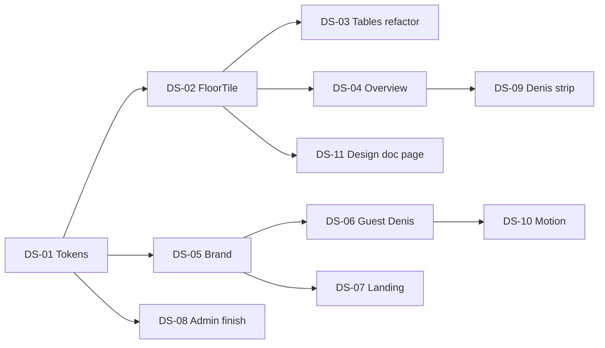

# Denis Spatial — Implementation Plan (v4 adopted)

| Field | Value |
|-------|--------|
| **Status** | **Approved for execution** (May 2026) |
| **North star** | [ADR-007 §v4](./ADR-007-visual-system.md#12-denis-spatial-v4--north-star-adopted) |
| **Rule** | **One PR per track** · `pnpm type-check` · no unrelated Denis kernel changes |
| **Brand** | **Denis** · subline **Part of Vera Group** · venue name unchanged in dashboard |

---

## Executive summary

We do not repaint screens with a new orange. We introduce **`FloorTile` as the atomic UI unit**, extract it from the existing `/dashboard/tables` cards, then propagate tiles to Overview, Denis surfaces, and landing.

**Total:** 14 tracks · **~16–20 dev-days** (solo) · can parallelize DS-02 + DS-03 after DS-01.



---

## Principles during implementation

1. **Extract, don’t rewrite** — `tables-board.tsx` logic stays; only card shell becomes `<FloorTile>`.
2. **Alias tokens first** — add `--qr-*` / `--denis-*` mapped to existing `--dash-*` until migration complete.
3. **No spinners** — skeleton + shimmer only (project rule).
4. **Status colors sacred** — order kanban hues unchanged; table `attention` / `payment` keep red/amber semantics.
5. **Vera indigo only on landing** — never leak `#818cf8` into `guest-theme` / `dashboard-theme`.
6. **Kitchen untouched** — `kitchen-theme` isolated.

---

## Phase 0 — Foundation (DS-01, DS-08 partial)

### DS-01 — Spatial tokens + theme aliases

**Goal:** Single source of truth for v4 palette; backward compatible with dashboard.

**Files:**

| Action | Path |
|--------|------|
| Edit | `src/app/globals.css` |
| Add | `src/styles/README.md` (pointer to globals until split) |

**Tasks:**

1. Add CSS variables on `.dashboard-theme`, `.admin-theme`, `.guest-theme`:

   ```css
   /* Spatial v4 — map to dash during migration */
   --qr-void: #0a0908;
   --qr-surface: #141210;
   --qr-elevated: #1c1917;
   --qr-ivory: #f5f0eb;
   --qr-muted: #9c958c;
   --qr-ember: #e85d04;
   --qr-ember-hover: #d14d04;
   --qr-ember-muted: rgba(232, 93, 4, 0.12);
   --qr-ember-glow: rgba(232, 93, 4, 0.22);
   --denis-bubble-assistant: var(--qr-elevated);
   --denis-bubble-user: var(--qr-surface);
   --denis-chip-border: rgba(232, 93, 4, 0.28);
   ```

2. Bridge: `--dash-accent: var(--qr-ember)` (or keep both equal) — **no visual break** on existing screens.

3. Add `@media (prefers-reduced-motion: reduce)` overrides for spatial animations (DS-10 prep).

4. Document token table in ADR-007 appendix.

**Acceptance criteria:**

- [ ] `pnpm type-check` passes
- [ ] Dashboard + guest + admin render without color regression (smoke: orders, tables, menu)
- [ ] grep shows no new hardcoded `#f97316` in touched files (use vars)

**Estimate:** 0.5–1 day  
**Depends:** —  
**PR title:** `design(DS-01): spatial v4 CSS tokens`

---

### DS-08 — Admin / platform dark pro (finish)

**Goal:** Complete started V3 work; align with spatial tokens.

**As-built:** `admin-theme`, `AdminBrandMark`, layout shells.

**Remaining tasks:**

1. Replace `AdminBrandMark` Sparkles with `DenisTableMark` (DS-05 may do this — coordinate: DS-08 uses placeholder until DS-05 lands, or DS-05 first).
2. Migrate top 3 admin pages off raw `neutral-*` to `FloorTile` / `QrCard` where applicable:
   - `denis-rollout-panel.tsx`
   - `denis-debug-graph-view.tsx`
   - `admin/settings/page.tsx` (first screen owners see)
3. Remove duplicate legacy remap rules in globals once components use semantic classes.

**Acceptance criteria:**

- [ ] `/admin/settings`, `/admin/denis-debug` readable dark pro
- [ ] Side-by-side screenshot: admin sidebar matches dashboard sidebar density

**Estimate:** 1 day  
**Depends:** DS-01  
**PR title:** `design(DS-08): admin spatial tokens + panel cards`

---

## Phase 1 — FloorTile atom (DS-02, DS-03)

### DS-02 — `FloorTile` primitive + variants

**Goal:** One component encodes table/KPI/chip/denis-tile visuals.

**Files:**

| Action | Path |
|--------|------|
| Add | `src/components/design-system/floor-tile.tsx` |
| Add | `src/components/design-system/floor-tile.types.ts` |
| Add | `src/components/design-system/index.ts` (barrel) |
| Add | `src/__tests__/floor-tile.test.tsx` |

**API (TypeScript):**

```ts
type FloorTileVariant = "floor" | "kpi" | "chip";
type FloorTileStatus =
  | "available"
  | "occupied"
  | "attention"
  | "payment"
  | "selected";

type FloorTileProps = {
  variant?: FloorTileVariant;
  status?: FloorTileStatus;
  label: string;
  sublabel?: string;
  value?: string;          // KPI number or price
  highlight?: boolean;     // waiter calls etc.
  compact?: boolean;       // overview KPI row
  as?: "button" | "a" | "div";
  href?: string;
  onClick?: () => void;
  className?: string;
  children?: React.ReactNode;
};
```

**Visual rules (encode in component):**

| Status | Border | Top bar | Glow |
|--------|--------|---------|------|
| `available` | dashed `border-dash-border` | none | none |
| `occupied` | solid emerald/ember mix per spec | **2px ember** `::before` | subtle |
| `attention` | red | pulse dot | existing |
| `payment` | amber | pulse dot | existing |
| `kpi` | solid surface | none | none |
| `chip` | ember border, horizontal min-h 44px | optional | none |

**Tasks:**

1. Implement base styles with `cn()` + CSS vars only.
2. `occupied` enter: `spatial-tile-occupy` keyframe (top bar scaleX 0→1, 200ms) — stub class, full motion in DS-10.
3. Export `floorTileStatusFromTable()` helper mapping `TableRow` → status (shared with tables-board).
4. Unit test: renders available vs occupied classNames.

**Acceptance criteria:**

- [ ] Story-less: temporary render in a dev-only route **or** snapshot in test
- [ ] Min touch 44px for `variant="chip"`
- [ ] a11y: `as="button"` has discernible name from `label`

**Estimate:** 1.5 days  
**Depends:** DS-01  
**PR title:** `design(DS-02): FloorTile primitive`

---

### DS-03 — Refactor `/dashboard/tables` to FloorTile

**Goal:** Tables page becomes reference implementation; zero behavior change.

**Files:**

| Action | Path |
|--------|------|
| Edit | `src/components/dashboard/tables-board.tsx` |
| Add | `src/lib/dashboard/table-tile-status.ts` (extract `tableStatus`) |

**Tasks:**

1. Move `tableStatus()` to `table-tile-status.ts` with tests.
2. Replace inner `<button className={cn(...)}>` (lines ~636–684) with:

   ```tsx
   <FloorTile
     variant="floor"
     status={tableStatus(table)}
     label={table.name}
     sublabel={`${table.seats} seats`}
     value={table.sessionTotal > 0 ? formatPrice(...) : undefined}
     onClick={() => setSelected(table)}
   />
   ```

3. Preserve `attention` / `payment` / timer children via `children` slot.
4. Manual QA: zone tabs, selection panel, QR download, add table — unchanged.
5. Compare screenshot before/after — layout pixel-close.

**Acceptance criteria:**

- [ ] All table states visually match pre-refactor
- [ ] Click opens bill panel as before
- [ ] `pnpm test:run` includes table-tile-status tests

**Estimate:** 1 day  
**Depends:** DS-02  
**PR title:** `design(DS-03): tables board uses FloorTile`

---

## Phase 2 — Dashboard Overview cockpit (DS-04, DS-09)

### DS-04 — Overview spatial layout

**Goal:** No scroll on 1440×900; floor-first; KPI as compact tiles.

**Files:**

| Action | Path |
|--------|------|
| Edit | `src/components/dashboard/dashboard-overview.tsx` |
| Add | `src/components/dashboard/overview-floor-snapshot.tsx` |
| Add | `src/components/dashboard/overview-kpi-strip.tsx` |
| Edit | `src/components/dashboard/overview-live-feed.tsx` (compact rows) |
| Deprecate usage | `overview-active-sessions.tsx` (dots → fold into floor or remove) |
| Edit | `src/components/dashboard/overview-sparkline.tsx` (inline mode) |

**Layout spec (desktop `lg+`):**

```
Row 0: location title (unchanged)
Row 1: OverviewKpiStrip — 5× FloorTile compact + sparkline inside first tile
Row 2: grid 12 cols
  col-span-8: OverviewFloorSnapshot (zones, max 2 rows visible, link to /tables)
  col-span-4: OverviewQuickActions (sticky min-h)
Row 3: OverviewDenisStrip (collapsed, DS-09)
```

**Tasks:**

1. Build `OverviewKpiStrip` using `FloorTile variant="kpi"`.
2. Build `OverviewFloorSnapshot`:
   - Input: `OverviewTableStatus[]` + optional zone names from overview hook
   - Group by zone if data available; else single grid
   - Reuse same grid classes as tables-board (`grid-cols-2 … lg:grid-cols-6`)
   - Cap visible tables per zone (e.g. 6) + “+N more” link
3. Shrink `OverviewLiveFeed` to **4 orders** max, single column, smaller typography.
4. Remove 2×2 grid and full-width sparkline card.
5. Move sparkline into revenue KPI tile (height 40px).

**Data tasks:**

- Extend `useDashboardOverview` / `overview-types` if zone grouping missing (optional follow-up in same PR if small).

**Acceptance criteria:**

- [ ] 1440×900: KPI + floor + quick actions visible without scroll
- [ ] Floor tiles match `/dashboard/tables` appearance
- [ ] Mobile: KPI horizontal snap scroll; floor stacks above actions

**Estimate:** 2–2.5 days  
**Depends:** DS-02, DS-03 (for visual parity)  
**PR title:** `design(DS-04): overview spatial cockpit`

---

### DS-09 — Denis insights strip (replaces AiIntelligenceCard on overview)

**Goal:** 360px card → one collapsible row; full analytics on `/dashboard/denis`.

**Files:**

| Action | Path |
|--------|------|
| Add | `src/components/dashboard/overview-denis-strip.tsx` |
| Edit | `src/components/dashboard/dashboard-overview.tsx` |
| Keep | `ai-intelligence-card.tsx` for `/dashboard/denis` only |

**Tasks:**

1. `OverviewDenisStrip`: collapsed default shows guests, conversion %, CTA link.
2. Expand (optional chevron): max-height 240px, scroll inside, reuse subset of `AiIntelligenceCard` data via `useAiInsights`.
3. If Denis disabled for location, render nothing.

**Acceptance criteria:**

- [ ] Overview no longer has 360px Denis block
- [ ] `/dashboard/denis` still full card

**Estimate:** 1 day  
**Depends:** DS-04  
**PR title:** `design(DS-09): overview Denis strip`

---

## Phase 3 — Brand system (DS-05, DS-07)

### DS-05 — Denis Table Mark + BrandMark v2

**Goal:** Replace Sparkles with Table D mark + presence line.

**Files:**

| Action | Path |
|--------|------|
| Add | `src/components/design-system/denis-table-mark.tsx` (SVG) |
| Add | `src/components/design-system/denis-brand-mark.tsx` |
| Edit | `src/components/admin/admin-brand-mark.tsx` → re-export or thin wrapper |
| Edit | `src/components/platform/platform-sidebar.tsx` |

**`DenisTableMark` props:**

```ts
{ size?: 24 | 32 | 40; state?: "idle" | "listen" | "think"; className?: string }
```

**CSS:**

- `.denis-presence-line` — ember bar under wordmark
- `.denis-mark-think` — shimmer on line (reuse `.shimmer`)

**Tasks:**

1. SVG: vertical 2px + horizontal 2px forming D, `currentColor` = ember.
2. `DenisBrandMark`: Denis + presence line + “Part of Vera Group”.
3. Swap admin/platform sidebars.
4. Add to `ai-concierge-chat` header (prep for DS-06).

**Acceptance criteria:**

- [ ] No Sparkles in product chrome (grep `Sparkles` in guest/admin headers)
- [ ] listen/think states animate only when reduced-motion off

**Estimate:** 1 day  
**Depends:** DS-01  
**PR title:** `design(DS-05): Denis Table Mark brand`

---

### DS-07 — Landing Denis + live floor hero

**Goal:** Public brand Denis; Vera Group subline; animated floor right.

**Files:**

| Action | Path |
|--------|------|
| Edit | `src/components/landing/landing-nav.tsx` |
| Edit | `src/components/landing/landing-hero.tsx` |
| Add | `src/components/landing/landing-floor-hero.tsx` |
| Edit | `src/components/landing/landing-footer.tsx` |
| Edit | `src/app/page.tsx` metadata |

**Tasks:**

1. Nav: `DenisBrandMark` compact (mark only on mobile).
2. Hero copy DE:

   - eyebrow: `Part of Vera Group`
   - H1: `Denis`
   - sub: `Der Concierge für Ihren Gastraum.` (or keep platform line — product decision)
   - CTA: ember (`landing-btn-accent` aligned to `--qr-ember`)

3. `LandingFloorHero`: 12–16 `FloorTile` in CSS grid, `occupied` cycles every 3s (`prefers-reduced-motion` static).
4. Footer: `© Vera Group` + Denis mention.
5. Metadata: title `Denis — Hospitality AI · Vera Group`.

**Keep:** landing indigo mesh on **corporate** backgrounds only; CTAs ember.

**Acceptance criteria:**

- [ ] `/` shows Denis not “vera” wordmark alone
- [ ] `e2e/landing.spec.ts` updated for new copy/brand
- [ ] Lighthouse: no CLS from hero animation

**Estimate:** 2 days  
**Depends:** DS-02, DS-05  
**PR title:** `design(DS-07): landing Denis spatial hero`

---

## Phase 4 — Guest Denis (DS-06)

### DS-06 — Guest AI panel spatial chrome

**Goal:** Floating panel, tile chips, brand header, warm stone.

**Files:**

| Action | Path |
|--------|------|
| Edit | `src/components/guest/ai-concierge-chat.tsx` |
| Add | `src/components/guest/denis-cart-tiles.tsx` |
| Add | `src/components/design-system/denis-chip.tsx` (wraps FloorTile chip) |
| Edit | `src/app/globals.css` `.guest-theme` warm stone values |

**Tasks:**

1. Sheet container: `mx-3 mb-3 rounded-[20px] border border-zinc-800` → use `--qr-*` tokens.
2. Header: `DenisBrandMark` + close.
3. Assistant bubble: `border-l-2 border-[var(--qr-ember)]` + `--denis-bubble-assistant`.
4. Quick replies: `DenisChip` → `FloorTile variant="chip"`.
5. `denis-cart-tiles`: horizontal scroll of mini tiles for cart preview (optional if cart API exposes items).
6. Placeholder i18n: use session language examples from menu.

**Acceptance criteria:**

- [ ] Mobile 390px: panel not full-bleed; 44px chips
- [ ] SR order flow still works (existing tests + manual Da/potvrdi)
- [ ] No English leak on SR session (separate from design — don’t regress)

**Estimate:** 2 days  
**Depends:** DS-05, DS-02  
**PR title:** `design(DS-06): guest Denis spatial panel`

---

## Phase 5 — Consolidation (DS-10, DS-11, DS-12)

### DS-10 — Motion system

**Goal:** Documented 200ms motions; occupy animation; Denis listen line.

**Files:**

| Action | Path |
|--------|------|
| Edit | `src/app/globals.css` (`@keyframes spatial-*`) |
| Edit | `floor-tile.tsx`, `denis-table-mark.tsx` |

**Tasks:**

1. `spatial-tile-occupy`: top bar grow.
2. `spatial-denis-listen`: line width pulse.
3. `prefers-reduced-motion: reduce` disables all three.

**Acceptance criteria:**

- [ ] OS reduced motion → static states
- [ ] No `animate-spin` added

**Estimate:** 0.5 day  
**Depends:** DS-02, DS-05  
**PR title:** `design(DS-10): spatial motion keyframes`

---

### DS-11 — Internal design system page (optional)

**Goal:** Living gallery for QA.

**Files:**

| Action | Path |
|--------|------|
| Add | `src/app/(platform)/platform/design-system/page.tsx` (platform admin only) |

**Sections:** tokens, FloorTile matrix, DenisBrandMark states, typography scale.

**Estimate:** 1 day  
**Depends:** DS-02, DS-05  
**PR title:** `design(DS-11): platform design-system gallery`

---

### DS-12 — QrCard + migrate loose ends

**Goal:** Replace ad-hoc `rounded-xl border border-dash-border` patterns.

**Files:** `overview-live-feed.tsx`, `denis-rollout-panel.tsx`, admin analytics cards.

**Estimate:** 1.5 days  
**Depends:** DS-01  
**PR title:** `design(DS-12): QrCard primitive + migrations`

---

## Phase 6 — Auth + print spec (DS-13, DS-14) — later

### DS-13 — Auth pages Denis brand

**Files:** `(auth)/login/page.tsx`, `signup/page.tsx`  
**Estimate:** 0.5 day

### DS-14 — QR print spec (documentation only)

**Files:** `docs/design/qr-card-print-spec.md`  
**Estimate:** 0.25 day

---

## Track summary table

| Track | Name | Phase | Days | Depends | Priority |
|-------|------|-------|------|---------|----------|
| **DS-01** | Spatial tokens | 0 | 1 | — | P0 |
| **DS-02** | FloorTile primitive | 1 | 1.5 | DS-01 | P0 |
| **DS-03** | Tables refactor | 1 | 1 | DS-02 | P0 |
| **DS-04** | Overview cockpit | 2 | 2.5 | DS-02,03 | P0 |
| **DS-05** | Table D brand | 3 | 1 | DS-01 | P1 |
| **DS-06** | Guest Denis panel | 4 | 2 | DS-05,02 | P1 |
| **DS-07** | Landing hero | 3 | 2 | DS-02,05 | P1 |
| **DS-08** | Admin finish | 0 | 1 | DS-01 | P1 |
| **DS-09** | Denis strip | 2 | 1 | DS-04 | P1 |
| **DS-10** | Motion | 5 | 0.5 | DS-02,05 | P2 |
| **DS-11** | Gallery page | 5 | 1 | DS-02,05 | P3 |
| **DS-12** | QrCard migration | 5 | 1.5 | DS-01 | P2 |
| **DS-13** | Auth brand | 6 | 0.5 | DS-05 | P3 |
| **DS-14** | QR print doc | 6 | 0.25 | DS-05 | P3 |

**Critical path:** DS-01 → DS-02 → DS-03 → DS-04 → DS-09 (~6–7 days)

---

## Recommended PR order (sprint-style)

### Sprint A — “Floor language” (week 1)

1. DS-01 Tokens  
2. DS-02 FloorTile  
3. DS-03 Tables refactor  
4. DS-04 Overview cockpit  
5. DS-09 Denis strip  

**Demo milestone:** Dashboard shows spatial identity; owner sees fix for scroll.

### Sprint B — “Denis public face” (week 2)

6. DS-05 Table D brand  
7. DS-08 Admin finish  
8. DS-06 Guest panel  
9. DS-07 Landing  

**Demo milestone:** Guest + landing match dashboard story.

### Sprint C — “Polish” (week 3)

10. DS-10 Motion  
11. DS-12 QrCard  
12. DS-11 Gallery (optional)  
13. DS-13 Auth  

---

## Per-PR checklist (copy into every PR)

```markdown
- [ ] Only one DS-track scope
- [ ] No Denis kernel / migration changes unless required
- [ ] Uses CSS vars (--qr-* / --dash-*) not raw hex in components
- [ ] prefers-reduced-motion respected for new animations
- [ ] pnpm type-check
- [ ] pnpm test:run (if tests added)
- [ ] Manual smoke: tables, overview, guest chat (as applicable)
- [ ] Screenshot before/after in PR description
- [ ] ADR-007 or this plan updated if API/behavior changed
```

---

## Risks & mitigations

| Risk | Mitigation |
|------|------------|
| Tables refactor breaks bill panel | No logic move; only JSX shell; QA click each status |
| Overview missing zone data | Fallback single grid; extend API in DS-04 if needed |
| Landing e2e fails | Update `e2e/landing.spec.ts` in DS-07 |
| Ember shift `#f97316` → `#e85d04` shocks users | DS-01: set `--qr-ember` = `#f97316` first; shift in DS-10 after approval |
| Scope creep into Denis AI kernel | Design tracks touch `components/` + CSS only |

---

## Success metrics (definition of done)

| Metric | Target |
|--------|--------|
| Overview scroll @ 1440×900 | None for core cockpit |
| `FloorTile` usage | tables + overview KPI + floor snapshot + guest chips |
| Brand grep | 0× Sparkles in Denis chrome |
| Visual consistency | Admin = dashboard = guest stone palette |
| Landing | Denis H1 + Vera subline live |

---

## Operator prompt

```
Denis Spatial mode. Read docs/design/denis-spatial-implementation-plan.md.
Implement exactly one DS-track. DS-01→DS-04 critical path first unless user specifies otherwise.
pnpm type-check && pnpm test:run. Do not commit unless asked.
```
